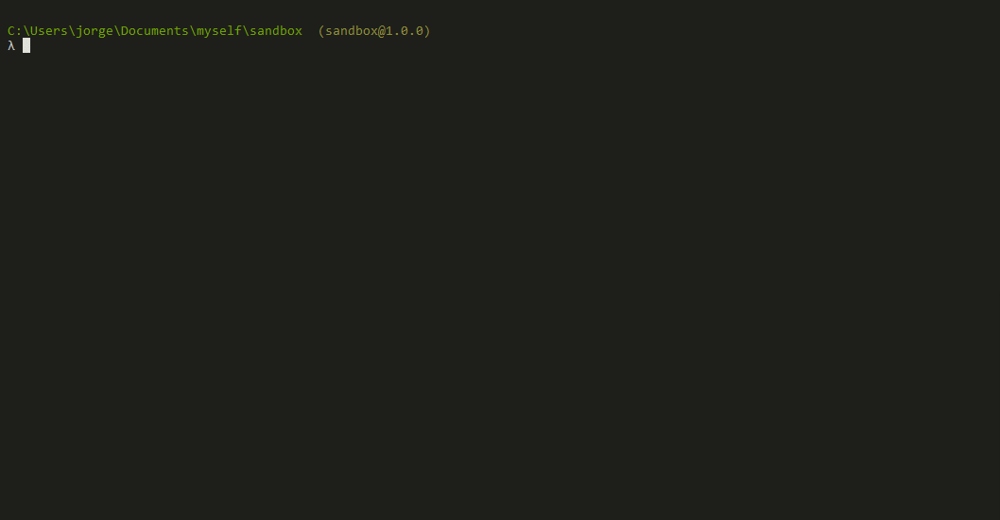
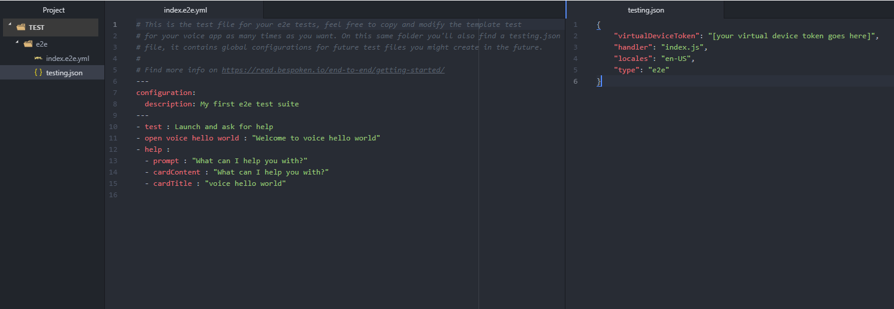

# Getting Started With The Bespoken CLI

## What is the Bespoken CLI

The Bespoken CLI are a set of tools created by us to let you develop faster and better. Do not slow-down for:
* Time-consuming server deployments
* Over-complicated and highly manual testing routines

## Installation

To install the Bespoken command line tool (bst) do:
```bash
$ npm install @bespoken-sdk/cli -g
```

__Note:__ If you are on MacOS and the command fails, it is probably because you need to run it with sudo, like this:
```bash
$ sudo npm install @bespoken-sdk/cli -g
```
Verify the installation by typing:
```bash
$ bst
```

Haven't used npm before? We have you covered:
[How To Install NPM](http://blog.npmjs.org/post/85484771375/how-to-install-npm/)

You will then be able to use our commands, as described below.

You can also use:

* --version, -v - Indicates the current BST and Node versions
* --help, -h - Shows usage information

## Updating

To update bst:
```bash
$ pnpm update @bespoken-sdk/cli -g
```

# Guide to Bespoken CLI Commands
## Command - Init

### Overview

The init command helps you creating all the files and folders you need to start unit or end to end testing your Conversational AI applications.

### Usage

To run the init command, simply open a terminal and, in the root folder of your project, type:
```
$ bst init
```

The command will ask you for the following data:

- Test type: unit or e2e
- Name of the Conversational AI Experience you are testing
- Type of Conversational AI Experience: Alexa, Google or IVR
- Test locales: en-US is the default. You can add more via a comma-separated list - for example: `en-US, de-DE, es-ES`
- For unit testing only:
  - Path of your handler file: default is index.js
  - Path of your dialogflow directory (only for Google actions)
- For end to end testing only:
  - Virtual device token
- For IVR systems only:
  - Phone number to call to

 Here's a preview:


After that, the command will create a "test" directory with all the needed files and folders.


You can execute your tests by typing `bst test` on the same command line.

## Command - Test

### Overview

The `test` command runs local YAML tests files.

### Usage

To run the test command, simply open a terminal and, in the root folder of your project, type:
```
$ bst test <TEST_PATTERN>
```

The TEST_PATTERN uses [the MicroMatch package](https://github.com/micromatch/micromatch) under the covers, which supports glob syntax, such as:
* test/*.js       # Runs all files in subfolders named test with files matching `*.js`
* test            # Runs all files in subfolders named test
* **/*.test.js    # Runs all files in any sub-folder that match `*.test.js`

Test results are automatically output to the console, as well as written as an HTML report in the folder `./test_output/index.inline.html`.

Test parameters and configuration are taken by default from the file `./testing.json` in the current working directory. For more information on the various test parameters, [read here](https://read.bespoken.ai/end-to-end/guide/#configuration).

## Command - Test Suite

### Overview

The `test-suite` command provides sub-commands to manage and run test suites defined in the Bespoken Dashboard.

The sub-commands are:
* `bst test-suite create` - creates or updates the named test suite in the Bespoken Dashbaord
* `bst test-suite run` - runs the named test suite in the Bespoken Dashboard

Each command is described in detail below.

### Test Suite Create

**Usage**

To execute the `test-suite create` create command, simply open a terminal and, in the root folder of your project, type:
```
$ bst test-suite create <TEST_SUITE_NAME> <CONFIGURATION_PATH> <TEST_SUITE_YAML_PATH>
```

If the named test suite already exists, it will be overwritten by running this.

The CONFIGURATION_FILE should be the path from the current directory a valid `testing.json` configuration file. 

The TEST_SUITE_YAML_PATH should be valid testing YAML script.

For more information on the structure of the configuration file and test scripts, [read here](https://read.bespoken.ai/end-to-end/guide/#configuration).


### Test Suite Run

**Usage**

To execute the `test-suite run` command, simply open a terminal and, in the root folder of your project, type:
```
$ bst test-suite run <TEST_SUITE_NAME> [KEY1=VALUE1] [KEY2=VALUE2] [KEY3=VALUE3]
```

This will run the named test suite within the Dashboard, passing the optional variables for test execution.

When the test is completed, a link to the results in the Dashboard will be provided in the console. The test run will be stored with the Dashboard, and will always be available to review there.

