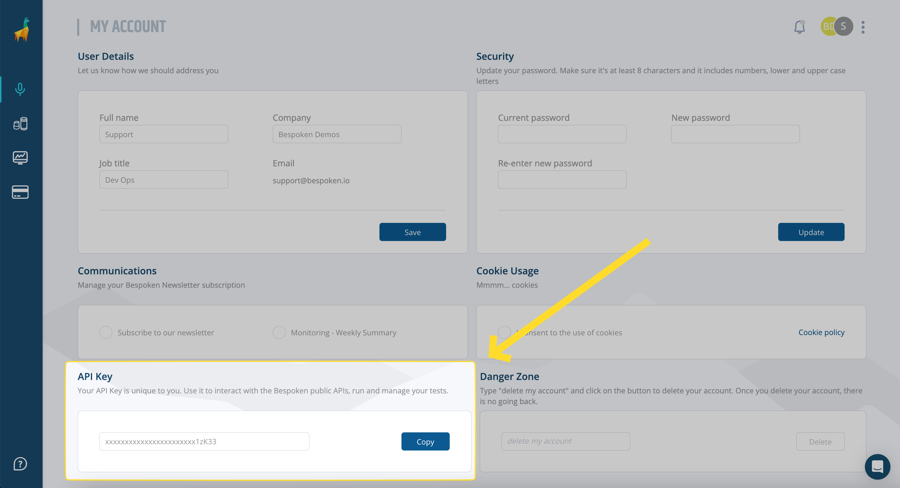

# Bespoken Test API

The Bespoken Test API provides powerful capabilities for running automated tests on conversational platforms such as IVR systems, chatbots, and messaging applications like WhatsApp. This API allows you to programmatically execute test suites and retrieve detailed results, enabling efficient end-to-end testing of your conversational interfaces.

Key features of the Bespoken Test API include:
- Running comprehensive test suites
- Retrieving detailed test results
- Flexibility to test different platforms and scenarios

::: tip Important
The full Swagger documentation for our APIs can be found [here](https://test-api.bespoken.io/api/docs/).
:::

This documentation covers three primary operations: running a test suite, running a test suite with replacement variables, and retrieving test run results. But first, you should know where to get your API key.

## Getting an API key
Your API key allows us to authenticate you against our APIs and execute diverse operations against your test suites. Your API key is personal and should not be shared. To get your API key:

1. Navigate to the Dashboard.
2. Click the three dots menu in the upper right corner.
3. Select "My account."
4. Copy the API key at the bottom of the page.



## Base URL
All URLs referenced in the documentation have the following base:
```
https://test-api.bespoken.io/api
```
The Bespoken Test API uses HTTPS; unencrypted HTTP is not supported.

## Running a Test Suite

This endpoint runs a test suite with the specific test suite ID. It returns a run id that can be used to then query the results of the test execution.
 
```
GET /test-suite/{test-suite-id}/run
```


### Path Parameters

| Name | Located in | Description | Required | Schema |
|------|------------|-------------|----------|--------|
| api-key | query | The api-key to authenticate the user and authorize this call | Yes | string |
| test-suite-id | path | The id of the test suite to interact with | Yes | string |
| phoneNumber | query | For `phone` tests, the phone number to call. | No | string |

### Responses

| Code | Description | Schema |
|------|-------------|--------|
| 200 | Successful response | [TestRun](#testrun-schema) |

### Example Request

```
GET /api/test-suite/12345/run?api-key=your-api-key
```

### Example Response

```json
{
  "id": "run-123456",
  "status": "IN_PROGRESS",
}
```

### Notes
- Ensure you have a valid API key before making the request.
- The `test-suite-id` can be obtained by opening your test suite in the bespoken Dashboard and copying the UUID at the end of the current URL.
- If a `phoneNumber` is provided, it will replace the phone number configured in the test suite.

### Try it 
<VuepressApiPlayground 
    url="https://test-api.bespoken.io/api/test-suite/{test-suite-id}/run"
    method="get" 
    :showMethod="true"
    :showURL="true"
    :data="[
      {
        name: 'test-suite-id',
        value: '12345',
        type: 'string',
      },
      {
        name: 'api-key',
        value: 'api-12345',
        type: 'string',
      },
      {
        name: 'phoneNumber',
        type: 'string',
      },
    ]" 
  />

## Running a Test Suite with Replacement Variables

This endpoint runs a test suite with the specific test suite ID and allows you to provide replacement variables in the request body. It returns a run id that can be used to query the results.

```
POST /test-suite/{test-suite-id}/run
```

### Path Parameters

| Name | Located in | Description | Required | Schema |
|------|------------|-------------|----------|--------|
| api-key | query | The api-key to authenticate the user and authorize this call | Yes | string |
| test-suite-id | path | The id of the test suite to interact with | Yes | string |
| phoneNumber | query | For `phone` tests, the phone number to call. | No | string |

### Request Body Parameters

| Name |  Description | Required | Schema |
|------|-------------|----------|--------|
| VARIABLE_NAME | The variable that you want to replace with a new value. You can add as many variables as you need. These are key-pair properties and not an array. | No | string |


### Responses

| Code | Description | Schema |
|------|-------------|--------|
| 200 | Successful response | [TestRun](#testrun-schema) |

### Example Request

```
POST /api/test-suite/12345/run?api-key=your-api-key
Content-Type: application/json

{
    "CITY_FROM": "Los Angeles",
    "CITY_TO": "New York"
}
```

### Example Response

```json
{
  "id": "run-123456",
  "status": "IN_PROGRESS",
}
```

### Notes
- Ensure you have a valid API key before making the request.
- The `variables` in the request body allows you to provide replacement variables for your test suite.
- To use them, you need to specify variable names in your test script following this nomenclature: `${VARIABLE_NAME}`

- If a `phoneNumber` is provided in the query, it will replace the phone number configured in the test suite.

## Retrieving Test Run Results

This endpoint checks the status of the specified test run and retrieves the results. 

```
GET /test-run/{run-id}
```

### Path Parameters

| Name | Located in | Description | Required | Schema |
|------|------------|-------------|----------|--------|
| api-key | query | The api-key to authenticate the user and authorize this call | Yes | string |
| run-id | path | The run ID to check the status of | Yes | string |

### Responses

| Code | Description | Schema |
|------|-------------|--------|
| 200 | Successful response | [TestRun](#testrun-schema) |

### Example Request

```
GET /api/test-run/run-123456?api-key=your-api-key
```

### Example Response

```json
{
  "id": "run-123456",
  "status": "COMPLETE",
  "recordingURL": "RECORDING_URL.wav",
  "results": [
    {
      "testName": "Help",
      "status": "PASS",
      "interactions": [
        {
          "utterance": "$DIAL",
          "expectedValue": "Bespoken Airlines",
          "actualValue": "Welcome to the Bespoken Airlines. In a few words, tell me what you're calling about",
          "status": "PASS",
          "timestamp": "2023-09-20T14:30:00Z",
          "raw": {}
        },
        {
          "utterance": "I need help",
          "expectedValue": "I'll connect you to an agent",
          "actualValue": "Ok, help. Hang in there and I'll connect you to an agent",
          "status": "PASS",
          "timestamp": "2023-09-20T14:30:05Z",
          "raw": {}
        }
      ]
    },
    {
      "testName": "Booking",
      "status": "FAILED",
      "interactions": [
        {
          "utterance": "$DIAL",
          "expectedValue": "Bespoken Airlines",
          "actualValue": "I'm sorry, all our agents are busy. Please, call back in a few minutes.",
          "status": "FAILED",
          "timestamp": "2023-09-20T14:31:00Z",
          "raw": {}
        }
      ]
    }
  ]
}
```

### Notes
- The `run-id` is obtained when you initially start a test run.
- The response includes detailed results for each test case and interaction, allowing for thorough analysis of the test execution.
- The `raw` property in each interaction contains more detailed debugging information that can vary for each platform.
- The `recordingURL` property is only available for IVR tests.
- Tests within a test suite are executed sequentially, so it might take a while for results to go from `IN_PROGRESS` to `COMPLETE`. 

### Try it 
<VuepressApiPlayground 
    url="https://test-api.bespoken.io/api/test-run/{run-id}"
    method="get" 
    :showMethod="true"
    :showURL="true"
    :data="[
      {
        name: 'run-id',
        value: 'run-12345',
        type: 'string',
      },
      {
        name: 'api-key',
        value: 'api-12345',
        type: 'string',
      },
    ]" 
  />

## TestRun Schema

| Property | Type | Description |
|----------|------|-------------|
| id | string | Unique identifier for the test run |
| status | string | Status of the test run (e.g., "COMPLETE", "IN_PROGRESS", "ERROR") |
| results | array | Array of test results |

Each result in the `results` array contains:

- `testName`: Name of the individual test
- `status`: Status of the test (e.g., "PASS", "FAILED")
- `interactions`: Array of interactions within the test

Each interaction contains:

- `utterance`: The input given to the system
- `expectedValue`: The expected response
- `actualValue`: The actual response received
- `status`: Status of this interaction
- `timestamp`: When this interaction occurred