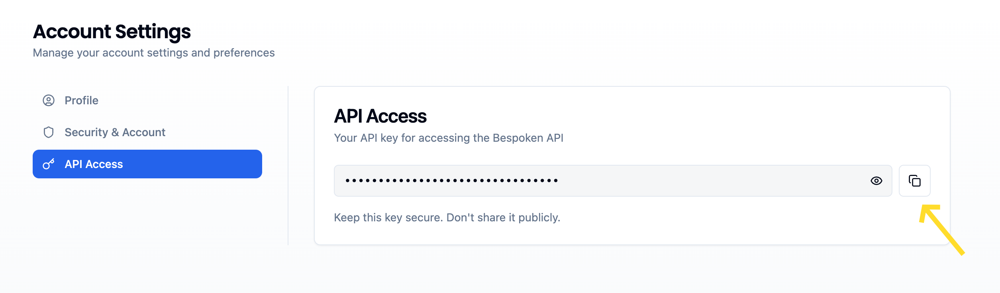
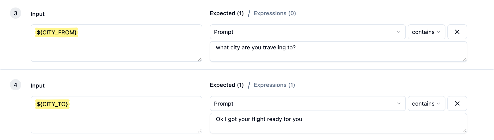

# Bespoken Test API

The Bespoken Test API provides powerful capabilities for managing and running automated tests on conversational platforms such as IVR systems, chatbots, and messaging applications like WhatsApp. This API allows you to programmatically create, update, execute test suites and retrieve detailed results, enabling efficient end-to-end testing of your conversational interfaces.

Key features of the Bespoken Test API include:
- Creating and managing test suites
- Running comprehensive test suites
- Retrieving detailed test results
- Flexibility to test different platforms and scenarios

::: tip Important
- To start using our APIs quickly, refer to our [Postman Collection](#using-the-postman-collection).
- The full Swagger documentation for our APIs can be found [here](https://api.bespoken.ai/api/docs/).
:::

This documentation covers test suite management operations, test execution, and result retrieval. But first, you should know where to get your API key.

## Getting an API key
Your API key allows us to authenticate you against our APIs and execute diverse operations against your test suites. Your API key is personal and should not be shared. To get your API key:

1. Navigate to the Dashboard.
2. Click the user menu in the upper right corner.
3. Select "Account."
4. Select the "Api Access" tab.
5. Copy your API key.



## Base URL
All URLs referenced in the documentation have the following base:
```
https://api.bespoken.ai/api
```
The Bespoken Test API uses HTTPS; unencrypted HTTP is not supported.

## Test Suite Management

These endpoints allow you to create, retrieve, and update test suites programmatically.

### Get All Test Suites

Retrieves all test suites associated with your organization.

```
GET /test-suite
```

#### Query Parameters

| Name | Located in | Description | Required | Schema |
|------|------------|-------------|----------|--------|
| api-key | query | The api-key to authenticate the user and authorize this call | Yes | string |
| org-id | query | The org-id to identify which organization to use, if empty, the default organization will be used | No | string |

#### Responses

| Code | Description | Schema |
|------|-------------|--------|
| 200 | Successful response | Array of [TestSuite](#testsuite-schema) |

#### Example Request

```
GET /api/test-suite?api-key=your-api-key
```

#### Example Response

```json
[
  {
    "id": "XXXXXXXX-XXXX-XXXX-XXXX-XXXXXXXXXXXX",
    "name": "Customer Support Tests",
    "configuration": {
      "platform": "phone",
      "phoneNumber": "+1234567890"
    },
    "yaml": "---\n- test : \"DIAL\"\n- $DIAL :\n  - prompt : \"Bepoke Airlin\"\n  - set listeningTimeout : \"10\"\n\n---\n- test : \"Help Request\"\n- $DIAL :\n  - prompt : \"Bespoken Airlines\""
  },
  {
    "id": "XXXXXXXX-XXXX-XXXX-XXXX-XXXXXXXXXXXX", 
    "name": "Booking Flow Tests",
    "configuration": {
      "platform": "webchat",
      "url": "https://example.com/chat"
    },
    "yaml": "---\n- test : \"Book Flight\"\n- Hello :\n  - prompt : \"How can I help you?\""
  }
]
```

#### Try it 
<VuepressApiPlayground 
    url="https://api.bespoken.ai/api/test-suite"
    method="get" 
    :showMethod="true"
    :showURL="true"
    :data="[
      {
        name: 'api-key',
        value: 'api-aBcDeFgHiJKlMnOpQrS',
        type: 'string',
      },
      {
        name: 'org-id',
        value: '',
        type: 'string',
      },
    ]" 
  />

### Get Single Test Suite

Retrieves a specific test suite by its ID.

```
GET /test-suite/{test-suite-id}
```

#### Path Parameters

| Name | Located in | Description | Required | Schema |
|------|------------|-------------|----------|--------|
| api-key | query | The api-key to authenticate the user and authorize this call | Yes | string |
| test-suite-id | path | The id of the test suite to retrieve | Yes | string |
| org-id | query | The org-id to identify which organization to use, if empty, the default organization will be used | No | string |

#### Responses

| Code | Description | Schema |
|------|-------------|--------|
| 200 | Successful response | [TestSuite](#testsuite-schema) |
| 404 | Test suite not found | Error message |

#### Example Request

```
GET /api/test-suite/1234abcd-fg18-12dg-313s-9831?api-key=your-api-key
```

#### Example Response

```json
{
    "id": "XXXXXXXX-XXXX-XXXX-XXXX-XXXXXXXXXXXX", 
    "name": "Booking Flow Tests",
    "configuration": {
      "platform": "webchat",
      "url": "https://example.com/chat"
    },
    "yaml": "---\n- test : \"Book Flight\"\n- Hello :\n  - prompt : \"How can I help you?\""
  }
```

#### Try it 
<VuepressApiPlayground 
    url="https://api.bespoken.ai/api/test-suite/{test-suite-id}"
    method="get" 
    :showMethod="true"
    :showURL="true"
    :data="[
      {
        name: 'api-key',
        value: 'api-aBcDeFgHiJKlMnOpQrS',
        type: 'string',
      },
      {
        name: 'test-suite-id',
        value: '1234abcd-fg18-12dg-313s-9831',
        type: 'string',
      },
      {
        name: 'org-id',
        value: '',
        type: 'string',
      },
    ]" 
  />

### Create Test Suite

Creates a new test suite with the specified configuration and tests.

```
POST /test-suite
```

#### Query Parameters

| Name | Located in | Description | Required | Schema |
|------|------------|-------------|----------|--------|
| api-key | query | The api-key to authenticate the user and authorize this call | Yes | string |
| project-id | query | The project-id to identify in which project the test suite will be created. If empty, a default project will be used | No | string |
| org-id | query | The org-id to identify which organization to use, if empty, the default organization will be used | No | string |

#### Request Body

| Property | Type | Description | Required |
|----------|------|-------------|----------|
| name | string | Name of the test suite | Yes |
| configuration | object | Platform-specific configuration settings | Yes |
| yaml | string | YAML definition of the test suite. Properly formatted as a JSON string (see [YAML Format Requirements](#yaml-format-requirements)). | Yes |

#### Responses

| Code | Description | Schema |
|------|-------------|--------|
| 200 | Test suite created successfully | [TestSuite](#testsuite-schema) |
| 400 | Invalid request body | Error message |

#### Example Request

```
POST /api/test-suite?api-key=your-api-key&project-id=optional-project-id
Content-Type: application/json

{
  "name": "Bespoken Airlines",
  "configuration": {
      "platform": "phone",
      "phoneNumber": "+12132242445"
    },
    "yaml": "---\n- test : Basic Greeting\n- $DIAL :\n  - prompt : \"Bespoken Airlines\"\n  - set listeningTimeout : 10"
}

```

#### Example Response

```json
{
  "id": "XXXXXXXX-XXXX-XXXX-XXXX-XXXXXXXXXXXX",
  "name": "Bespoken Airlines",
  "configuration": {
    "phoneNumber": "+1234567890",
    "platform": "phone",
  },
  "yaml": "---\n- test : Basic Greeting\n- $DIAL :\n  - prompt : \"Bespoken Airlines\"\n  - set listeningTimeout : 10"
}
```

:::tip Notes
- Test suite IDs are automatically generated upon creation
- Platform-specific configuration options vary by platform type (they correspond to the `testingJson` field when doing a GET request)
:::

<!-- #### Try it 
<VuepressApiPlayground 
    url="https://api.bespoken.ai/api/test-suite"
    method="post" 
    :showMethod="true"
    :showURL="true"
    :data="[
      {
        name: 'api-key',
        value: 'api-aBcDeFgHiJKlMnOpQrS',
        type: 'string',
      },
      {
        name: 'project-id',
        value: '',
        type: 'string',
      },
      {
        name: 'org-id',
        value: '',
        type: 'string',
      },
    ]" 
  /> -->

### Update Test Suite

Updates an existing test suite with new configuration or tests.

```
PUT /test-suite/{test-suite-id}
```

#### Path Parameters

| Name | Located in | Description | Required | Schema |
|------|------------|-------------|----------|--------|
| api-key | query | The api-key to authenticate the user and authorize this call | Yes | string |
| test-suite-id | path | The id of the test suite to update | Yes | string |
| project-id | query | The project-id to identify to which project the test suite will be moved. If empty, the test suite will remain in its current project | No | string |
| org-id | query | The org-id to identify which organization to use. If empty, the default organization will be used | No | string |

#### Request Body

| Property | Type | Description | Required |
|----------|------|-------------|----------|
| name | string | Name of the test suite | Yes |
| configuration | object | Platform-specific configuration settings. If not sent, the current configuration will be kept. | No |
| yaml | string | YAML definition of the test suite. Properly formatted as a JSON string (see [YAML Format Requirements](#yaml-format-requirements)). | Yes |


#### Responses

| Code | Description | Schema |
|------|-------------|--------|
| 200 | Test suite updated successfully | [TestSuite](#testsuite-schema) |
| 404 | Test suite not found | Error message |
| 400 | Invalid request body | Error message |

#### Example Request

```
PUT /api/test-suite/1234abcd-fg18-12dg-313s-9831?api-key=your-api-key&project-id=optional-project-id
Content-Type: application/json

{
  "name": "Bespoken Airlines - update",
  "configuration": {
      "phoneNumber": "+12132242445"
    },
    "yaml": "---\n- test : Initial Greeting\n- $DIAL :\n  - prompt : \"Welcome to the Bespoken Airlines contact center\"\n  - set listeningTimeout : 10\n---\n- test : \"Ask for Help\"\n- $DIAL :\n  - prompt : \"Bespoken Airlines\"\n  - set listeningTimeout : 10\n- I need help :\n  - prompt : \"I'll connect you to an agent\""
}
```

#### Example Response

```json
{
  "id": "1234abcd-fg18-12dg-313s-9831",
  "name": "Bespoken Airlines - update", 
  "configuration": {
    "platform": "phone",
    "phoneNumber": "+12132242445"
  },
  "yaml": "---\n- test : Initial Greeting\n- $DIAL :\n  - prompt : \"Welcome to the Bespoken Airlines contact center\"\n  - set listeningTimeout : 10\n---\n- test : \"Ask for Help\"\n- $DIAL :\n  - prompt : \"Bespoken Airlines\"\n  - set listeningTimeout : 10\n- I need help :\n  - prompt : \"I'll connect you to an agent\""
}
```

::: tip Notes
- Only provided fields will be updated; omitted fields remain unchanged
- It's not possible to change the platform of a test suite (eg. from `phone` to `webchat`)
::: 

<!-- #### Try it 
<VuepressApiPlayground 
    url="https://api.bespoken.ai/api/test-suite/{test-suite-id}"
    method="put" 
    :showMethod="true"
    :showURL="true"
    :data="[
      {
        name: 'test-suite-id',
        value: '1234abcd-fg18-12dg-313s-9831',
        type: 'string',
      },
      {
        name: 'api-key',
        value: 'api-aBcDeFgHiJKlMnOpQrS',
        type: 'string',
      },
      {
        name: 'project-id',
        value: '',
        type: 'string',
      },
      {
        name: 'org-id',
        value: '',
        type: 'string',
      },
    ]" 
  /> -->

### Add Test to Test Suite

Adds a new test to an existing test suite.

```
POST /test-suite/{test-suite-id}/test
```

#### Query Parameters

| Name | Located in | Description | Required | Schema |
|------|------------|-------------|----------|--------|
| api-key | query | The api-key to authenticate the user and authorize this call | Yes | string |
| org-id | query | The org-id to identify which organization to use, if empty, the default organization will be used | No | string |

#### Path Parameters

| Name | Located in | Description | Required | Schema |
|------|------------|-------------|----------|--------|
| test-suite-id | path | The id of the test suite to add the test to | Yes | string |

#### Request Body

| Property | Type | Description | Required |
|----------|------|-------------|----------|
| yaml | string | YAML definition of the individual test to add. Properly formatted as a JSON string (see [YAML Format Requirements](#yaml-format-requirements)). | Yes |

#### Responses

| Code | Description | Schema |
|------|-------------|--------|
| 200 | Test added successfully | [TestSuite](#testsuite-schema) |
| 404 | Test suite not found | Error message |
| 400 | Invalid request body | Error message |

#### Example Request

```
POST /api/test-suite/1234abcd-fg18-12dg-313s-9831/test?api-key=your-api-key
Content-Type: application/json

{
  "yaml": "---\n- test : \"Book a flight\"\n- $DIAL :\n  - prompt : \"Bespoken Airlines\"\n  - set listeningTimeout : 10\n- New flight reservation :\n  - prompt : \"What city are you traveling from?\""
}
```

#### Example Response

```json
{
  "id": "1234abcd-fg18-12dg-313s-9831",
  "name": "Bespoken Airlines",
  "configuration": {
    "platform": "phone",
    "phoneNumber": "+12132242445"
  },
  "yaml": "---\n- test : Initial Greeting\n- $DIAL :\n  - prompt : \"Welcome to the Bespoken Airlines contact center\"\n  - set listeningTimeout : 10\n---\n- test : \"Ask for Help\"\n- $DIAL :\n  - prompt : \"Bespoken Airlines\"\n  - set listeningTimeout : 10\n- I need help :\n  - prompt : \"I'll connect you to an agent\"\n---\n- test : \"Book a flight\"\n- $DIAL :\n  - prompt : \"Bespoken Airlines\"\n  - set listeningTimeout : 10\n- New flight reservation :\n  - prompt : \"What city are you traveling from?\""
}
```

::: tip Notes
- The new test will be appended to the existing test suite YAML
- The response includes the complete updated test suite with all tests
- Each test must be a valid YAML block starting with `---`
:::
## Test Suite Execution

These endpoints allow you to execute test suites and retrieve execution results.

### Running a Test Suite

This endpoint runs a test suite with the specific test suite ID. It returns a run id that can be used to then query the results of the test execution.
 
```
GET /test-suite/{test-suite-id}/run
```

#### Path Parameters

| Name | Located in | Description | Required | Schema |
|------|------------|-------------|----------|--------|
| api-key | query | The api-key to authenticate the user and authorize this call | Yes | string |
| test-suite-id | path | The id of the test suite to interact with | Yes | string |
| phoneNumber | query | For `phone` tests, the phone number to call. | No | string |

#### Responses

| Code | Description | Schema |
|------|-------------|--------|
| 200 | Successful response | [TestRun](#testrun-schema) |

#### Example Request

```
GET /api/test-suite/12345/run?api-key=your-api-key
```

#### Example Response

```json
{
  "id": "run-123456",
  "status": "IN_PROGRESS",
}
```

#### Notes
- Ensure you have a valid API key before making the request.
- The `test-suite-id` can be obtained by opening your test suite in the bespoken Dashboard and copying the UUID at the end of the current URL.
- If a `phoneNumber` is provided, it will replace the phone number configured in the test suite.

#### Try it 
<VuepressApiPlayground 
    url="https://api.bespoken.ai/api/test-suite/{test-suite-id}/run"
    method="get" 
    :showMethod="true"
    :showURL="true"
    :data="[
      {
        name: 'test-suite-id',
        value: '12345',
        type: 'string',
      },
      {
        name: 'api-key',
        value: 'api-aBcDeFgHiJKlMnOpQrS',
        type: 'string',
      },
      {
        name: 'phoneNumber',
        type: 'string',
      },
    ]" 
  />

### Running a Test Suite with Replacement Variables

This endpoint runs a test suite with the specific test suite ID and allows you to provide replacement variables in the request body. It returns a run id that can be used to query the results.

```
POST /test-suite/{test-suite-id}/run
```

#### Path Parameters

| Name | Located in | Description | Required | Schema |
|------|------------|-------------|----------|--------|
| api-key | query | The api-key to authenticate the user and authorize this call | Yes | string |
| test-suite-id | path | The id of the test suite to interact with | Yes | string |
| phoneNumber | query | For `phone` tests, the phone number to call. | No | string |

#### Request Body Parameters

| Name |  Description | Required | Schema |
|------|-------------|----------|--------|
| VARIABLE_NAME | The variable that you want to replace with a new value. You can add as many variables as you need. These are key-pair properties and not an array. | No | string |

#### Responses

| Code | Description | Schema |
|------|-------------|--------|
| 200 | Successful response | [TestRun](#testrun-schema) |

#### Example Request

```
POST /api/test-suite/12345/run?api-key=your-api-key
Content-Type: application/json

{
    "CITY_FROM": "Los Angeles",
    "CITY_TO": "New York"
}
```

#### Example Response

```json
{
  "id": "run-123456",
  "status": "IN_PROGRESS",
}
```

#### Notes
- Ensure you have a valid API key before making the request.
- The `variables` in the request body allows you to provide replacement variables for your test suite.
- To use them, you need to specify variable names in your test script following this nomenclature: `${VARIABLE_NAME}`

- If a `phoneNumber` is provided in the query, it will replace the phone number configured in the test suite.

### Retrieving Test Run Results

This endpoint checks the status of the specified test run and retrieves the results. 

```
GET /test-run/{run-id}
```

#### Path Parameters

| Name | Located in | Description | Required | Schema |
|------|------------|-------------|----------|--------|
| api-key | query | The api-key to authenticate the user and authorize this call | Yes | string |
| run-id | path | The run ID to check the status of | Yes | string |

#### Responses

| Code | Description | Schema |
|------|-------------|--------|
| 200 | Successful response | [TestRun](#testrun-schema) |

#### Example Request

```
GET /api/test-run/run-123456?api-key=your-api-key
```

#### Example Response

```json
{
  "id": "run-123456",
  "status": "COMPLETE",
  "recordingURL": "RECORDING_URL.wav",
  "results": [
    {
      "testName": "Help",
      "status": "PASS",
      "interactions": [
        {
          "utterance": "$DIAL",
          "expectedValue": "Bespoken Airlines",
          "actualValue": "Welcome to the Bespoken Airlines. In a few words, tell me what you're calling about",
          "status": "PASS",
          "timestamp": "2023-09-20T14:30:00Z",
          "raw": {}
        },
        {
          "utterance": "I need help",
          "expectedValue": "I'll connect you to an agent",
          "actualValue": "Ok, help. Hang in there and I'll connect you to an agent",
          "status": "PASS",
          "timestamp": "2023-09-20T14:30:05Z",
          "raw": {}
        }
      ]
    },
    {
      "testName": "Booking",
      "status": "FAILED",
      "interactions": [
        {
          "utterance": "$DIAL",
          "expectedValue": "Bespoken Airlines",
          "actualValue": "I'm sorry, all our agents are busy. Please, call back in a few minutes.",
          "status": "FAILED",
          "timestamp": "2023-09-20T14:31:00Z",
          "raw": {}
        }
      ]
    }
  ]
}
```

#### Notes
- The `run-id` is obtained when you initially start a test run.
- The response includes detailed results for each test case and interaction, allowing for thorough analysis of the test execution.
- The `raw` property in each interaction contains more detailed debugging information that can vary for each platform.
- The `recordingURL` property is only available for IVR tests.
- Tests within a test suite are executed sequentially, so it might take a while for results to go from `IN_PROGRESS` to `COMPLETE`. 

#### Try it 
<VuepressApiPlayground 
    url="https://api.bespoken.ai/api/test-run/{run-id}"
    method="get" 
    :showMethod="true"
    :showURL="true"
    :data="[
      {
        name: 'run-id',
        value: 'run-12345',
        type: 'string',
      },
      {
        name: 'api-key',
        value: 'api-aBcDeFgHiJKlMnOpQrS',
        type: 'string',
      },
    ]" 
  />

## YAML Format Requirements

Bespoken test suites are defined using a specific YAML format. However, when sending YAML content through the API, it must be properly formatted as a JSON string with escaped characters.

### YAML Structure
Our test format uses triple dashes (`---`) to separate individual tests within a suite:

```yaml
---
- test: Initial Greeting
- $DIAL:
  - prompt: "Welcome to the Bespoken Airlines contact center"
  - set listeningTimeout: 10
---
- test: "Ask for Help"
- $DIAL:
  - prompt: "Bespoken Airlines"
  - set listeningTimeout: 10
- I need help:
  - prompt: "I'll connect you to an agent"
```

### API Format Requirements
When sending YAML through the API, it must be converted to a properly escaped JSON string:

```json
{
  "yaml": "---\n- test : Initial Greeting\n- $DIAL :\n  - prompt : \"Welcome to the Bespoken Airlines contact center\"\n  - set listeningTimeout : 10\n---\n- test : \"Ask for Help\"\n- $DIAL :\n  - prompt : \"Bespoken Airlines\"\n  - set listeningTimeout : 10\n- I need help :\n  - prompt : \"I'll connect you to an agent\""
}
```

### Converting YAML to API Format

#### Using JavaScript
```javascript
// Convert YAML string to API format
const yamlContent = `---
- test : "Test 1"
- $DIAL :
  - prompt : "*"
  - set listeningTimeout : 10`;

const apiPayload = {
  yaml: yamlContent
};

// When stringifying for HTTP request
const requestBody = JSON.stringify(apiPayload);
```

#### Using Python
```python
import json
import yaml

# Your YAML content
yaml_content = """---
- test : "Test 1"
- $DIAL :
  - prompt : "*"
  - set listeningTimeout : 10"""

# Create API payload
api_payload = {
    "yaml": yaml_content
}

# Convert to JSON string for HTTP request
request_body = json.dumps(api_payload)
```

#### Using Command Line Tools
```bash
# Using jq to create proper JSON payload
echo '{"yaml": ""}' | jq --rawfile yaml test-suite.yaml '.yaml = $yaml'

# Using yq and jq together
yq eval '.' test-suite.yaml | jq -Rs '{"yaml": .}'
```

## Using the Postman Collection

To help you get started quickly with the Bespoken Test API, we provide a comprehensive Postman collection that includes all the endpoints described in this documentation.

### Download and Import

1. **Download the Collection**
   - Download our <a href="/assets/postman/test-api.postman_collection.json" download="test-api.postman_collection.json">Postman Collection</a> 
   - The collection contains pre-configured requests for all Test API endpoints

2. **Import into Postman**
   - Open Postman
   - Click "Import" in the top left corner
   - Drag and drop the downloaded JSON file or browse to select it
   - Click "Import" to add the collection to your workspace

### Configure Collection Variables

Before using the collection, you need to set up the required variables:

1. **Open Collection Variables**
   - Click on "Bespoken AI - Test API" collection
   - Go to the "Variables" tab

2. **Set Required Variables**
   - `api-key`: Your Bespoken API key (required for all requests)
   - `test-suite-id`: The ID of a test suite for testing individual suite operations
   - `test-run-id`: A test run ID for checking execution status
   - `project-id`: The project id where to create or move a test suite to (optional, uses default if empty)
   - `org-id`: Your organization ID (optional, uses default if empty)

3. **Save Changes**
   - Click "Save" to store your variable configurations

### Collection Structure

The collection is organized into two main folders:

#### Test Suite Management
Contains requests for:
- **Get All Test Suites**: Retrieve all test suites in your organization
- **Get Test Suite**: Retrieve a specific test suite by ID
- **Create Test Suite**: Create a new test suite with configuration and YAML
- **Update Test Suite**: Update an existing test suite
- **Add Test to Test Suite**: Add a new test to an existing test suite

#### Test Suite Execution
Contains requests for:
- **Run a Test Suite**: Execute a test suite (GET method)
- **Run a Test Suite with Params**: Execute with replacement variables (POST method)
- **Get Status of Test Run**: Check execution status and retrieve results

### Tips for Using the Collection

1. **Start with Get All Test Suites**
   - Use this to see your existing test suites and get valid test suite IDs
   - Copy a test suite ID to the `test-suite-id` variable

2. **Test Execution Flow**
   - First run a test suite using either execution endpoint
   - Copy the returned run ID to the `test-run-id` variable
   - Use "Get Status of Test Run" to check progress and results

3. **Example Requests**
   - The collection includes example request bodies for creating and updating test suites
   - Modify the examples to match your specific use case

4. **Authentication**
   - All requests automatically use the `api-key` variable
   - Make sure to set your actual API key before making requests

### Next Steps

Once you have the collection configured:
1. Test the "Get All Test Suites" endpoint to verify your API key works
2. Try running an existing test suite to see the execution flow
3. Create a new test suite using the provided examples as a template
4. Explore the different execution options with and without replacement variables

## Schemas

### TestSuite Schema

| Property | Type | Description |
|----------|------|-------------|
| id | string | Unique identifier for the test suite |
| name | string | Name of the test suite |
| configuration | object | Platform-specific configuration settings |
| yaml | string | String containing the complete YAML definition for the test suite |

The `configuration` object varies by platform but may include:
- `phoneNumber`: Phone number for phone platform tests
- `locale`: Language/locale setting
- `voiceId`: Which voice to use when making a phone call
- `url`: URL for webchat platform tests  
- Other platform-specific settings

### TestRun Schema

| Property | Type | Description |
|----------|------|-------------|
| id | string | Unique identifier for the test run |
| status | string | Status of the test run (e.g., "COMPLETE", "IN_PROGRESS", "ERROR") |
| results | array | Array of test results |

Each result in the `results` array contains:

- `testName`: Name of the individual test
- `status`: Status of the test (e.g., "PASS", "FAILED")
- `interactions`: Array of interactions within the test

Each interaction contains:

- `utterance`: The input given to the system
- `expectedValue`: The expected response
- `actualValue`: The actual response received
- `status`: Status of this interaction
- `timestamp`: When this interaction occurred