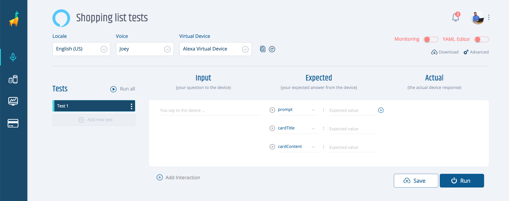
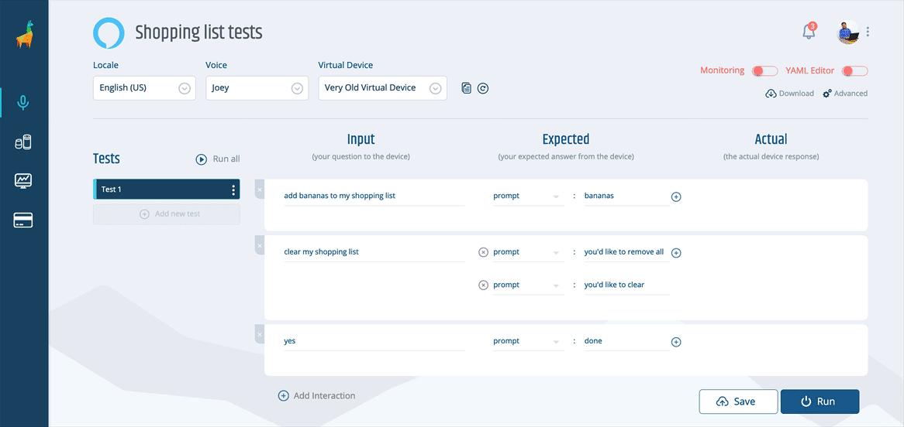
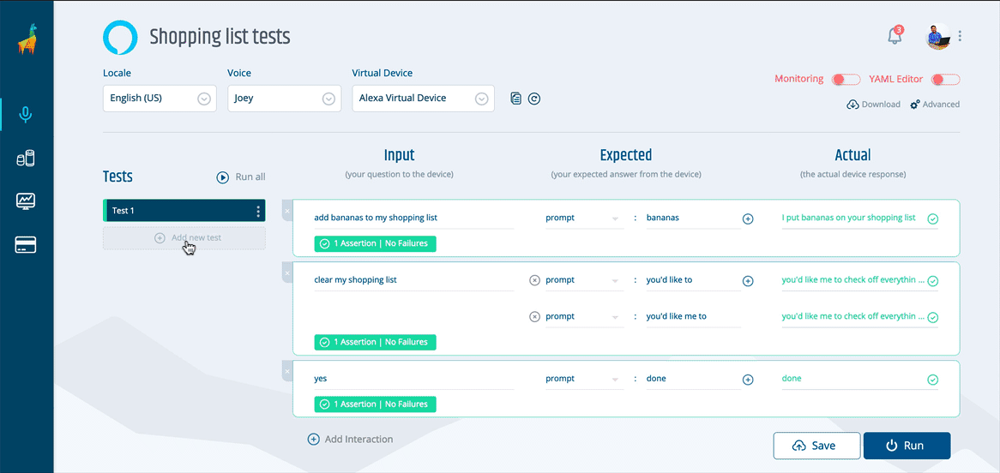
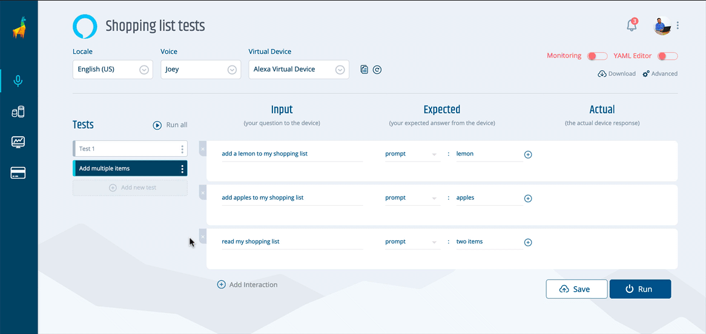
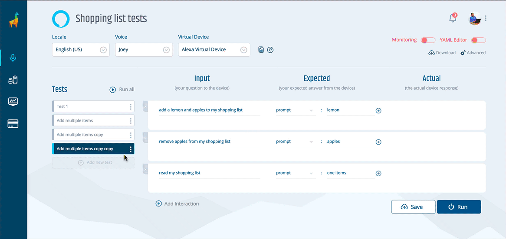
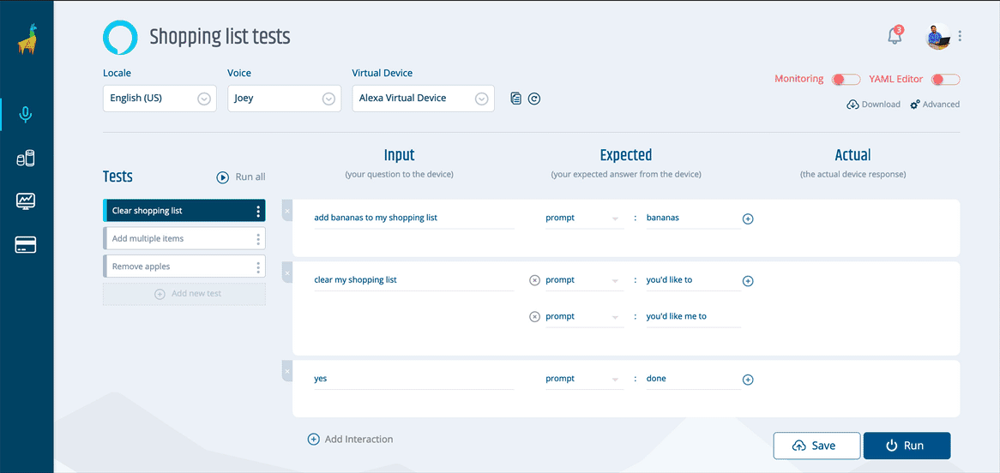

# NEW FROM BESPOKEN! Manage Multiple Tests Easily In One Place
## One of our MOST requested features now available in your Bespoken Dashboard

### Background - Our Evolution Froms Tools To Testing Environment
If you are like us and you love delivering exceptional voice experiences, you know how important it is to have well-organized automated tests: thoughtfully grouped and easily accessible in one place. A lack of organization in your tests leads to wasted time, gaps in your areas under test, and confusion across your team.

While there are several places you can store and organize your YAML scripts (GitHub and other repos come to mind), many of you have asked us to provide a way to do it in our Dashboard. You see, up until now, you could create as many voice apps as you'd want with one caveat: each voice app could only have one single test. 

The limitation remained in place while we focused our efforts on improving and maturing our CLI, something we think we've accomplished in the past few months. And so, today we are excited to announce the release of this long-awaited feature: allowing multiple tests in our UI. With it, we have transitioned to making our Dashboard into a full-fledged, enterprise-grade testing environment.

With it, we have furthered our aim of making automated testing for voice accessible to anyone. We invite everyone, regardless of their technical background (or lack thereof) to try it out and see how easy it is to begin making better voice experiences through our easy-to-use UI.

### How does this work?

Adding more tests is simple, we'll start by creating a new voice app as usual. Once inside your voice app, you'll be presented with this screen.

As you can see, most of the test screen remains unchanged. You can still create your assertions and run them in the same way you did before.

The good stuff, however, is on the left side of the screen. Click on "Add test", then enter a name for your test and press ENTER or TAB and your new test will be created.

Is the new test that you want to create similar to a previous one? Simply click on the three dots next to that test name, click on "Clone" and enter a new name for it. Then modify as you want.

You can also rename a test or delete it on that same menu.

When clicking on "Run all", all of your tests will be run in succession. A green or red indicator to the left of your tests will let you know if your test succeeded or not. Simply click on any of your tests to see its results in detail. This way, it's easy to find errors like mine below.

If you are already familiar with our YAML scripts and prefer to write your tests that way, you can still switch over to our YAML editor and edit, remove or add tests and, of course, run them. Switching back to the UI editor will preserve your changes. 

Finally, you can export your tests as a .zip file anytime you want. The file will contain both the YAML script and the `testing.json` file needed to run your tests using our CLI.

### What's next?
At Bespoken, we want to make sure that our products are your go-to source in voice experiences testing. Our Dashboard plays a key role in that vision, as the one place where you can manage and automate all of your tests. You can think of it as an integrated test environment, one that will give you an improved user experience and increase your testing productivity overall. And, while there are many more steps we have to take to reach that goal, we firmly believe that this is a big step towards that and the foundation of many more good things to come your way.

### Now it's your turn
If you are already a Dashboard user, you can go into any of your voice apps and start adding new tests to them. If you are not, then I invite you to try our 30-day free trial by signing up [here](https://apps.bespoken.io)

Give it a try and let me know your thoughts. Is there something you would like us to improve? A bug that slipped through the cracks? A feature you think is still missing? Contact me at diego@bespoken.io and I'll be glad to take care of it. I'm looking forward to it.
