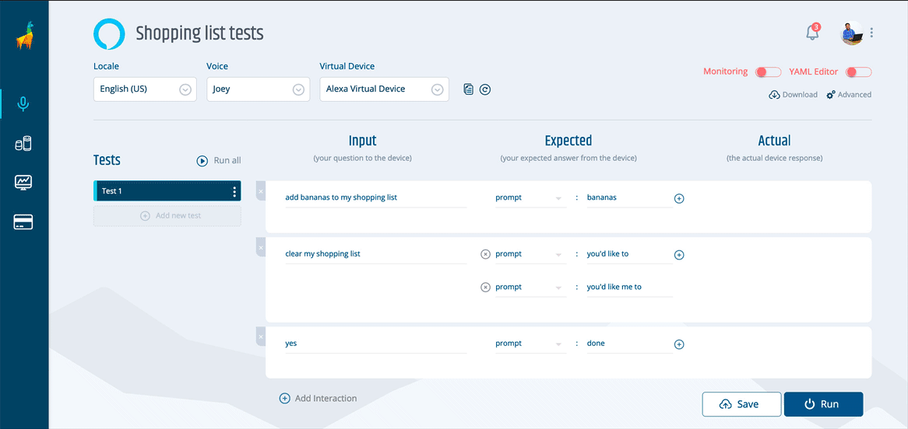

# NEW: adding multiple tests to your voice apps in the Bespoken Dashboard

## A quick background
If you are like us and you love testing your voice experiences from end to end, you know how important it is to have all your tests well grouped, organized and easily accessible under one place. A lack of organization in your tests can lead to hunting and searching for a particular file or test in frustration, wasting your valuable time.

While there are several places you can store and organize your YAML scripts (Github and other repos come to mind), many of you have asked us to provide a way to do it in our Dashboard. You see, up until now, you could create as many voice apps as you'd want with one caveat: each voice app could only have one single test. 

The limitation remained in place while we focused our efforts on improving and maturing our CLI, something we think we've accomplished in the past few months. And so, today we are excited to announce the release of this long-awaited feature: allowing multiple tests in your voice app.

## How does this work?

Adding more tests is simple, we'll start by creating a new voice app as usual. Once inside your voice app, you'll be presented with this screen.

As you can see, most of the test screen remains unchanged. You can still create your assertions and run them in the same way you did before.

The good stuff, however, is on the left side of the screen. Click on "Add test", then enter a name for your test and press ENTER or TAB. A new test has been created.

-- gif for adding a test

Is the new test that you want to create similar to a previous one? Simply click on the three dots next to that test name, click on "Clone" and enter a new name for it. Then modify as you want.

-- gif for cloning

You can also rename a test or delete it on that same menu.

-- gif for deleting

When clicking on "Run all", all of your tests will be run in succession. A green or red indicator to the left of your tests will let you know if your test succeeded or not. Simply click on any of your tests to see its results in detail.

-- gif with a whole test running

If you are already familiar with our YAML scripts and prefer to write your tests that way, you can still switch over to our YAML editor and edit, remove or add tests and, of course, run them. 

-- gif running a YAML test.

Switching back to the UI editor will preserve your changes. 

-- gif switching back

Finally, you can export your tests as a .zip file anytime you want. The file will contain both the YAML script and the `testing.json` file needed to run your tests using our Bespoken CLI.

## Now it's your turn
If you are already a Dashboard user, you can go into any of your voice apps and start adding new tests to them. If you are not, then I invite you to try our 30-day free trial by signing up [here](https://apps.bespoken.io)

Give it a try and let me know your thoughts. Is there something you would like us to improve? A bug that slipped through our hands? Write to me at diego@bespoken.io and I'll be glad to take care of it. We hope you found this useful, we firmly believe it is a big step on improving our Dashboard experience and the foundation of many more good things to come.