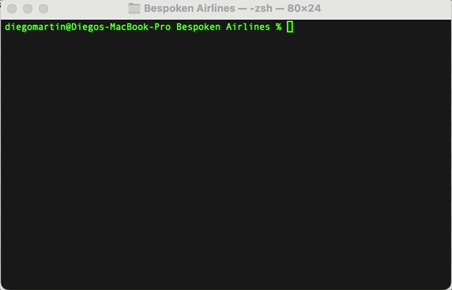
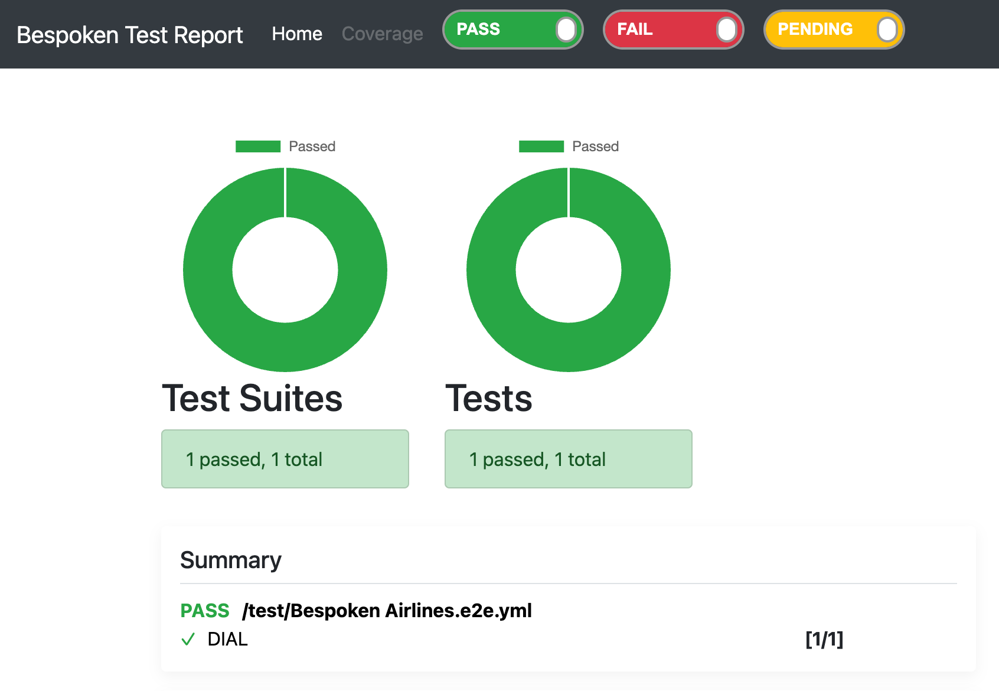
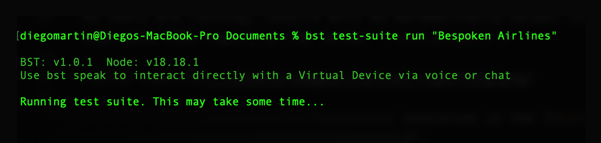

# The Bespoken CLI 

The Bespoken Command Line Interface (CLI) offers a powerful way to run and manage your tests directly from your terminal. This guide will cover installation, available commands, and usage instructions to help you integrate the CLI into your workflow.

## Installation
To install the Bespoken CLI, run the following command using npm:

```sh
npm install -g @bespoken-sdk/cli
```

You will need node version 18 at the minimum.

## Available Commands

### Command - Test
The test command allows you to run tests locally. These are the same tests you download from the Test Page on the dashboard as explained [here](../dashboard/test-page/#downloading-a-test-package). 

To use this command simply unzip the file you downloaded from the Dashboard, navigate to the resulting folder in a terminal and type:
```sh
bst test
```
Test parameters and configuration are taken by default from the `./testing.json` file in the current working directory. Test steps are found in the YAML file within the `/test/` directory.



As tests are running, results will be automatically output to the console. Once a test run has finished, you can find a shareable HTML report in the folder `/test_output/`.



You will also find the results of your execution in the [History Page](../dashboard/history/) of your Dashboard. When using the CLI, the Client column will say "CLI".

### Command - Test Suite 
The test suite command lets you invoke the execution of a test suite directly from the dashboard by specifying the test suite name and optional parameters.

To use this command provide set your api key as an environment variable called `TEST_API_KEY` and then type

```sh
bst test-suite run <TEST_SUITE_ID>
```

TODO, where to get the test suite id from.

```sh
bst test-suite run <TEST_SUITE_NAME>
```

This will run the named test suite within the Dashboard, passing the optional variables for test execution.



When the test is completed, a link to the results in the Dashboard will be provided in the console. The test run result will available in the [History Page](../dashboard/history/), and will always be available to review there.

Additionally, you can also send optional variables to be replaced during the execution like this:

```sh
bst test-suite run <TEST_SUITE_NAME> [KEY1=VALUE1] [KEY2=VALUE2] [KEY3=VALUE3]
```

TBD

## Retrieving Your API Key
To use the `bst test-suite` command, you need to retrieve your API key from the Dashboard. Follow these steps:

1. Navigate to the Dashboard.
2. Click on the user menu at the upper right side of your screen.
2. Click on "My account".
3. Copy the API key at the bottom of the page.

 

## Summary
The Bespoken CLI provides a versatile and efficient way to run your tests both locally and through the dashboard. By integrating it into your development process, you can ensure your conversational applications perform as expected in a streamlined manner.


