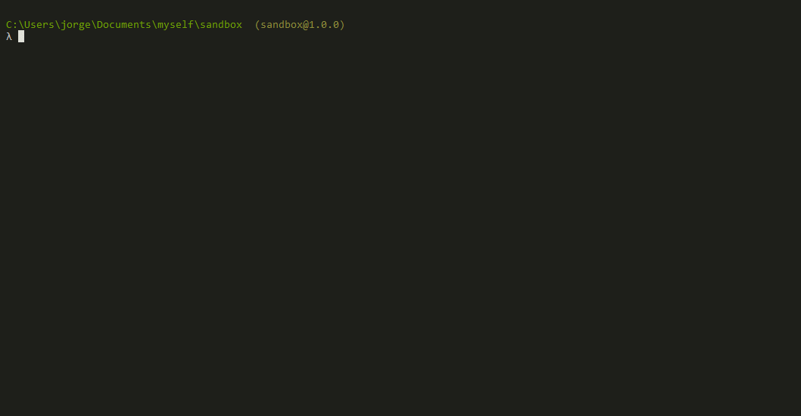
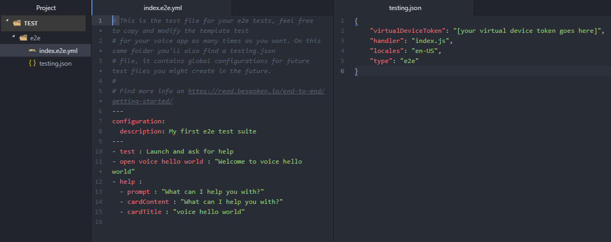

# Complete Guide to Bespoken CLI Commands

## Proxy

### Overview

The proxy command allows you to interact with a local service running on your machine via an Alexa device.  Using it, you can make changes to code running on your machine and immediately make them available via an Echo or the Alexa simulator.

The proxy tool works either directly with Node/JavaScript lambda code - **proxy lambda**.  Or it can proxy any http service using **proxy http**.  

The two commands are described below, as well as the urlgen helper command.

### bst proxy lambda

**Overview**  

The proxy lambda command allows you to run a Lambda as a local service your machine.

**Note**

- The command currently only supports Node/JavaScript Lambdas.

**Usage**  

To use it, invoke it with the Lambda file to run.  The proxy will automatically use the latest code in your working directory.

Syntax:
```bash
$ bst proxy lambda <PATH_TO_LAMBDA>
```

Example:  
```bash
$ bst proxy lambda index.js
```

You can learn more here at our [Node.js Tutorial](/cli/tutorials/tutorial-lambda-nodejs/):

### bst proxy http

**Overview**  

Proxy http allows you to interact with a local service running on your machine (on a port) via an Alexa device.

**Usage**  

The proxy http command takes one command, the `<PORT>` that your local Alexa service is listening on.  All traffic coming from Alexa will be forwarded to it.

Syntax:
```bash
$ bst proxy http <PORT>
```

Example:
```bash
$ bst proxy http 9999
```

You can learn more here at our [Java Tutorial](/cli/tutorials/tutorial-local-server-java/)

**Options**

The `--verbose` flag will print out the requests and responses from all calls made to your skill.

To use it, just start up the proxy with:
```bash
$ bst proxy http 9999 --verbose
```


### bst proxy function

**Overview**

The proxy function command allows you to run a Google Cloud Function as a local service your machine.

**Usage**

To use it, invoke it with the Cloud Function file to run.  The proxy will automatically use the latest code in your working directory.

Syntax:
```bash
$ bst proxy function <FUNCTION_FILE> <FUNCTION_NAME>
```

Example:
```bash
$ bst proxy function index.js myFunction
```

## Utter

### Overview

The utter command takes an utterance ("play next song") and turns into a JSON payload, imitating as if it was coming from Alexa itself.

It works in a manner very similar to the Alexa simulator available via the Alexa developer console.  

To start using it, you will need to have your Interaction model, it could be written as a single file or separated as an Intent Schema and Sample Utterances.
By default, we have adopted the pattern used by the Alexa Skills Sample projects, we support the [Interaction model pattern](https://github.com/alexa/skill-sample-nodejs-fact/) and also the [Intent Schema and Sample Utterances](https://github.com/alexa/skill-sample-nodejs-hello-world/) one.

That is, we look for the Interaction Model files inside a folder called models or speechAssets (if you're using the older style) located off the source root.

You can specify an alternative location via options to the command-line.

### Uttering

To invoke the utter command, simply type:
```bash
$ bst utter <UTTERANCE>
```

For example:
```bash
$ bst utter Hello World
```

The utter command will return the full request and response of the interaction with your Skill service.

By default, the system will:

* Use the Interaction Model in the models folder under the current working directory
* If there's no Interaction Model, it will use the Intent Model and Sample Utterances in the speechAssets folder under the current working directory
* Use the service currently running via the `bst proxy` command

If no service is currently running via bst proxy, and HTTP endpoint can be specified with the `--url` option:
```bash
$ bst utter Hello World --url https://my.skill.com/skill/path
```

### Interaction Model Format and Location
If your Interaction Model is not stored under ./models, or you have multiple locales, you can use an option to specify another location.

By default, we look for:

* `./models/en-US.json`

"Example With Alternative Locale:"
```bash
$ bst utter Hello World -m models/en-UK.json
```

These files are JSON, and typically defined by the ASK CLI tool from Amazon.

An example of these file can be found [here](https://github.com/alexa/skill-sample-nodejs-fact/blob/en-US/models/en-US.json).

### Working With Slots

Slot handling is automatic - we check for defined slots and samples and extract them. To send an utterance that uses slots, just write it as you would say it.

For example, if the sample utterance was defined as:
```js
HelloWorld Hello world, my name is {Name}
```

Then the utter command would be:
```js
$ bst utter Hello World, my name is John
```

The value `John` will then be automatically placed in the Name slot for the utterance on the request.

## Launch

### Overview

The launch command sends a launch request to your service as if it was coming from alexa itself.

To start using it, you will need to support the "LaunchRequest" event on your handler for the received Intents in your service.

### Usage

To invoke the launch command, simply type:
```bash
$ bst launch
```

The launch command will return the full request and response of the interaction with your Skill service.

By default, the system will use the service currently running via the `bst proxy` command

### Working without using the proxy

If no service is currently running via bst proxy, an HTTP endpoint can be specified with the `--url` option:
```bash
$ bst launch --url https://my.skill.com/skill/path
```


## Intend

### Overview

The intend command generates intent requests for your service as if they were coming from Alexa itself.

It works in a manner very similar to the Alexa simulator available via the Alexa developer console.  

To start using it, you will need to have your Interaction model, it could be written as a single file or separated as an Intent Schema and Sample Utterances.
By default, we have adopted the pattern used by the Alexa Skills Sample projects, we support the [Interaction model pattern](https://github.com/alexa/skill-sample-nodejs-fact) and also the [Intent Schema and Sample Utterances](https://github.com/alexa/skill-sample-nodejs-hello-world/) one.

That is, we look for the Interaction Model files inside a folder called models or speechAssets (if you're using the older style) located off the source root.

You can specify an alternative location via options to the command-line.

### Intending

To invoke the intend command, simply type:
``` bash
$ bst intend <INTENT_NAME> [SlotName=SlotValue...]
```

For example:
```bash
$ bst intend HelloIntent SlotA=SlotValue
```

The intend command will return the full request and response of the interaction with your Skill service.  

By default, the system will:

* Use the Interaction Model in the models folder under the current working directory
* If there's no Interaction Model, it will use the Intent Model and Sample Utterances in the speechAssets folder under the current working directory
* Use the service currently running via the `bst proxy` command

If no service is currently running via bst proxy, and HTTP endpoint can be specified with the `--url` option:
```bash
$ bst intend HelloIntent --url https://my.skill.com/skill/path
```

### Interaction Model Format and Location
If your Interaction Model is not stored under ./models, or you have multiple locales, you can use an option to specify another location.

By default, we look for:

* `./models/en-US.json`

"Example With Alternative Locale:"

```bash
$ bst intend HelloIntent -m models/en-UK.json
```

These files are JSON, and typically defined by the ASK CLI tool from Amazon.

An example of these file can be found [here](https://github.com/alexa/skill-sample-nodejs-fact/blob/en-US/models/en-US.json).

## Speak

### Overview

The speak command communicates to a virtual device to test your skills with text as if they were voice commands.

It allows you to test your skill without using a physical device and it will return the generated audio response converted to text as well as the card data and possible audio streams that could have been returned.

### Speaking

To invoke the speak command, simply type:
```bash
$ bst speak <UTTERANCE>
```

For example:
```bash
$ bst speak Tell My Skill hello
```

On the first run the command will provide the instructions to obtain a token. You will see an output like this:

```bash
BST: v1.0.8  Node: v7.10.1

You need a token for this option to work, get it here:

	https://apps.bespoken.io/dashboard/skills/skill-Generated-Name/validation
	(Bespoken Dashboard account required for use of this feature)

Then try again with:

	bst speak --token <ProvidedToken> <Speech to try>
```


Provide the token generated by following the instructions on the provided link.
```bash
	bst speak --token <ProvidedToken> Tell My Skill hello
```

Now you will get the expected response
```bash
	Transcript:
	Hello from My Skill.
```

From then on you can use the command without the token.

## Init

### Overview

The init command helps you creating all the files and folders you need to start unit or end to end testing your Alexa skills and Google Actions.

### Usage

To run the init command, simply open a terminal and, in the root folder of your project, type:
```
$ bst init
```

The command will ask you for the following data:

- Test type: unit or e2e
- Name of your voice app
- Voice Platform: Alexa or Google
- Locales of your voice app: en-US is the default. You can add more via a comma-separated list - for example: en-US, de-DE, es-ES
- For unit testing only:
  - Path of your handler file: default is index.js
  - Path of your dialogflow directory (only for Google actions)
- For end to end testing only:
  - Virtual device token

 Here's a preview:


After that, the command will create a "test" directory with all the needed files and folders.



You can execute your tests by typing `bst test` on the same command line.

