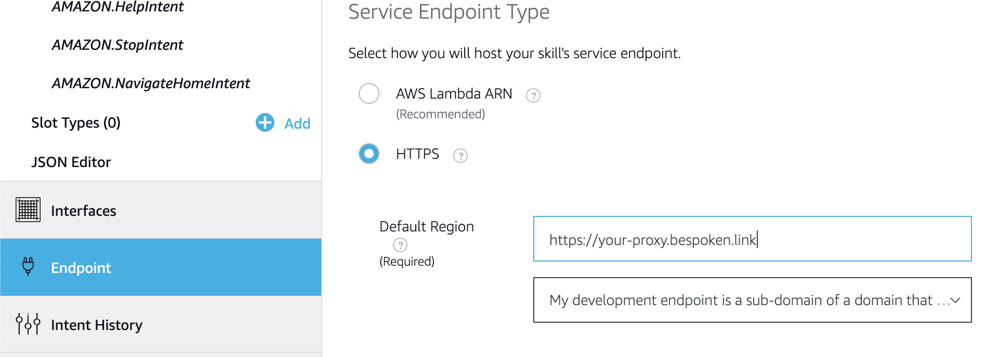

# Debugging Python voice apps locally with Bespoken

This tutorial shows you how to get started developing with bst for Alexa Skills Kit in Python using [Flask-Ask](https://flask-ask.readthedocs.io/en/latest/).

## Prerequisites

* Bespoken command-line tools (bst)
    * `$ npm install bespoken-tools -g`
    <!-- * [Installation Instructions](./../getting-started#Installation/) -->
* Amazon Developer Account
    * [Amazon Developer](https://developer.amazon.com/alexa/)
* Flask-Ask
    * `$ pip install flask-ask`

## Getting Started

We will use the tidepooler sample John [provides](https://github.com/johnwheeler/flask-ask/tree/master/samples/tidepooler/) in the Flask-Ask repo..

Clone the repo:
```bash
$ git clone https://github.com/johnwheeler/flask-ask.git
```
And jump to the root of the tidepooler sample:

```bash
$ cd flask-ask/samples/tidepooler/
```

and start the local server for the skill:

```bash
$ python tidepooler.py
```

The tidepooler skill is now running on your local machine, listening on port 5000.

## Start bst proxy

Open a new terminal and start the bst proxy:

```bash
$ bst proxy http 5000
```

where `http` is the protocol for the proxy and `5000` is the port the tidepooler skill server is listening on.

## Configure your Skill

From the [Alexa Skills Kit list](https://developer.amazon.com/edw/home.html#/skills/list) within the Amazon Developer's Console:

__Click on the "Create Skill" button__

__Fill out the Information tab__


* Give your skill a name, 'tidepooler' for example
* Click on the __"Create Skill"__ button

__Leave the default "Start from scratch" option and click on "Choose"__

__Fill out the Interaction Model__


* Copy the Interaction Model from [here](https://gist.githubusercontent.com/jperata/e9866c5d86311ae6558012a7b9e153c7/raw/4cbe189c6f9c55bf8bb65be321b04bc597645c28/en-US.json)
* Click on the __"JSON Editor"__ from the Interaction Model Options
* Paste the Interaction Model
* Click on the __"Save Model"__ button
* Click on the __"Build Model"__ button

__Configure the Endpoint__

When you started the proxy, bst printed out a URL that you need to configure your skill:

```bash
$ bst proxy http 5000
BST: v2.3.14  Node: v8.9.4

Your public URL for accessing your local service:
https://your-proxy.bespoken.link
(Be sure to put in your real path and other query string parameters!)

INFO  2016-09-12T17:34:52.202Z Connected - proxy.bespoken.tools:5000
```

Copy this URL as your endpoint, then:

* Select the __"Endpoint"__ option in your skill configuration
* Select __"HTTPS"__ for your service endpoint type
* Paste the proxy url
* On the SSL Certificate Option, select the middle option "My development endpoint is a sub-domain of a domain that has a wildcard certificate from a certificate authority"



## Test
 * Go to the __"Test"__ tab in the skill Configuration
 * Enable testing for development by clicking in the selector on the top of the page, it starts in "Off" by default.
 * On the service simulator, type: "Ask hello world".

You should get a valid JSON in reply:


After that you can try other utterances like:

```bash
get high tide
```
```bash
when is the next highest water for virginia beach
```
```bash
what cities are supported
```

We can also use the bst utter command to test locally instead of using the Service Simulator.  In order to do this, you need to tell Flask-Ask to not verify the request signatures (which it does by default).

After [line 55](https://github.com/johnwheeler/flask-ask/blob/master/samples/tidepooler/tidepooler.py#L55) of tidepooler.py, insert the following line:

```python
app.config['ASK_VERIFY_REQUESTS'] = False
```

__Please Note:__  As mentioned in the [documentation](https://flask-ask.readthedocs.io/en/latest/configuration.html), this should be disabled for production.  

Restart your python skill server and from a new terminal (make sure bst proxy is still running) at the root of the project run:

```bash
$ bst utter -i speech_assets/IntentSchema.json -s speech_assets/SampleUtterances.txt get high tide
```

You should see the request and then the response back from tidepooler.py.

You can even test with slots by including your slot value in brackets, for example:

```bash
$ bst utter -i speech_assets/IntentSchema.json -s speech_assets/SampleUtterances.txt when is the next highest water for {virginia beach}
```
