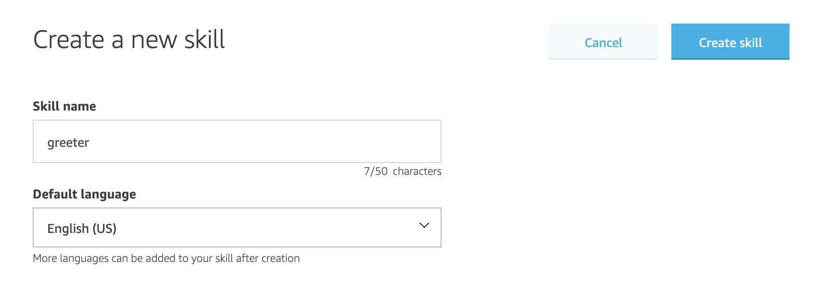
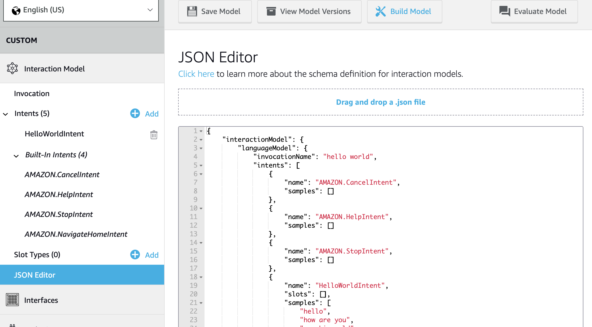
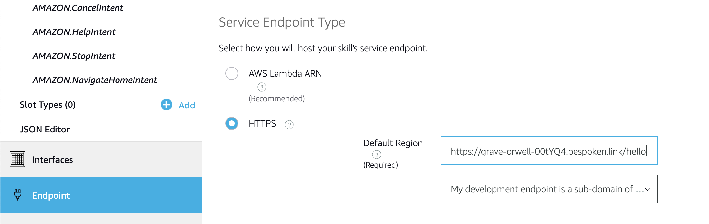
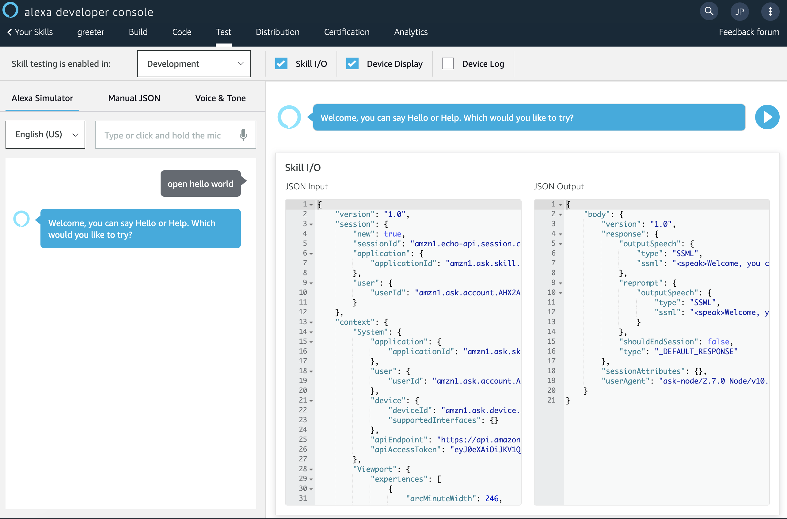

# Debugging your Java voice apps locally with Bespoken

This tutorial shows you how to get started developing for Alexa with Java and Maven.  

## Prerequisites

* bespoken tools (bst)
    * `$ npm install bespoken-tools -g`
    * [Installation Instructions](../getting-started.html#Installation)
* maven
    * OSX with homebrew: `$ brew install maven`
    * [Installation Instructions](https://maven.apache.org/install.html)
* Amazon Developer Account
    * [Amazon Developer](https://developer.amazon.com/alexa)

## Getting Started

Clone the bst project:
```bash
$ git clone https://github.com/bespoken/bst
```

Go to the sample java skill
```bash
$ cd bst/samples/java
```

## Run the Sample Java Skill

From within bst/samples/java directory, compile the example with this command:  
```bash
$ mvn compile
```

Run the server with this command:  
```bash
$ mvn exec:java -Dexec.executable="java" -DdisableRequestSignatureCheck=true -Dexec.args=$@
```

The service will listen on port 9999 by default.

## Start bst proxy

Open a new terminal and start the proxy for port 9999:

```bash
$ bst proxy http 9999
```

## Configure your Skill

From the [Alexa Skills Kit list](https://developer.amazon.com/edw/home.html#/skills/list) within the Amazon Developer's Console:

__Click on the "Create Skill" button__

__Fill out the Information tab__



* Give your skill a name, 'greeter' for example
* Click on the __"Create Skill"__ button

__Leave the default "Start from scratch" option and click on "Choose"__


__Fill out the Interaction Model__



* Copy the Interaction Model from [here](https://raw.githubusercontent.com/alexa/skill-sample-nodejs-hello-world/master/models/en-US.json)
* Click on the __"JSON Editor"__ from the Interaction Model Options
* Paste the Interaction Model
* Click on the __"Save Model"__ button
* Click on the __"Build Model"__ button

__Configure the Endpoint__

When you started the proxy, bst printed out a URL that you need to configure your skill:

```bash
$ bst proxy http 9999
BST: v2.3.14  Node: v8.9.4

Your public URL for accessing your local service:
https://your-proxy.bespoken.link
(Be sure to put in your real path and other query string parameters!)

```

You first need to modify it to the path that your server is listening on, in this case it is `/hello`.

```bash
https://your-proxy.bespoken.link/hello
```

Copy this URL as your endpoint, then:

* Select the __"Endpoint"__ option in your skill configuration
* Select __"HTTPS"__ for your service endpoint type
* Paste the proxy url
* On the SSL Certificate Option, select the middle option "My development endpoint is a sub-domain of a domain that has a wildcard certificate from a certificate authority"




## Test
 * Go to the __"Test"__ tab in the skill Configuration
 * Enable testing for development by clicking in the selector on the top of the page, it starts in "Off" by default.
 * On the service simulator, type: "Ask hello world".

You should get a valid JSON in reply:



## Next Steps
You can now start adding functionality to your skill. To learn more about coding Alexa Skills, see the official [documentation](https://github.com/amzn/alexa-skills-kit-java)

You can also try it out on an Alexa device like an Echo, as long as it is registered with your account.
Just say "Open hello world" to use it.
