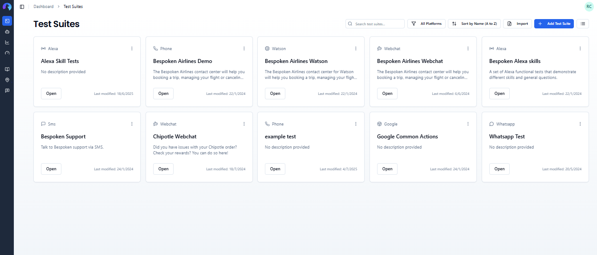
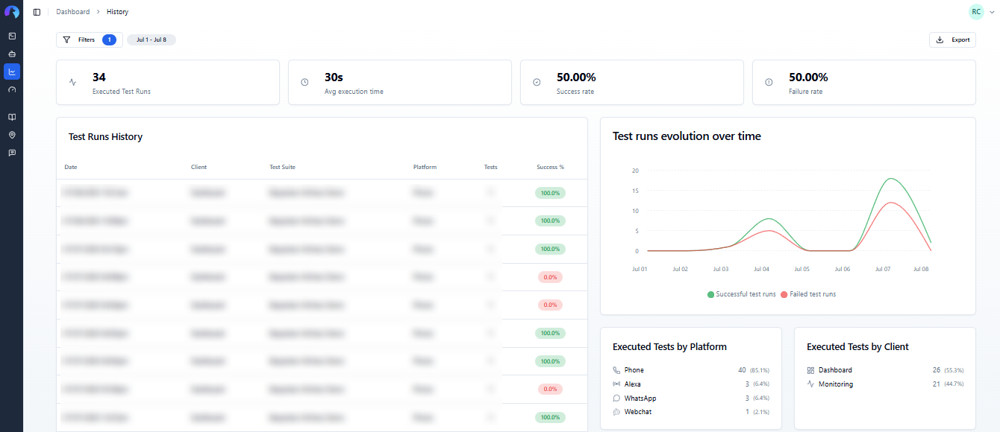
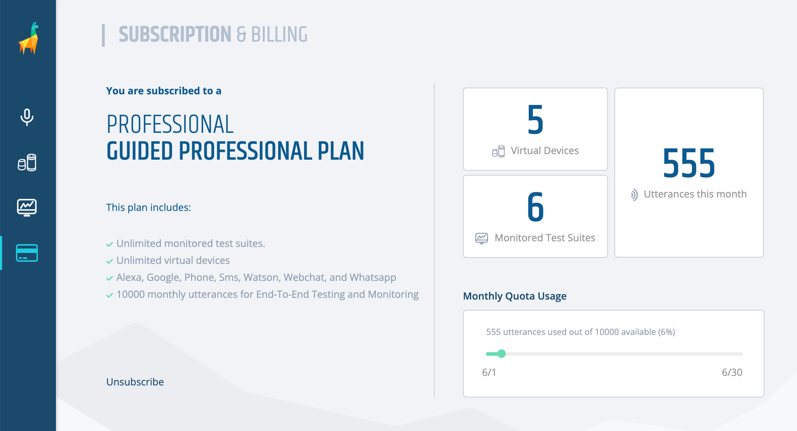
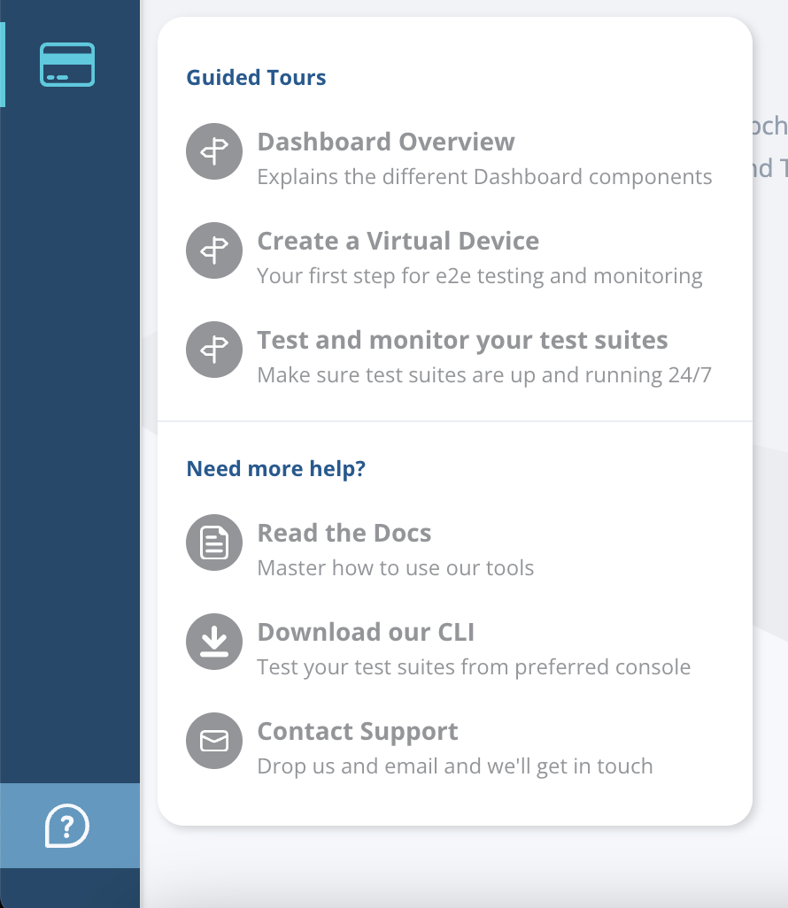

# The Bespoken Dashboard

Welcome to the Bespoken Dashboard, your central hub for managing and optimizing your conversational platform testing and monitoring efforts. With our intuitive web UI, you can create and manage test suites and projects, monitor their performance, and access comprehensive reports and insights to ensure the quality and reliability of your conversational experiences. Whether you're testing an IVR, Webchat, Alexa, Google Assistant, or any other conversational platform, our Dashboard provides the tools and functionality you need to enhance your testing workflows and achieve your testing goals.

::: tip Important
Before starting, you'll need a Bespoken account. Head over to [dashboard.bespoken.ai](https://dashboard.bespoken.ai) and sign up for a free trial for your team. Then come back to explore our key features together.
:::

## Projects Management

The Projects screen is the first screen you'll see when you access the Dashboard. It contains all the projects, and test suites within them, that your team has access to. You can reach this page by clicking on the first icon on the sidebar to the left of your screen.

The Projects section allows you to organize your test suites into structured groups for easier navigation and collaboration. It helps teams keep test cases well-organized and improves efficiency when working across multiple clients or environments. 

On this page, you can create, delete, filter, and sort your projects. For detailed instructions on how to do this, click [here](/dashboard/projects). 

## Test Suites Management

By selecting a project, you'll see all the test suites it contains. Each test suite is a collection of test cases, which are fundamental for your quality assurance processes.

On this page, you can create, delete, clone, filter, and sort your test suites. For detailed instructions on how to do this, click [here](/dashboard/test-suites).

## Data Tables

Data Tables provide a centralized way to manage test data and variables for your conversational testing workflows. Accessible from the sidebar, this feature allows you to create and maintain reusable datasets that can be referenced across multiple test suites.

With Data Tables, you can organize customer account information, test phone numbers, locale-specific data, and any other variables you need for comprehensive testing. Each table is structured with customizable columns and rows, making it easy to manage different test scenarios. You can then reference this data in your test suites using simple variable syntax like `${data.fieldKey}`, enabling dynamic testing without duplicating test scripts.

On this page, you can create, edit, and delete data tables, manage columns and rows. The Excel-like editing experience makes it familiar and efficient to work with your test data. Learn more about Data Tables [here](/dashboard/data-tables).

## Managing Virtual Devices

Virtual devices are at the core of what Bespoken does. They represent real devices for the platform you are testing, be it a phone, Alexa device, web browser, or more. The Virtual Device Manager page is where you'll find your virtual devices. It's accessible by clicking on the "Virtual Devices" icon on the left sidebar.

Here, you can create, delete, rename, filter, or update the credentials associated with your devices. Learn more about this page by clicking [here](/dashboard/virtual-devices).

## Team Member Management

When you create a Bespoken account, you create an account for your organization. This allows you to add more people to your team and collaborate on creating and running functional tests. You'll manage this on the "Manage Organization" page, accessible by clicking on the on the "Manage" button that appears for admin users on the lower left corner of the screen.

On this page, you can invite new team members, manage their permissions, remove people from your organization, and resend or cancel invites. Learn more about this page by clicking [here](/dashboard/manage-organization).

## History and Reporting

The "History" page provides an overview of your results for the past week and beyond. It contains graphs and relevant stats from your past runs. You can access it by clicking on the third icon on the left sidebar of the Dashboard.

On this page, you can view your results in graphical, statistical, and tabular forms. You can also export the results in CSV format and see detailed information about each individual test run. Learn more about it [here](/dashboard/history).

## Subscription and Billing

The Subscription and Billing page is accessed by clicking the fourth icon on the left sidebar of the Dashboard. It allows you to see your current plan details, how many virtual devices and monitored tests you have, and your current usage of your monthly utterance quota.

## Help and Tours

At the bottom of the sidebar, click the question mark icon to access our product tours, which will help you navigate the Dashboard, create a virtual device, and explore the test page for the first time. Additionally, you'll find access to these docs, our CLI, and contact support via email.

