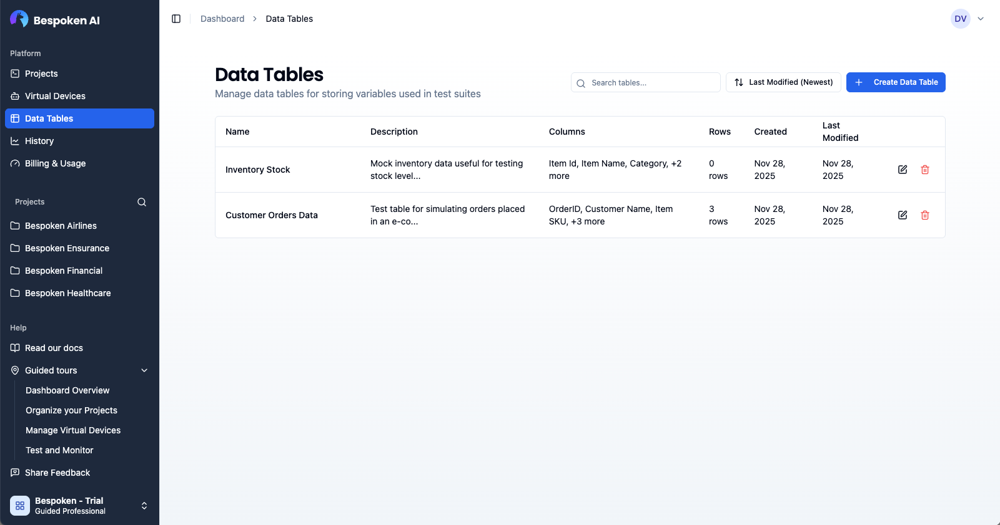
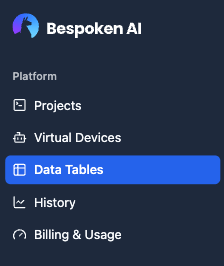
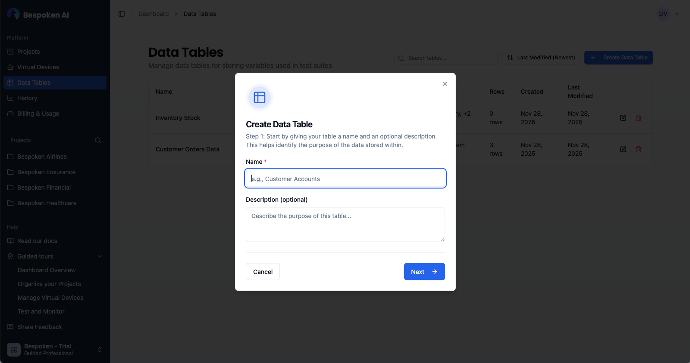
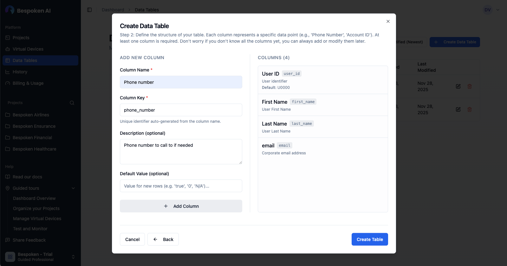
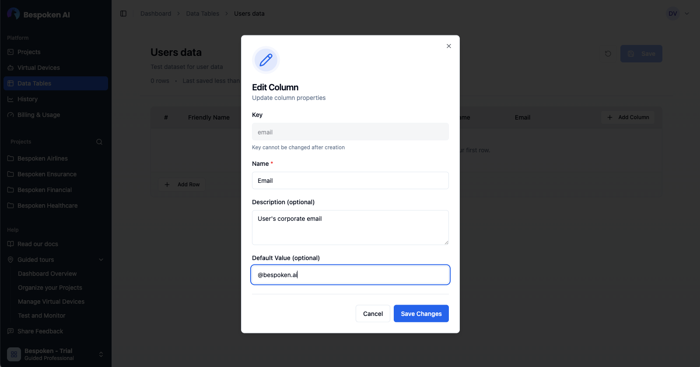
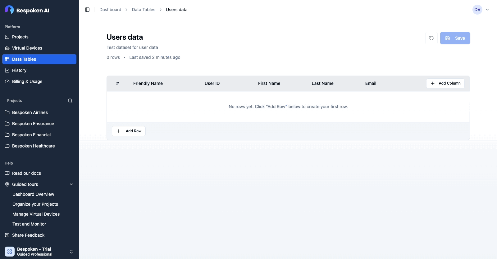
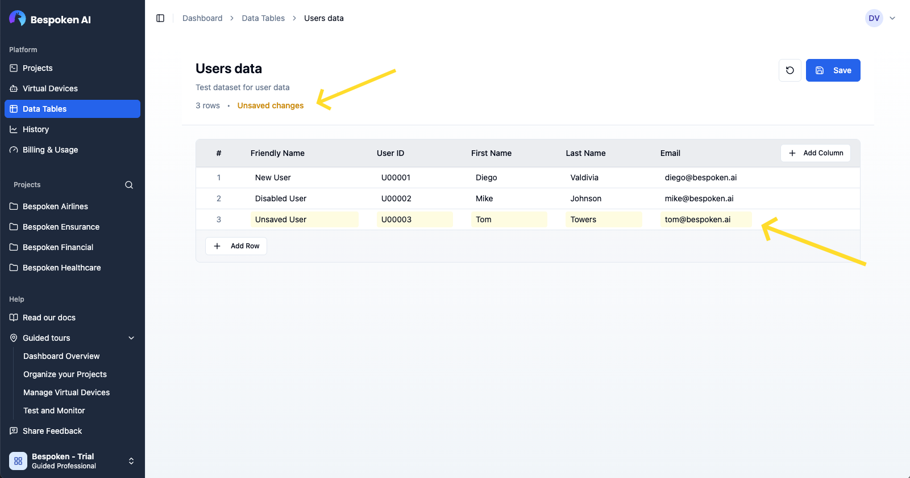

# Data Tables

Data Tables provide a powerful way to manage test variables and data sets for your conversational testing workflows. By storing data in reusable tables, you can easily test different scenarios, manage customer account data, and maintain test datasets across multiple test suites.

## What are Data Tables?

A data table is a structured collection of data organized in rows and columns, similar to a spreadsheet. Each table contains:

- **Columns (Fields)**: Define the structure of your data with a unique key, display name, and optional description
- **Rows**: Individual data records, each with a friendly name for easy identification
- **Data Values**: The actual test data stored as text values in each cell

::: tip Note
Data tables are organization-specific. All members of your organization can access and use the same data tables across different projects and test suites.
:::

## Accessing Data Tables

Data tables can be accessed from the main navigation by clicking on "Data Tables" in the sidebar.

## Creating a Data Table

To create a new data table:

1. Navigate to the **Data Tables** page.
2. Click **"Create Data Table"** in the top-right corner.
3. Enter a **name** and optional **description**, then click Next.

4. Define your initial columns (Key, Name, Description, Default Value).
5. Click **"Create Table"**.

## Managing Data Tables

You can manage your data tables directly from the main list:

- **Search**: Use the search bar to find tables by name or description.
- **Sort**: Organize tables by Name, Last Modified, Created date, or Row count.
- **Edit Info**: Click on a table to open it, then edit the name or description.
- **Delete**: Click the trash icon on a table card to remove it.

::: warning Note
Deleting a data table is permanent. Any test suites using this data table will need to be updated.
:::

## Editing Data Tables

The data table editor allows you to manage the structure and content of your tables.

### Columns

You can add, edit, reorder, and delete columns to define your data structure.

- **Add**: Click the **Add column** button. Enter the name, description and default value for your new column.
- **Edit**: Use the dropdown menu on column headers. Keep in mind, a column can be renamed but it's key cannot change.
- **Delete**: Use the dropdown menu on column headers. Keep in mind, deleting a column instantly removes the data for that column on each row.
- **Reorder**: Drag and drop column headers to reorder. The new column order is instantly saved to the database.

### Rows

Rows contain your actual test data.

- **Add**: Click **"Add Row"** or press Tab in the last cell.
- **Edit**: Click any cell to type. Use Tab/Enter to navigate.
- **Friendly Names**: Give each row a descriptive name for easy reference in tests.
- **Delete**: Hover over the row number and click the trash icon.

## Saving Changes

The editor data uses an explicit save model. Changes are tracked but not persisted until you click **Save**.

- **Unsaved Changes**: Indicated by highlighted cells and a header message.
- **Discard**: Revert all unsaved changes to the last saved state.

::: warning Note
Unlike rows, any structural changes to the datatable (adding or removing columns) are immediately saved to the database.
:::

## Using Data Tables in Test Suites

Once you have created your data tables, you can use them in your test suites to create dynamic, data-driven tests. For detailed instructions on how to select data tables and use data variables in your tests, please refer to the [Test Page documentation](test-page.md#using-data-variables).
