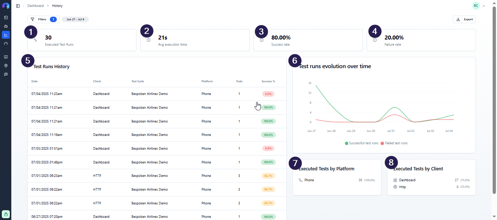
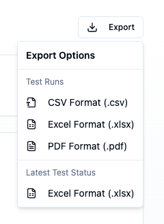
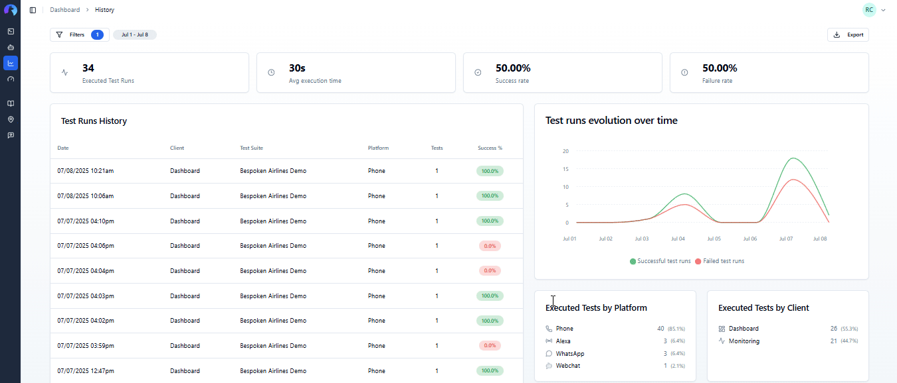
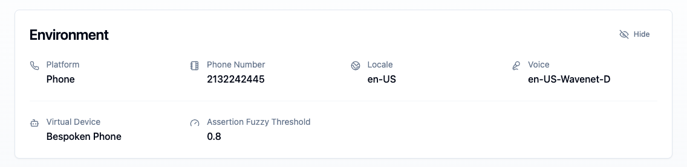
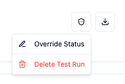
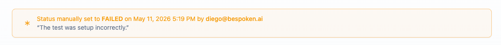

# The History Page
The History page is where you'll find all the historic results for your test runs. By default, you'll see results for the last two weeks on all your test suites and across the different Bespoken clients (API, CLI, Dashboard, Monitoring). Among the charts and data you can find are: 

1. Number of executed tests
1. Average execution time per test
1. Success rate for the selected dates
1. Failure rate for the selected dates
1. Test run results: Tabular data with information about the number of test suites and tests executed on a run.
1. Test runs evolution over time: Line graphic that shows the number of executed tests, number of successful and failed tests per day.
1. Test runs by platform: Chart that shows the percentage of tests executed across different platforms available.
1. Test runs by client: Chart that shows the percentage of tests executed across different Bespoken clients.

All data can be filtered by Project, Test Suite Name, Platform, Client, Result, and Dates by changing these values on the "Filters" button at the top of the page. Filters are reflected in the URL, so you can bookmark or share a pre-filtered view directly.

## Exporting Results

Click the **Export** button in the top-right corner to download your data. There are two export types:

- **Test Runs** — exports the paginated table data. Available in CSV, Excel, and PDF formats.
- **Latest Test Status** — exports a snapshot of the most recent result for each test. Available in CSV and Excel formats.

## Test Run Results and Details
The test run results table at the bottom of the screen is where you'll find detailed information about each run with Bespoken. It comprises the following columns:
- Date and time of the test run
- Client used to run your tests (Dashboard, CLI, HTTP)
- Test Suite name
- Platform that was tested
- Number of tests executed
- Success percentage. This column is color-coded based on the results, where green represents a success level above 80%, yellow represents a success level above 50%, and red represents any value below that.

Clicking on any of the rows within the table will open a detailed view of said run with the following sections:

- **Header** — test suite name, status badge, date/time, duration, and a link to the parent project (if assigned).
- **Environment** — a collapsible card showing the full execution environment: platform, phone number or URL, locale, voice ID, virtual device, and fuzzy threshold. Extra fields are hidden behind a "Show more" toggle when there are many.

- **Test result filtering** — results can be filtered by outcome (all, active, passed, failed, etc.) to focus on specific tests in large suites.
- **Detailed results** — all steps executed per test including utterances, expected results, and actual results. Failed steps are highlighted in red.
- **Export** — an export button on the detail page lets you download results for that individual run.

Finally, for each executed IVR and Webchat tests, recorded evidence is available to view, listen, and download.

## Admin Actions

Users with the **admin** or **owner** role have access to additional actions from the shield icon button in the top-right corner of the test run detail page.

### Deleting a Test Run

Select **Delete Test Run** from the admin menu. A confirmation dialog will appear before the deletion is carried out. After deletion you are redirected back to the History page.

### Overriding Test Run Status

Select **Override Status** (or **Edit Override** if one already exists) to manually force the test run status to PASSED or FAILED. A reason is required. Overridden runs are marked with a small asterisk (`*`) next to the status badge, and a banner below the header shows who set the override, when, and the stated reason.

To revert to the status determined by actual results, select **Clear Override** from the same admin menu.

### Overriding Individual Test Results

Within the test results list, each test row also supports per-result status overrides. Admins can set any test result to PASSED or FAILED with a reason. Overridden results are marked with an asterisk and can be cleared individually.
