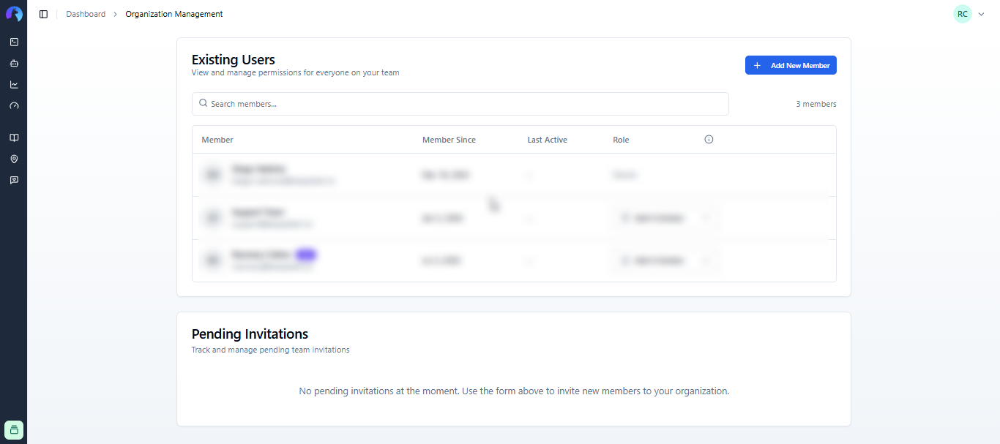

# Organization Management
Use this page to invite team members to your organization so that you can share your Bespoken account and work on tests together. To access this page, simply click on the "Manage" button next to your organization name in the lower left corner of the page.

## Inviting a Member
To invite a new member to your account, enter their email and assign a role to them. Available roles are:
- **Member**: Can manage tests, virtual devices, and see the testing run history.
- **Admin**: In addition to member privileges, admins can add and remove members from the team.

When a new member is invited, you'll see the invitations sent at the bottom. You'll be able to cancel an invitation or resend it if needed. Your invitee will be emailed a link to create their account and join your organization.

## Changing a Member's Role
If you are an admin, changing a teammate's role is as easy as selecting the desired role from the Role dropdown and selecting a new one. Changes are automatically saved.

## Removing a Member
In the same way, removing a member from the team is done by clicking on the trash icon. You will be asked to provide confirmation before successfully removing a member.
