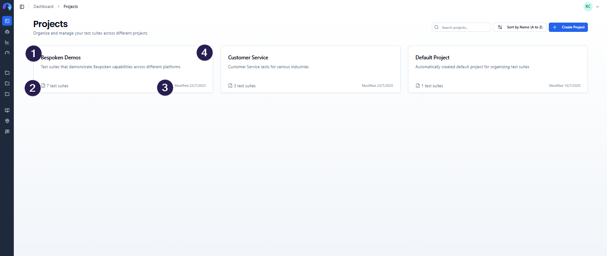

# Projects

Projects provide a powerful way to organize and manage your test suites in the Bespoken Dashboard. By grouping related test suites into projects, you can maintain a cleaner workspace and improve collaboration across different testing scenarios.

## What are Projects?

A project is a container that groups related test suites together. For example, you might create separate projects for:
- Different applications or products you're testing
- Different development stages (development, staging, production)
- Different teams or departments
- Different clients or customers

Each project contains:
- **Name**: A descriptive title for your project
- **Description**: Optional details about the project's purpose
- **Test Suites**: All test suites belonging to this project
- **Metadata**: Creation date, last modified date, test suite count

## Creating Projects

### From the Projects Dashboard

1. Navigate to the **Projects** page from the main navigation.
2. Click the **"Create Project"** button in the top right corner.
3. Enter a **project name** (required).
4. Add an optional **description** to explain the project's purpose.
5. Click **"Create Project"**

## Managing Projects

### Project Dashboard Overview

The Projects dashboard provides a comprehensive view of all your projects with the following features:

#### Search and Filtering
- **Search bar**: Find projects by name or description
- **Real-time filtering**: Results update as you type
- **Case-insensitive**: Searches match regardless of capitalization

#### Sorting Options
Access sorting options via the sort dropdown:
- **By Name**: Alphabetical order (A-Z or Z-A)
- **By Modified**: Most recently updated first or last
- **By Test Suites**: Projects with most or fewest test suites first
- **By Keyword Search**: Use the search bar to filter projects by name or keywords

#### Project Cards
Each project is displayed as a card showing:
- Project name and description
- Test suite count
- Last modified date
- Pin status (if pinned)
- Quick action menu

### Project Actions

#### Pinning Projects
Pin frequently used projects for quick access:
- Click the **pin icon** in the project card menu
- Pinned projects appear at the top of the dashboard
- Maximum of **5 projects** can be pinned per organization
- Pinned projects also appear first in the sidebar navigation

#### Editing Projects
To modify project details:
1. Click the **three-dot menu** on any project card
2. Select **"Edit"**
3. Update the name or description
4. Click **"Save Changes"**

#### Deleting Projects
1. Click the three-dot menu on the project card
1. Select "Delete"
1. Confirm the deletion in the dialog
1. The project will be removed permanently if no test suites are present

⚠️ Note: Projects with test suites cannot be deleted. Please move or delete the test suites first.

## Project Navigation

### Sidebar Integration

Projects are integrated into the main sidebar navigation:

#### Smart Visibility
- **When expanded**: Shows up to 5 projects total (pinned projects first)
- **When collapsed**: Prioritizes pinned projects, fills remaining slots with unpinned
- **"Show More" button**: Reveals additional projects when expanded

#### Search in Sidebar
- Click the **search icon** next to "Projects" in the sidebar
- Search functionality works the same as the main dashboard
- Press **X** or collapse the sidebar to clear search

#### Project Selection
- Click any project in the sidebar to navigate to its test suites
- Current project is highlighted in the navigation
- Project context is maintained across browser sessions

## Project Workflow

### Typical Project Workflow

1. **Create Project**: Set up a new project with a descriptive name
2. **Add Test Suites**: Create or move test suites into the project
3. **Pin Important Projects**: Pin frequently accessed projects for quick access
4. **Organize**: Use search and sorting to manage multiple projects
5. **Collaborate**: Share project context with team members

### Best Practices

#### Project Organization
- Use clear, descriptive project names
- Add meaningful descriptions to help team members understand the project's purpose
- Group related test suites logically (by feature, environment, or team)

#### Naming Conventions
Consider establishing naming conventions like:
- `[Product] - [Environment]` (e.g., "ChatBot - Production")
- `[Team] - [Feature]` (e.g., "Mobile Team - Voice Features")
- `[Client] - [Application]` (e.g., "Acme Corp - Customer Service Bot")

#### Project Limits
- Maximum of **5 pinned projects** per organization
- No limit on total number of projects
- Each project can contain unlimited test suites 

## Integration with Test Suites

Projects are tightly integrated with the test suites workflow:

### Project Context
- All test suites must belong to a project
- When viewing test suites, you're always in the context of a specific project
- The project name appears in the page header
- URL structure reflects the project context: `/projects/{projectId}`

### Cross-Project Operations
- **Move test suites** between projects

- **Clone test suites** to other projects

See the [Test Suites documentation](test-suites.md) for detailed information about working with test suites within projects.

## Troubleshooting

### Common Issues

#### Project Not Found
If you see a "Project Not Found" error:
- The project may have been deleted
- You may not have access to the project
- Check the URL for typos
- Return to the Projects dashboard to see available projects

#### Cannot Pin More Projects
If you can't pin a project:
- You may have reached the limit of 5 pinned projects
- Unpin an existing project first to make room
- Only organization members can pin projects

#### Empty Project List
If you don't see any projects:
- You may need to create your first project
- Check if you're in the correct organization
- Verify your permissions with your organization administrator

### Getting Help

If you encounter issues with projects:
1. Check this documentation for common solutions
2. Contact your organization administrator for permission issues
3. Reach out to Bespoken support for technical problems to support@bespoken.ai 

---

*Projects help you stay organized and improve productivity by grouping related test suites together. Start by creating your first project and experience the benefits of organized testing workflows.*