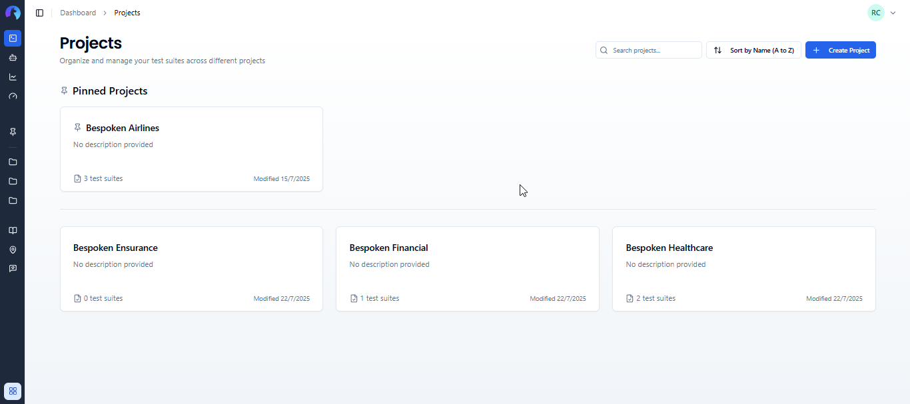
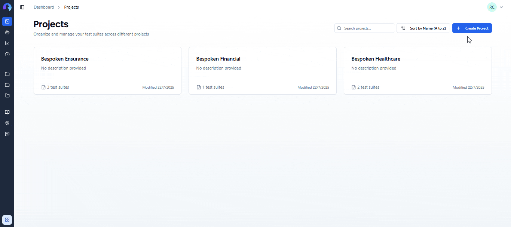
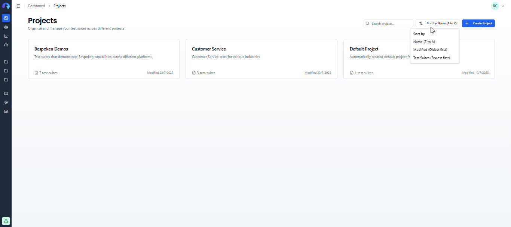
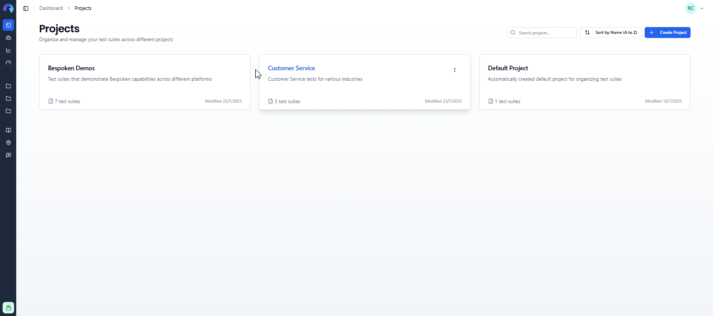
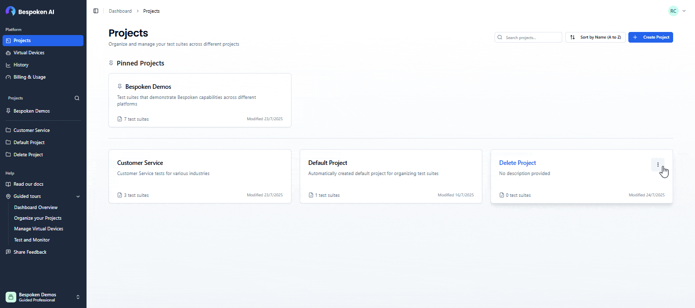
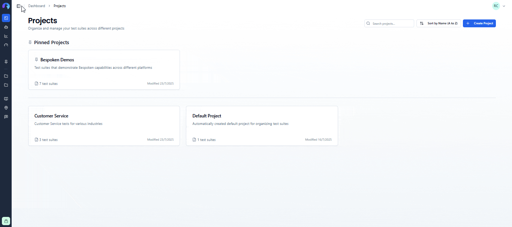
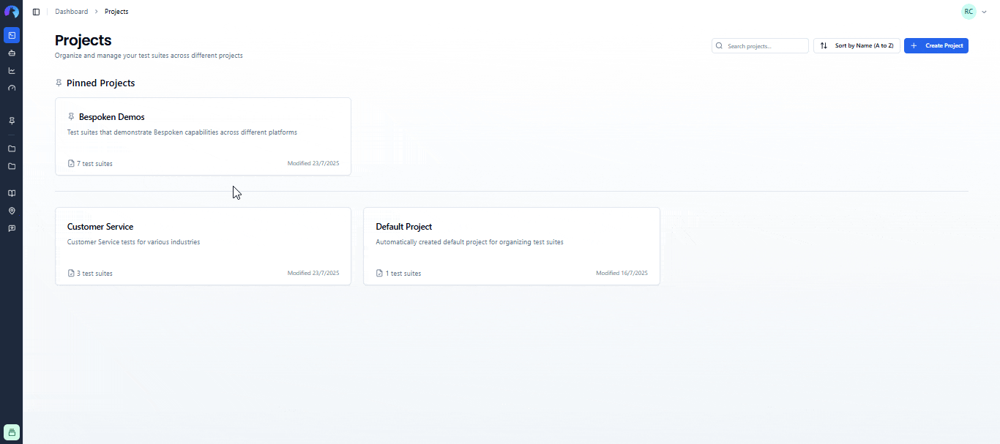
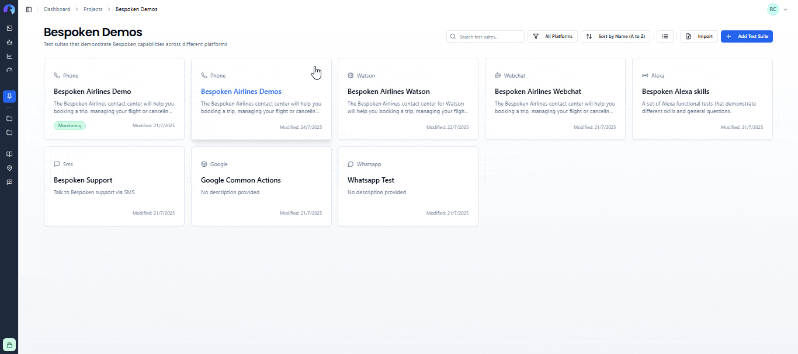

# Projects

Projects provide a powerful way to organize and manage your test suites in the Bespoken Dashboard. By grouping related test suites into projects, you can maintain a cleaner workspace and improve collaboration across different testing scenarios.

## What are Projects?

A project is a container that groups related test suites together. For example, you might create separate projects for:
- Different applications or products you're testing
- Different development stages (development, staging, production)
- Different teams or departments
- Different clients or customers

Each project contains:
- **Name**: A descriptive title for your project
- **Description**: Optional details about the project's purpose
- **Test Suites**: All test suites belonging to this project
- **Metadata**: Creation date, last modified date, test suite count

In this article, we'll detail the different options you have to manage them.

## Creating Projects

To create a new project:

1. Navigate to the **Projects** page from the main navigation
2. Click **"Create Project"** in the top-right corner
3. Enter a **project name** (required)
4. Add an optional **description** 
5. Click **"Create Project"**

You'll be taken to the project's test suites page where you can start adding test suites.

## Managing Projects

### Searching and Sorting Projects

You can find projects quickly using the search bar at the top of the Projects page. Results update as you type and are case-insensitive.

Use the sort dropdown to organize your projects:
- **By Name**: Alphabetical order (A-Z or Z-A)
- **By Modified**: Most recently updated first or last  
- **By Test Suites**: Projects with most or fewest test suites first

### Pinning Projects

Pin frequently used projects to keep them at the top and in your sidebar:

1. Click the **three-dot menu** on any project card
2. Select **"Pin Project"**
3. Pinned projects appear at the top of the dashboard and in sidebar navigation

::: tip Note
You can pin up to 5 projects per organization.
:::

### Editing Projects

To modify a project:

1. Click the **three-dot menu** on any project card
2. Select **"Edit"**
3. Update the name or description
4. Click **"Save Changes"**

### Deleting Projects

To delete a project:

1. Click the **three-dot menu** on the project card
2. Select **"Delete"**
3. Confirm the deletion in the dialog

::: tip Note
Projects with test suites cannot be deleted. Please move or delete the test suites first.
:::

## Project Navigation

### Sidebar Integration

Projects appear in the main sidebar for quick access:

- **Pinned projects** appear first
- **Other projects in alphabetical order** fill remaining spots
- Click **"Show More"** to see additional projects when the sidebar is expanded
- Use the **search icon** next to "Projects" to search within the sidebar

Click any project in the sidebar to navigate to its test suites.

## Working with Test Suites

All test suites belong to a project. When you're viewing test suites, you'll see:

- **Project name** in the page header
- **Project description** (if provided) below the project name
- Only test suites belonging to the current project

### Moving Test Suites Between Projects

You can move test suites from one project to another:

### Cloning Test Suites to Other Projects  

You can also clone test suites to different projects:

For more details about working with test suites, see the [Test Suites documentation](test-suites.md).
