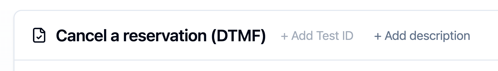
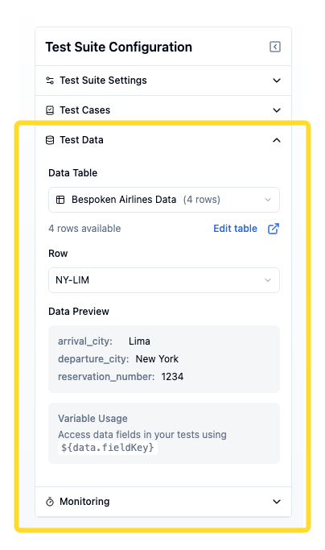
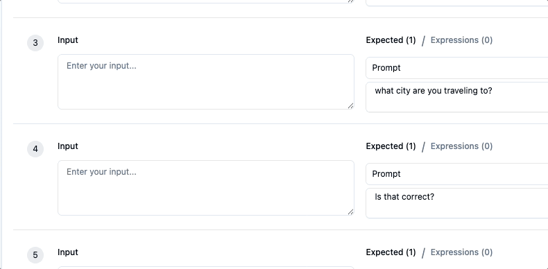
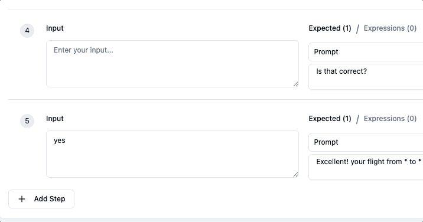
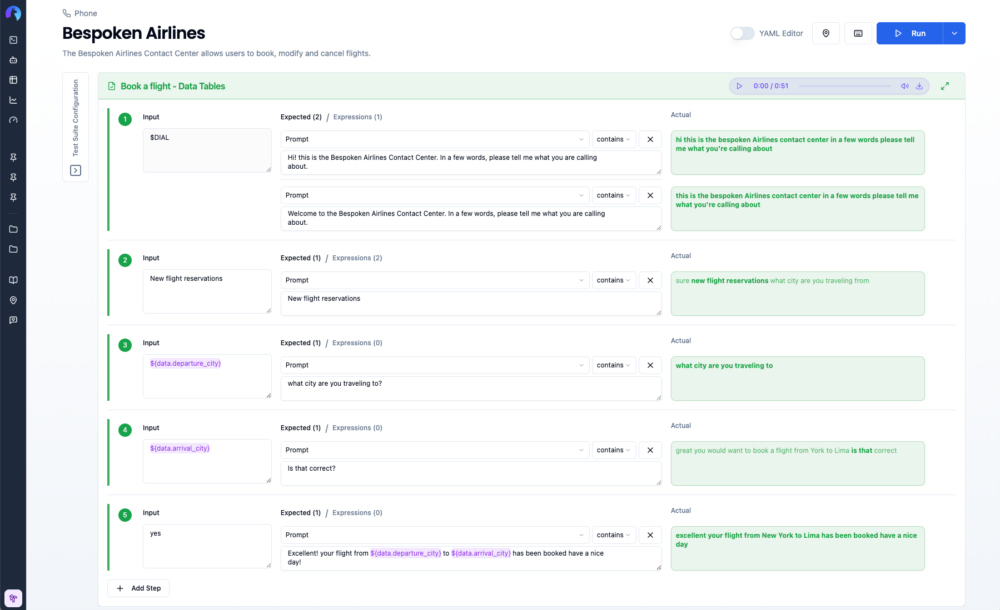
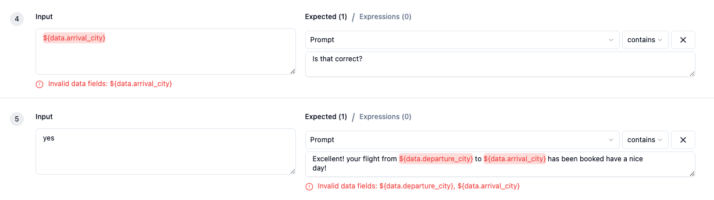
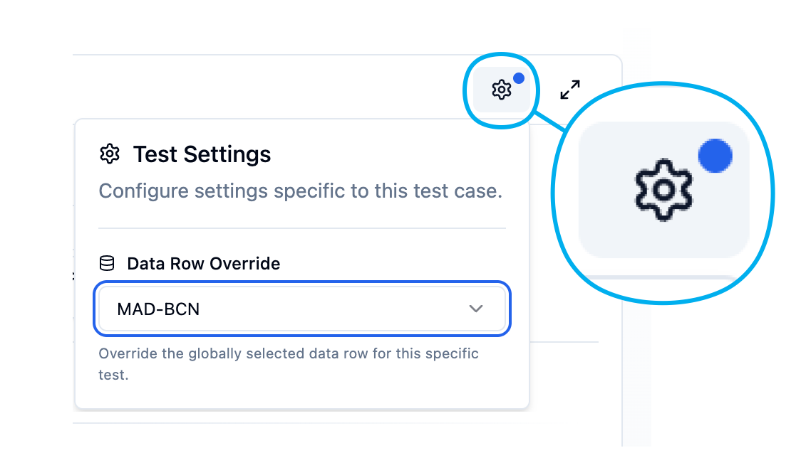

# Test Page

Now that you have created a test suite and your virtual devices, you are ready to work on the test page.

::: tip Important
In this article, we'll learn about aspects of this page that are common to all the platforms Bespoken supports. Platform-specific guides can be found [here](/guides/).
:::

The test page is divided into two main areas that work together to help you build comprehensive tests:

1. **Configuration Panel** (left sidebar):
    - Test Suite Settings: Basic configuration for running your test suite
    - Test Cases: Management of different test scenarios
    - Test Data: Connect data tables for dynamic test variables
    - Monitoring: Automated test scheduling and failure notifications

2. **Test Editor** (main area): 
    - Test name and metadata editing
    - Visual or YAML editing of test steps and assertions
    - Test execution and results viewing
    - Real-time validation of your conversational flows

<br>


## Configuration

For any platform you are working with, this configuration section will contain the minimum required parameters to start a test. These could include a locale, a voice, a URL, a phone number, etc. Common to all platforms, you'll need to specify the Virtual Device you want to use for testing.

## Test Case Management


In this section of the page, you'll find all the test cases available for your current test suite. You can:
- Add a new test
- Rename a test
- Delete a test
- Clone a test
- Flag a test as "only" (more on this [here](#running-your-tests))
- Flag a test as "skip" (more on this [here](#running-your-tests))
- Reorder existing tests by dragging and dropping them in the desired order (or using the keyboard: **Space** to start/end a drag, **arrow keys** to move, **Escape** to cancel)

## Test Editor

The Test Editor is the main area where you build and run your tests. It includes a header for managing test metadata (name, ID, and description) and a script area composed of three columns — Input, Expected, and Actual — where you add interactions, configure assertions, and execute your test cases.

### Test Metadata

Each test case has optional metadata you can edit inline directly from the Test Editor header:

- **Test Name**: Click the test name to rename it. Press **Enter** to save or **Escape** to cancel.
- **Test ID**: A short identifier for traceability — useful for linking tests to external systems like a Jira ticket or test management tool (e.g., `TC001`). Click the badge to edit it, or hover over the header to reveal the **+ Add Test ID** prompt when none is set.
- **Description**: A free-text description of what the test validates. Hover over the header to reveal the **+ Add description** prompt, then click to open an inline text area. The description saves automatically on blur.



### Test Script Structure

#### Input Column

The Input column contains what we will say to the platform we are testing. This could represent text that we will send to a messaging system, text that will be converted to audio (using a specified locale and voice), a URL containing pre-recorded audio to send, or even jQuery instructions to execute against a webpage.

You can include data variables (e.g., `${data.account_number}`) directly in your inputs — see [Working with Test Data](#working-with-test-data) for details.

##### Silent Input

For certain platforms (phone, webchat, and Watson), you may want to test scenarios where no input is sent to the system. This is useful for testing reprompts, timeout handling, or any situation where the bot should respond without receiving user input. To do this:

- Hover over any input field to reveal the mute icon.
- Click the icon to enable a "silent" input
- The input field will display "No input will be sent." in italic text
- Click the icon again to disable and return to normal input mode

When this mode is enabled:

- The input field becomes read-only 
- The silent message icon remains visible with a blue highlight to indicate the active state
- For phone tests: Silent audio is sent to the system (simulating a user not speaking)
- For webchat/Watson tests: No message is sent (simulating a user not typing)


In YAML format, muted steps are represented with the $SILENCE keyword:

``` yaml
- $SILENCE: I didn't hear that, could you repeat?
```

#### Expected Column

In this column, we'll define the expected value for the current test interaction that, if received as part of the response, would make the assertion pass. The structure for each assertion is:

`[property] [operator] [value]`

A default assertion would look like this:

`[prompt] [contains] [value]`

Where `prompt` is the property that returns the main response content from the platform being tested: a transcription, a text message, a chatbot reply, etc., and `contains` represents a partial equality operator or, in other words, a substring search. In YAML format, the contains operator is represented by `:`. E.g., `prompt : "expected value"` would be valid if the response we get is "expected value" or "this is the expected value I got."

You can also use data variables in expected values — see [Working with Test Data](#working-with-test-data) for details.

<!-- Other available operators are:
- != Not equal to
- \> Greater than
- \>= Greater than or equal
- < Less than
- <= Less than or equal -->

#### Actual Column

As you might expect, the Actual column contains the response that comes back from the platform being tested. This column will only appear when a test is running and will be populated sequentially as the responses come back.

When data variables are used, you'll see the actual replaced values in the results, making it easy to verify that the correct data was used in the test.

#### Test Steps

You can add more test steps (also known as interactions) to your test case by clicking the "Add step" button below the last step on your test, or by clicking the "plus" sign to the right of each step. 


Note that the plus sign will "insert" a new step below the current one, while the "Add step" button will always add an interaction at the end. Similarly, if you want to remove a step, you can click on the "x" icon to its right.

## Running Your Tests

Once you have configured and created all the steps for your test case, simply click on the "Run" button, and Bespoken will start running your tests. Responses will start populating the "Actual" column one by one as the test progresses. Be aware, if you leave the page at this moment, you won't be able to see your test results.


If you want to run all test cases within your test suite, click on the "Run all tests" option button on the dropdown menu next to the "Run" button.
- If you only want to run a subset of tests, you can specify which ones to run by adding the "only" flag to them, by opening the three-dot menu on each test.
- Similarly, you can decide which tests to ignore altogether by selecting the "Skip" flag.


::: warning Note
Running a whole test suite can take a while. Tests are run sequentially, and you won't be able to see all the results until all tests have completed running. You should also not leave the page while the test suite is running.
:::

## Interpreting the Results

As each response comes back, Bespoken will evaluate the assessments for the current interaction and will highlight in green the interactions that were successful and in red the interactions that failed. Moreover, Bespoken will highlight and format in bold the parts of the response that made the assertion pass. From our previous example where we looked for `expected value`, the response would look like: "this is the **expected value** I got."


When data variables are used in your tests, the actual column will show the resolved values, making it easy to verify that the correct data was injected and that responses matched expectations.

## Working with Test Data

The Test Data section allows you to connect data tables to your test suite, enabling dynamic test scenarios with variable data.

### Setup

1. In your test suite configuration, go to the **Test Data** section.
2. Select a **Data Table** and a specific **Row**.



For more detailed information about creating and managing data tables, see the [Data Tables documentation](data-tables.md).

### Using Data Variables

Once you have configured a data table, you can insert data fields into your tests.

1. Use the **Insert Data Field** button that appears when hovering over the `Input` or `Expected` fields to add data fields values to your tests.



2. Alternatively, type `${` to trigger the data fields autocomplete.



3. Run your test and verify how values are replaced during execution.



#### Data Field Syntax

Use the syntax `${data.fieldKey}` to reference values.

**Examples:**
- `${data.account_number}`
- `${data.customer_name}`

When you hover over a token, a tooltip shows the field's friendly name, key, and its current value from the selected data row. If the key doesn't match any column in the table, the token is highlighted in red and the UI shows an alert — useful for catching typos early.



The autocomplete popup triggered by typing `${` also displays the field name, key, value preview, and description for each available field, making it easy to pick the right one without leaving the editor.

### Per-Test Data Row Override

While the global data row is set in the **Test Data** section of the configuration panel, you can override it for individual test cases. This is useful when you want most tests to use one data row but need specific tests to run with different data.

To override the data row for a specific test:

1. Select the test case you want to configure.
2. Click the **Settings** (gear icon) button in the top-right corner of the Test Editor. This button is only visible when a data table is configured for the test suite.
3. In the **Test Settings** popover, use the **Data Row Override** dropdown to select the desired row.



A small blue dot on the Settings button indicates that a row override is active for the current test.

To remove the override and revert to the globally selected row, open the same popover and select **Default (Global Selection)**.

::: tip
Use per-test overrides when testing edge cases or platform-specific behaviors that require different input data — for example, testing how your system handles a premium account versus a basic account without creating separate test suites.
:::

### Example: Testing with Customer Data

Here's a complete example using data tables for IVR customer account testing:

**Data Table: "Customer Accounts"**

| Friendly Name | phone | account_number | customer_name | balance |
|---------------|-------|----------------|---------------|---------|
| Premium Customer | +15551234567 | ACC12345678 | John Doe | 1250.50 |
| Basic Customer | +15559876543 | ACC87654321 | Jane Smith | 500.00 |

**Test Steps:**
```yaml
---
- test: Check Account Balance
- $DIAL: Welcome to our service
- ${data.account_number}: Hello ${data.customer_name}
- check balance: Your balance is ${data.balance} dollars
```

When the test runs with "Premium Customer" selected:
- `${data.account_number}` → "ACC12345678"
- `${data.customer_name}` → "John Doe"  
- `${data.balance}` → "1250.50"

You can easily switch to test with "Basic Customer" by selecting a different row, without changing any test code.

::: tip Best Practice
Use descriptive friendly names for your data rows (e.g., "Premium Customer - Valid Card" instead of "Row 1"). This makes it much easier to select the right test data when configuring your test suite.
:::

### In YAML

When using data tables, you'll see the data table and row configuration in the suite's YAML, and a per-test override represented as a `settings` block inside the test:

```yaml
---
- test: Check Premium Account
- settings:
    dataTableRowId: "row-id-here"
- $DIAL: Welcome to our service
- ${data.account_number}: Hello ${data.customer_name}
```

When no `settings` block is present, the test uses the globally selected row defined in the suite's configuration.

## Other Options

### YAML Editor

All our tests are saved in YAML. You can directly edit your test suite in text format by clicking on the YAML editor toggle at the top right corner of the page. A typical test suite might look like this:

```yaml
---
- test: Test 1
- open my skill: welcome to my skill

---
- test: Test 2
- open my skill: welcome to my skill
- what is on my list: you have the following items on your list
```

Where:
- `---` is the start of a new test case
- `- test: Test 1` represents the name of your first test
- `open my skill: welcome to my skill` represents a first interaction in the form of `[input] [operator] [expected value]`

You can safely toggle between the regular editor and the YAML editor, and changes will be reflected on both sides.

### Compact Mode

The Test Editor can be switched to a compact layout to fit more content on screen. Click the **minimize icon** in the top-right corner of the Test Editor to enable it. Click the **maximize icon** to return to normal layout.

Compact mode reduces spacing, font sizes, and padding throughout the editor. On smaller resolutions, compact mode is enabled automatically and the toggle is hidden. Your preference is saved across sessions.

### Monitoring


You can enable Monitoring for your test suite by clicking on the Enable Monitoring toggle on the configuration panel. You can read more about how monitoring can help you ensure that your system remains stable by clicking [here](/monitoring/).

### Advanced Settings


The "Advanced settings" window, which you can access by clicking on "Show advanced settings" link on the Test Suite Settings panel, contains parameters that can further modify the behavior or evaluation of a test run. Common parameters are:

| Property | Description | Default Value |
|---|---|---|
| Assertion fuzzy threshold | A decimal number from 0 to 1 that represents the threshold applied when using fuzzy matching to verify a prompt assertion. Setting this property to 1 means the values have to match exactly. | 0.8 |
| Max. response wait time | Interval in milliseconds to wait for a response. | 120000 |
| Stop tests on first failure | Stop the current test as soon as the first error is detected, saving time between runs| false |
| Lenient Mode | Removes common punctuation signs and extra white spaces from the transcript. | false |

Additionally, each platform has its own set of unique properties that will be explained in the [platform-specific guides](/guides/) section of these docs.
