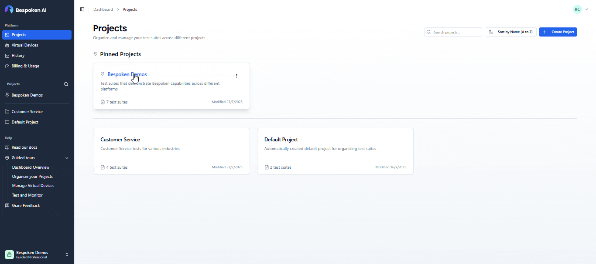
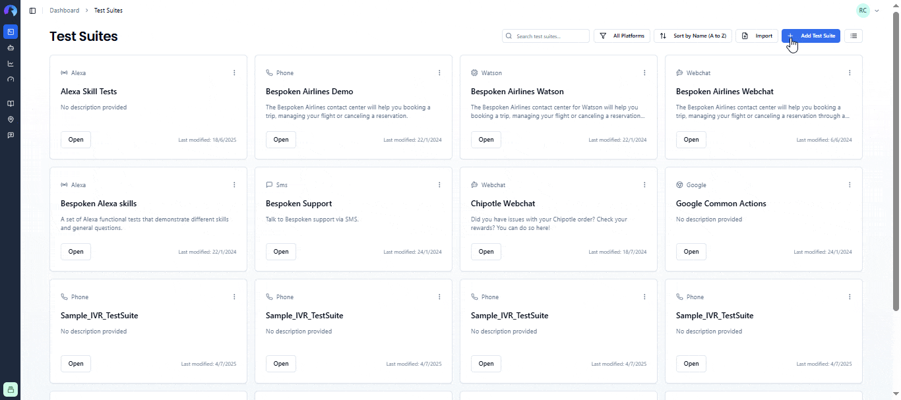
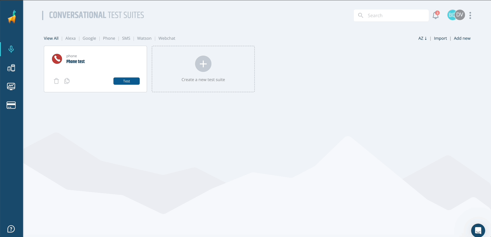
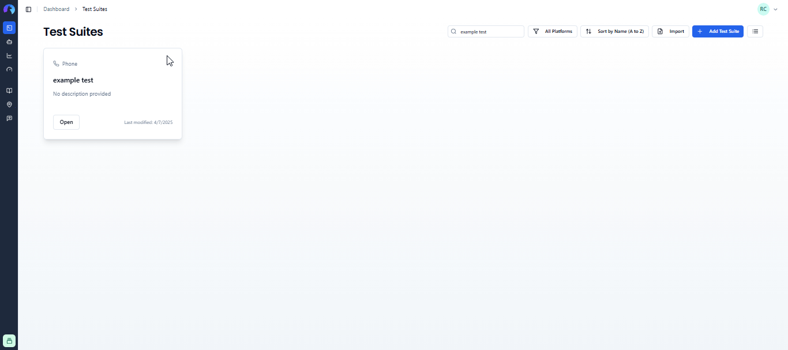
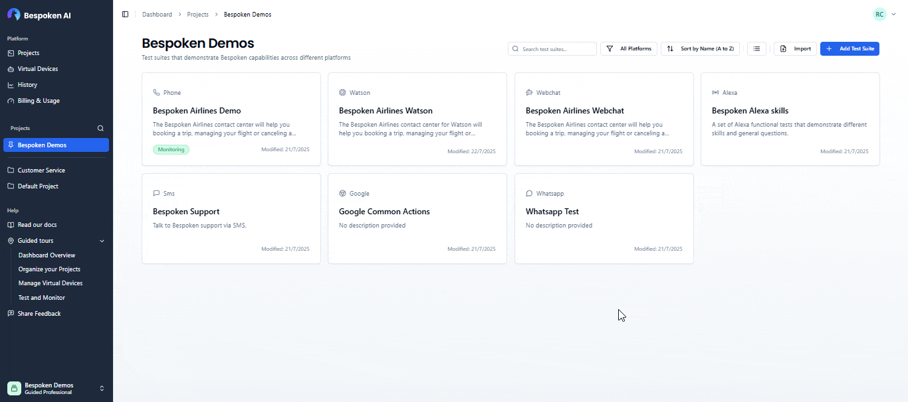
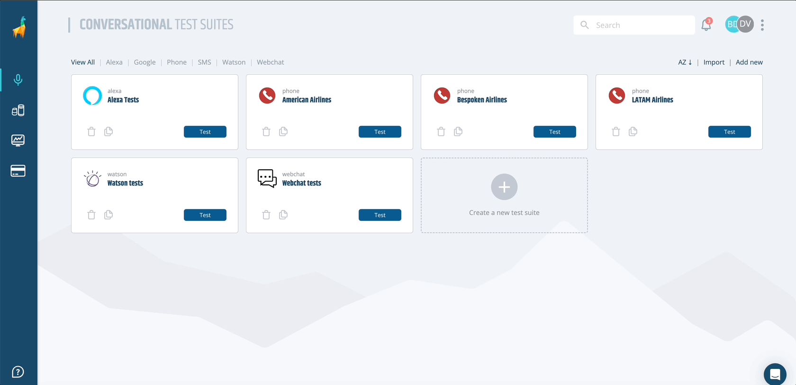
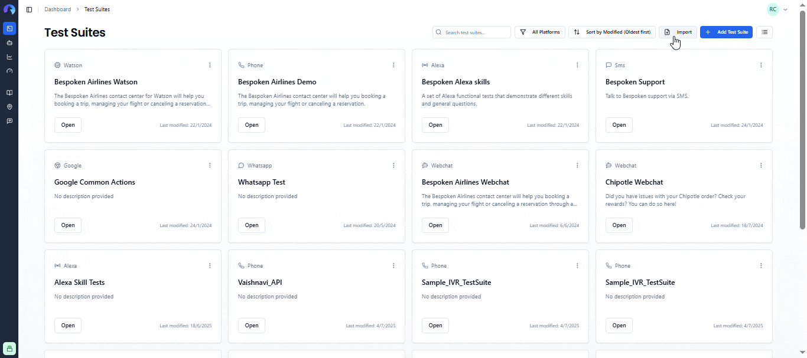

# Test Suites Management

A test suite is a collection of test cases designed to verify that your conversational application functions as expected. It is an essential component of software testing and quality assurance processes.
Test suites are the core building blocks of your testing workflow in Bespoken Dashboard. They contain collections of tests that validate the behavior of your conversational applications across different platforms like Alexa, Google Assistant, phone systems, webchat, and more.

::: tip Note
All test suites are organized within [Projects](projects.md). You must select or create a project before working with test suites.
:::
 
In this article, we'll detail the different options you have to manage them.

## Accessing Test Suites

### Navigation to Test Suites

Test suites are accessed within the context of a specific project:

1. **From the Projects Dashboard**: Click on any project card to view its test suites
1. **From Sidebar Navigation**: Click on a project in the sidebar to navigate to its test suites
1. **Direct URL**: Navigate to `/projects/{projectId}` to access a specific project's test suites

### Project Context

When viewing test suites, you'll always see:
- **Project name** in the page header
- **Project description** (if provided) below the project name
- Only test suites belonging to the current project
- Project-specific URL structure

## Adding New Test Suites

To create a new test suite within a project:

1. Navigate to the project where you want to create the test suite
2. Click **"New Test Suite"** in the top-right corner
3. Choose your platform (Alexa, Google Assistant, Phone, Webchat, etc.)
4. Enter a **name** for your test suite
5. Add an optional **description**
6. Click **"Create Test Suite"**

The new test suite will be created in the current project context.

You'll be immediately taken to the Test page. This is the most important page in our Dashboard and where you'll spend most of your time creating your functional testing scripts. To learn more about it, click [here](/dashboard/test-page).

## Deleting a Test Suite

Once you have test suites created, you can easily delete them by clicking on the "trash" icon within the test suite menu. You'll be asked for confirmation, as this action cannot be undone.

Simply click "OK" to remove the selected test suite.

## Cloning Test Suites

**Clone within Project**

Also on the test suite menu, you'll see a "Clone" option that is used to clone your test suite. This is useful when you have a test suite that you can use as a base for a new one. It will copy all the tests within it, as well as its configurations. The new test suite will have the same name plus a number for each copy you create.

1. Click the **three-dot menu** on any test suite
2. Select **"Clone"**
3. A copy is created immediately in the same project
4. The clone has the same name with "(Copy)" appended

**Clone to Different Project**

Similarly, the "Clone to project" option is used to clone your test suite in a different project than the current one. 

1. Click the **three-dot menu** on any test suite
2. Select **"Clone to Project"**
3. Choose the target project from the dropdown
4. Optionally rename the cloned test suite
5. Click **"Clone to Project"**

## Moving Test Suites

If you want to move a test suite to a different project (rather than copying it), you can use the move functionality:

1. Click the **three-dot menu** on any test suite
2. Select **"Move to Project"**
3. Choose the target project from the dropdown
4. Click **"Move to Project"**

::: tip Note
Moving a test suite removes it from the current project and places it in the target project. If you want to keep a copy in the original project, use the [Clone to Project](#cloning-test-suites) option instead.
:::

### Downloading a Test Package

Your test suite is also exportable as a zip test package by clicking on the Export -> YAML option on the test suite menu. This package will contain your test suite YAML file as well as its configuration in a JSON file. You can also export a test suite to an Excel format in a similar way by clickin Export -> Excel.

## Filtering Your Test Suites

There are two ways you can filter your test suites. First, you can filter your test suites by platform by clicking on the platform dropdown at the top of the page.

You can also filter your test suites by name by typing in the search box before it.

## Importing Test Suites

If you want to import multiple test cases from an Excel file, you can do so by clicking on the Import button on this page. This link will open a modal where you'll be able to select your Excel file and upload your test cases to the Dashboard. If you don't know the format to use, don't worry! You'll also be able to download a template to start.

<!-- TODO: Add table view section -->
