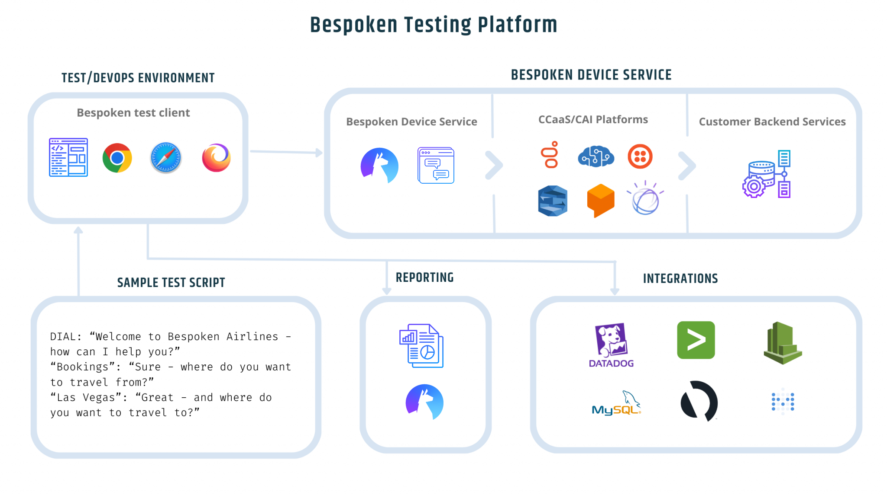
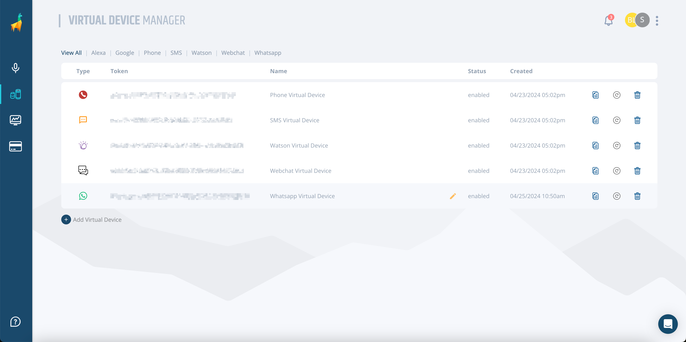
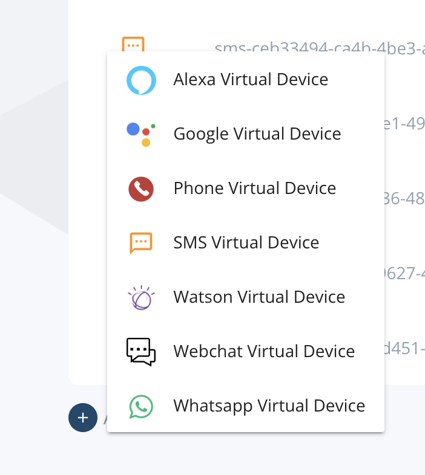
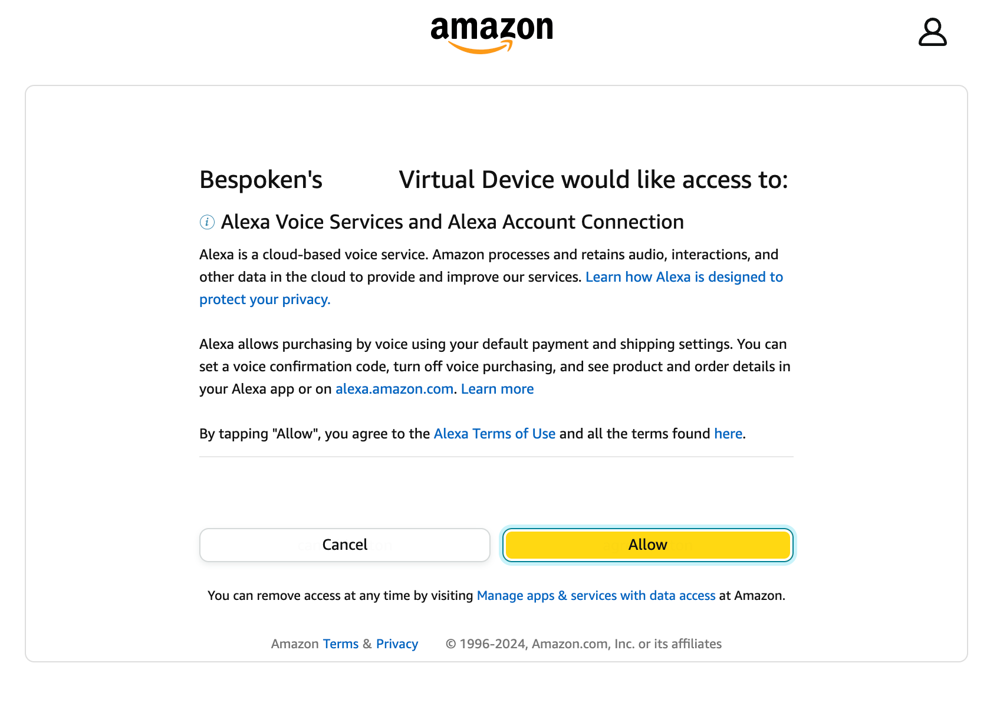
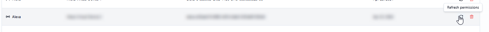
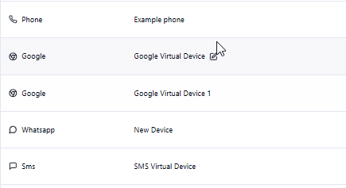
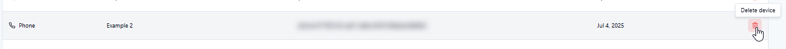

# Virtual Devices

Virtual Devices allow Bespoken to interact with conversational applications (voice or text-enabled) as a real user would against physical devices like a phone or an Amazon Echo, enabling comprehensive and automated end-to-end testing without the need for physical hardware.

For text systems, Bespoken sends a message from a test script, gathers any text response(s), and evaluates them against expected values. For voice-enabled systems, a Virtual Device converts written test scripts into spoken audio and then transforms the system's audio responses into text for verification. This process helps identify and resolve issues related to speech recognition, natural language understanding (NLU), and overall user functionality.

By using virtual devices, Bespoken can test across different languages, accents, and sound conditions, ensuring the robustness and reliability of conversational applications. This approach not only speeds up the development and testing processes but also significantly improves the quality of customer experiences by catching errors and usability issues early in the development cycle.

The Virtual Device Manager is where you can find your virtual devices. Below, you'll find all the things you can do on this page.

## Create a New Virtual Device

A virtual device's unique identifier is called a virtual device token. When you first create your Dashboard account, any virtual device that does not require authentication from your part will be created by default. These include phone, SMS, Watson, Webchat, and WhatsApp virtual devices.

You can add more of these virtual devices by clicking the "New Device" button at the top of the page and then selecting the platform you need a new virtual device for.

### Alexa and Google Devices

For communicating with Alexa and Google Assistant on your behalf, Bespoken will ask you to enter your Amazon/Google credentials when a new virtual device is added. Simply log in to your account; authorization data will be kept with the virtual device, and you won't need to do this again.

Once the virtual device has been created, you can also refresh/re-assign credentials to it by clicking on the refresh icon. We will ask for new credentials and assign them to the existing token.

## Rename a Virtual Device

To rename a virtual device, simply click on its name and modify it. Press Enter when you are ready.

## Delete a Virtual Device

To delete a virtual device, simply click on the trash icon next to it. You'll be asked for confirmation, as this operation cannot be undone.

