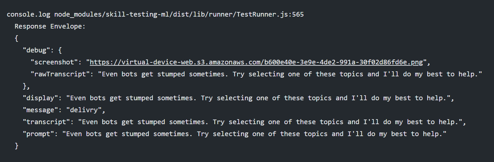
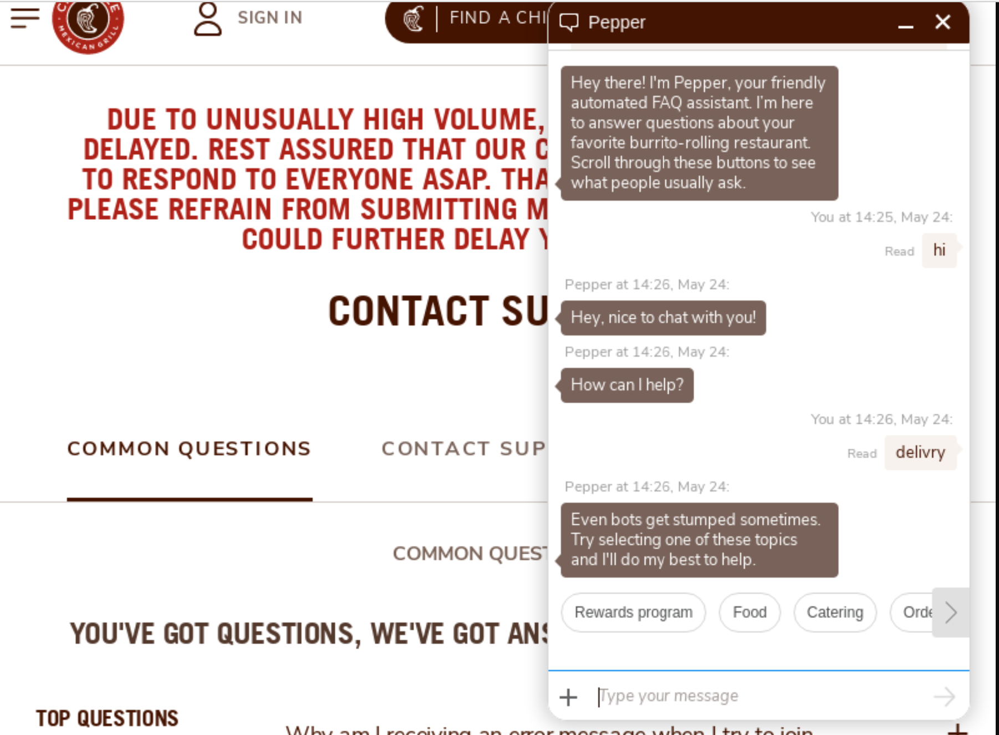

# End-To-End Testing for Chatbots
We provide support for testing chatbot systems on SMS, Whatsapp and the Web.

Most of the features from our standard end-to-end testing work as normal for this, but there are some special features that we will cover in this guide.

For in-depth information on how our end-to-end testing works, [read here](/end-to-end/guide/).

## Approach
Take a look at the following automated test run for the Chipotle web-based chatbot:

<p style="text-align:center">

</p>

Our process here is simple:
- We open the webpage where the chatbot is embedded
- We launch the chatbot by clicking on the button for it
- We interact back and forth with it, capturing the HTML response at each step

Here's the same chat sequence translated into one of our YAML tests:

```yaml
---
- test: Rewards test
- hi: Hey, nice to chat with you!
- rewards program: Being rewarded for eating, ahh... what a dream!
- learn about rewards: Dropping knowledge on the most delicious program there is!
- about points: I've got answers
- can i earn points anywhere: You can earn points anywhere in the US! Just make sure you
```

## Configuration
We have some parameters that are particular to Chatbot testing. In addition to the [regular e2e configuration](https://read.bespoken.io/end-to-end/guide/#configuration). 

| Field | Description | Required? |
|---|---|---|
| inputSelector | The CSS selector for the text input where messages should be entered | Yes |
| replySelector | The CSS selector for the reply HTML | Yes |
| widgetSelector | For chatbots that require clicking a button to open and begin the chat, the css selector for the button | No |

These fields allow us to correct enter messages from the user and capture the response from the bot. The virtual device token for chatbots is manually configured - please [contact us](mailto:contact@bespoken.io) to get yours setup.

For SMS and Whatsapp based testing, we need the phone number for the system we are interacting with. We also need to set the platform to `sms`:

```json
{
    "platform": "sms",
    "phoneNumber": "PHONE_NUMBER",
    "virtualDeviceToken": "twilio-xxxxxxxx-xxxx-xxxx-xxxx-xxxxxxxxxxxx" 
  }
}
```

For webchat-based testing, the virtual device base URL should be set to `https://virtual-device-web.bespoken.io`, like so:

```json
{
    "virtualDeviceBaseURL": "https://virtual-device-web.bespoken.io" 
  }
}
```

These values can also be set inside a particular test file with a configuration section at the top of the file, like this:
```yaml
---
configuration:
  phoneNumber: "PHONE_NUMBER"
```

"Utterance" level parameters are set inside each test with the use of the reserved keyword `set`.

## Special syntax
### JQuery-style asseertions
For webchat, it is convenient to write assertions using JQuery selectors. This allows us to do deep-checks on HTML responses.

These selectors can be of the form:
```

```

### The "set" keyword
The `set` keyword is used to establish parameters that will alter the behavior of each interaction, it's also used to differentiate them from properties that will be verified (and not set) like `transcript`. 


## BST Init
The `bst init` command is the fastest way to create all the files and folders needed to start testing your IVR system. It's a great starting point! You can read more about it [here](./../../cli/commands/#init).

## Debugging and Troubleshooting
### Browser screenshots
Each response comes with a link to a screenshot of the current state of the browser for webchat-based tests. This can be extremely useful for debugging issues with the chatbot.
<p style="text-align:center">
  
</p>

A sample image:
<p style="text-align:center">
  
</p>

### Tracing output
Make sure "trace" is set to true in the testing.json file. This will output the complete back and forth of the test. It includes:
* The message we send to the IVR system
* The transcript of the response received

## Project Sample
You can find the Chipotle tests and reporting we used in this page [here](https://github.com/bespoken-samples/webchat-sample). 