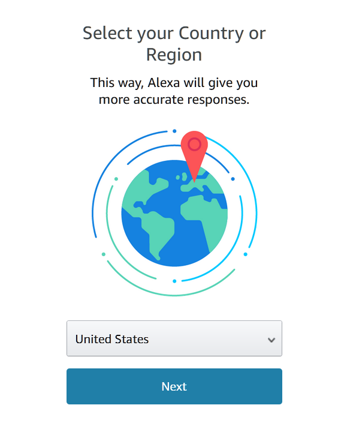
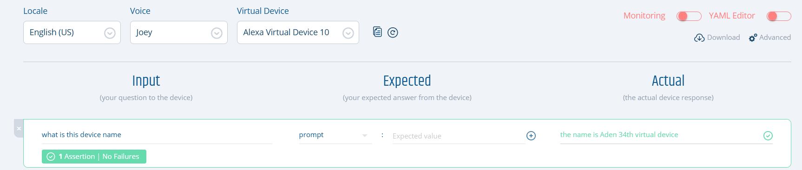
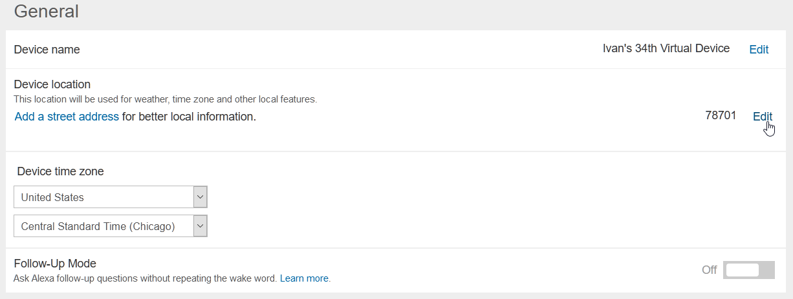
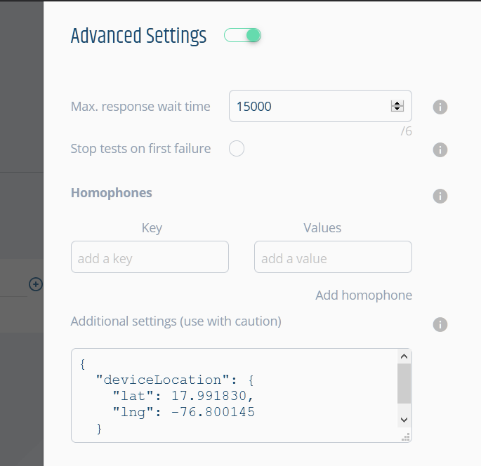

# FAQ for End-to-end Testing
Here you can find common questions on regards End-to-end testing for voice apps.

# **Getting started**

## **What is End-to-end (E2E) testing and why do I need it?**
>_End-to-end testing involves ensuring that the integrated components of an application function as expected. The entire application is tested in a real-world scenario such as communicating with the database, network, hardware and other applications ... Techopedia_

Talking specifically about voice apps. End-to-end tests focus on testing:
* The voice app as a whole (from Alexa/Google through infrastructure to voice app).
* The utterance resolution aka the speech recognition.
* The interaction models.

You need to do E2E testing because it's critical to be sure your voice app will behave as expected before it reaches your users. Most apps work with other services and use different pieces of technology and testing only your code (i.e. just doing Unit testing) is no guarantee you are free from errors.

Our approach to E2E testing is based on the creation and execution of __test scripts__. Ideally, the test scripts should cover the entire functionality of your voice app.

E2E testing and Regression testing are two types of _functional testing_.


## **What is Regression testing?**
Regression testing is re-running functional and non-functional tests to ensure that previously developed and tested software still performs after a change. Changes that may require regression testing include bug fixes, software enhancements, configuration changes, and even substitution of electronic components. As regression test suites tend to grow with each found defect, test automation is frequently involved.

As E2E, Regression testing is another type of _functional testing_.

## **Which tools does Bespoken offer to do E2E or Regression testing for voice apps?**
The simplest and easiest way to do functional testing is creating and executing test scripts. These scripts contain the interactions needed to verify the functionality of your voice app.

An interaction is a group of utterances and expected responses that are executed against your voice app (Alexa or Google Action) through our Virtual Device.

As with Unit testing, the functional test scripts are based on our simple YAML syntax, which is very easy to understand, create and maintain.

## **What permissions are needed for End-to-end Testing?**
When you get a token from Bespoken’s Dashboard, what actually happens behind the scenes is we create a Virtual Device to interact with your skills. Virtual Devices need permissions to access your voice apps.

The specific permissions are to access Alexa Voice Services and Alexa Account Connection. This allows us to interact with your skills programmatically. 

Remember, you can remove access at any time by visiting your Alexa account [online](https://alexa.amazon.com/spa/index.html#settings) or via the Alexa app.

## **Is it possible to test skills written in languages other than Javascript?**
Yes, it is possible. Our tools are language agnostic. For example, you can create [unit](https://read.bespoken.io/unit-testing/getting-started.html) or [end-to-end](https://read.bespoken.io/end-to-end/getting-started.html) test scripts using our syntax based on YAML regardless of the language used to create the voice app. We also provide SDKs for writing tests programmatically - also available for both [unit](https://github.com/bespoken/virtual-alexa) and [end-to-end](https://read.bespoken.io/end-to-end/api.html) testing. In either case, our tests work with your skill regardless of the language it is written in. 

## **Is it better to use the YAML syntax or the programmatic SDKs for testing?**
Both are good choices. In the case of unit-testing, our YAML tests actually rely on [Virtual Alexa](https://github.com/bespoken/virtual-alexa) under the covers. In the case of end-to-end tests, similarly our YAML test scripts rely on our [Virtual Device SDK](https://github.com/bespoken/virtual-device-sdk). The big advantage of our YAML syntax is that it allows tests to be written in the same way no matter what type of test it is (unit or end-to-end), and what platform it works with (Google or Alexa). It also does not require programming skills. On the other hand, for many programmer using our programmatic APIs is easy and more what they are accustomed to - it also allows for writing tests that are more complex, such as ones that call external APIs to validate results. So the best approach takes into consideration the type of tests being written, as well as the skillset of the testing team.

## **How do I run end-to-end tests?**
To get started, you need to install the Bespoken CLI, please follow next steps:
1. Install the CLI by running `npm install -g bespoken-tools` on your command line.
2. Open a command-line window and change directory to the root of your `<PROJECT_FOLDER>`
3. Run the tests - just enter `bst test`. The output should look like this:
```bash
$ bst test
BST: v2.0.10  Node: v8.9.4

 PASS  de-DE\launchRequest.e2e.yml (38.316s)
  de-DE
    Launch request, no further interaction
      √ öffne bring
    Launch request, one interaction
      √ öffne bring
      √ sag mir was auf meiner liste ist

 PASS  de-DE\addItems.e2e.yml (45.518s)
  de-DE
    Invoke intent with one-shot utterance (adding items)
      √ öffne bring und füge obst hinzu
    Invoke intent, multiple interactions (adding items)
      √ öffne bring
      √ füge gemüse
      √ sag mir was auf meiner liste ist

Test Suites: 2 passed, 2 total
Tests:       7 passed, 7 total
Snapshots:   0 total
Time:        150.985s
```

## **Does Bespoken support the Amazon SMAPI Simulation API for testing?**
Yes, we do in our latest versions, now that the Simulation API supports multi-turn testing.

To use this feature, set your test type to `simulation`. The feature support is still experimental - it relies on the [Alexa SMAPI to execute tests](https://developer.amazon.com/docs/smapi/skill-simulation-api.html). A few requirements to use this feature:  
* The ASK CLI must be installed and configured on the machine where tests are run
* The skillId of the skill being tested must be specified as part of the configuration
* Testing must be enabled for the skill in the Alexa dev console
* The skill must be in development stage

Read more about it in our [full guide](./guide.html#smapi-configuration).

## **How do I learn more?**
Take a look at this [__sample project__](https://github.com/bespoken-samples/virtual-device-example) and use it as a base to start creating your own functional test scripts. For more info on End-to-end testing please read [__here__](https://read.bespoken.io/end-to-end/getting-started.html).
If you need assistance reach us on any of these channels:
* [Email](mailto:contact@bespoken.io)
* [Twitter](https://twitter.com/bespokenio)
* [Gitter](https://gitter.im/bespoken/bst)


## **Besides Alexa, can I use Bespoken to functional test Google Actions?**
Yes, you can. Our Virtual Device Test Scripts can also be used to do E2E or Regression testing for Google Actions. First thing is to generate a Virtual Device token to be used with your Action, get it [__here__](https://apps.bespoken.io/dashboard). Then you need to include the token in your `testing.json` file, something like this:
```json
{
    "type": "e2e",
    "trace": false,
    "jest": {
      "silent": false
    },
    "virtualDeviceToken": "google-xxxxxxxx-xxxx-xxxx-xxxx-xxxxxxxxxxxx"

```
Then create and execute your scripts as usual.

## **I want to do something that is not supported with the tools like adding a delay between responses or stopping after a test has failed**
Use the filter functionalities to add any kind of behavior during tests (read [here](https://read.bespoken.io/end-to-end/guide/#filtering-during-test) for more information). Please, also refer to [the API documentation](https://bespoken.github.io/skill-testing-ml/api/Test.html) to understand how to use the `test` property. For instance, the `test` property can be used to know if the test has passed/failed, or if the test should be skipped.

# **Working with test scripts**

## <a name="anchorToFolderStructure"></a>**How should I organize my test files?**
If your voice app supports just one locale you can have a folder structure like this:

```
└───My Skill E2E testing
        functionalityName.e2e.yml
        otherFunctionalityName.e2e.yml
        testing.json
```

For this case, we recommend the locale and Virtual Device Token to be defined on your `testing.json` file.

```json
{
  "type": "e2e",
  "virtualDeviceToken": "alexa-xxxxxxxx-xxxx-xxxx-xxxx-xxxxxxxxxxxx" 
}
```

If your voice app supports multiple locales, the folder structure can look like this:

```
└───My Multi-locale E2E testing
    │   testing.json
    │
    ├───de-DE
    │       functionalityName.e2e.yml
    │
    ├───en-GB
    │       functionalityName.e2e.yml
    │
    └───en-US
            functionalityName.e2e.yml
```

Your Virtual Device Token and locale can be defined either on the configuration section of each test script file or in the `testing.json`.

For example this is a configuration section on a German script:

```yaml
---
configuration:
  locale: de-DE
  voiceId: Hans
  virtualDeviceToken: xxxxxxxx-xxxx-xxxx-xxxx-xxxxxxxxxxxx
```
And this is how a `testing.json` file would look like if you'd want to use a different virtual device for each locale (useful if your voice apps are published in different regions):
```json
{
  "type": "e2e",
  "virtualDeviceToken": {
    "alexa": {
       "en-US": "alexa-xxxxxxxx-xxxx-xxxx-xxxx-xxxxxxxxxxxx",
       "de-DE": "alexa-xxxxxxxx-xxxx-xxxx-xxxx-xxxxxxxxxxxy",
       "en-GB": "alexa-xxxxxxxx-xxxx-xxxx-xxxx-xxxxxxxxxxxz"
    }
 }
}
```

## **How do I troubleshoot end-to-end tests for Alexa?**
We recommend taking into account the following:
- Set the trace option to __true__ in the `testing.json` file to see the response coming from Alexa/Google.

```json
{
  "type": "e2e",
  "homophones": {
    "lettuce": ["let us"]
  },
  "trace": true,
  "jest": {
    "silent": false
  }
}
```

- Check the history of interactions on the Alexa website.
![Showing Alexa's utterances history][AlexaHistory]
- Use the `.only` command in the scripts to isolate a specific sequence.

If you need assistance, please talk to us through the chat widget at the lower right-hand corner of our [Dashboard](https://apps.bespoken.io/dashboard/) or [Website](https://bespoken.io/).

## **My test interaction is not working, how can I troubleshoot the problem?**
Perhaps you are trying to run a monitoring script (or just executing an end-to-end test) and you are getting an odd response like this one:
![Showing monitoring odd result][MonitoringOddResult]
What is going on here? Let's follow this workflow to troubleshoot the problem:
![Workflow to troubleshoot test script issues][TroubleshootingWorkflow]
1. **Check what the voice service understood:** The first thing to check is if the voice service is understanding your test script correctly. In the image above, our utterance is "ask my skill to tell me a joke". Let's see what the voice service understood. As this is an Alexa skill, check the interactions history page (navigate to the Alexa dashboard, log in with the same account used to create the Bespoken Virtual Device token used in your test script, go to "Settings - History" in the left menu).
![Alexa interactions history][AlexaInteractionsHistory]
>Note:  Take into account that the exact URL for viewing this history depends on the region youn are testing in. For example, for the US go to alexa.amazon.com, for Germany go to alexa.amazon.de. 

2. **Verify what token you are using**: If you can't locate the interaction in the history page, that means you probably looking at a  different account than the one used to create the Bespoken Virtual Device used in your test script. It is as if you are sending the utterance to a different Echo device. Please use the Amazon account associated with the selected token in your test scripts. If you have created several virtual devices and you are not sure which one is being used, ask the voice service by sending the utterance 'what is this device name' or 'what is my name'.
![What is this device][WhichDeviceIsThis]

3. **Try another Polly voice**: If you are able to locate the utterance in the history of interactions and the voice service did not understand it, then we have a speech recognition problem. If the problem is related to the invocation name, that explains why the voice service can't determine which skill to launch - it will say something like "Sorry, I don't know that" instead of invoking the skill.
![Invocation name speech recognition problem][InnvocationNameSRP]
In the above image (not a real case), Alexa is incorrectly understanding "my skill". Why is that? Voice services keep improving their ASR and NLU every day, but they are not perfect. In our case, we use Amazon Polly voices to transform the text utterance from your test script into speech, and sometimes, like in real life, the voice service might not understand it correctly. One way to troubleshoot this is going to the AWS Polly console and play around with the different available voices - listen to how they pronounce your voice app's invocation name and select the one you think sounds best. By default, we use the "Joey" voice for en-US locale, which in general provides good results. But keep in mind that if you listen to the generated speech and it sounds good to you, but the voice service is not understanding correctly, [you might have a serious problem that can become a reality once you publish your skill](https://medium.com/swlh/i-just-shut-down-my-startup-heres-what-i-learned-2a57c0e98090). If that is the case, consider using a different invocation name and be sure it is correctly understood in one-shot and in-session utterances.

4. **Use special characters in the invocation name**: Let's image the invocation name you have selected is ABE, but the voice service is interpreting it as the name "Abe". To avoid this you can add special characters to it, for example, "A-B-E" or "A.B.E."

5. **Use sound-alike words or the phoneme tag**: This is a good way to overcome speech recognition issues with your invocation name when writing test scripts. You can start by using sound-alike words. For example, let's imagine you invoke your voice app like this "open pikachu facts", you can use "open peak a choo facts" as the utterance in your scripts if you are having speech recognition problems. If that doesn't solve the issue you can try using [the `phoneme` tag](https://docs.aws.amazon.com/polly/latest/dg/supportedtags.html#phoneme-tag). For example, let's say we have a skill which can be invoked with a one-shot utterance like "ask who's the boss to play episode 3 season 4 on main screen", sadly Alexa is hearing "ask who's the bounce to play episode 3 season 4 on main screen" and we are getting "sorry, I don't know that" in return. This certainly might happen with some of your user's accents. To resolve this problem you can use the phoneme tag like this:
```
<speak>ask who's the <phoneme alphabet="ipa" ph="/bɒss/">boss</phoneme> to play episode 3 season 4 on main screen.</speak>
```
Adding an extra "s" with the phoneme tag makes it more clear, and Alexa can properly understand the invocation name. Use Amazon Polly console, a [phonetic transcription software](https://www.phonetizer.com/ui), and a [phonetic alphabet](https://docs.aws.amazon.com/polly/latest/dg/ph-table-english-us.html) to help you create the appropriate SSML code for your specific case.

6. **Choose another invocation name**: In case you have tried several things and the problem persists, we recommend to select another invocation name that provides better results.

7. **Check your interaction model**: It might happen that the voice service is correctly invoking your voice app but the wrong intent is requested, causing unexpected behavior. In this case, the problem might be located in your interaction model. Adding additional utterances to the model to match what Alexa hears will often resolve the issue.

8. **Check your voice app code**: In case the voice service is correctly recognizing the invocation name, and the appropriate intent is being hit, but still you are getting an unexpected response it is probably a problem with your voice app's backend. Please check your app's code. For this, we suggest using unit test scripts with a debugger to easily and quickly spot the issue. Read [here](https://read.bespoken.io/unit-testing/faq/#how-do-i-use-the-debugger-with-bespoken-unit-tests-and-visual-studio) to know how.

If you need assistance, please talk to us through the chat widget at the lower right-hand corner of our [Dashboard](https://apps.bespoken.io/dashboard/) or [Website](https://bespoken.io/).

## **How do I test a voice app that requires account linking?**
To test a voice app that requires account linking, simply link the account as you normally would within the Alexa and/or Google management screens. Once the account linking process is completed, you can talk to the skill and access account-specific information via your virtual device. It's that easy!

Of course, make sure the Alexa/Google account you are using is the same one that your virtual device is associated with.

If you are unsure what Amazon account your virtual device is associated with, try sending this to Alexa:

`bst speak --token <VIRTUAL-DEVICE-TOKEN> what is my name`

## **Can I test the account linking process itself with Bespoken?**
As the account linking process involves __visual__ user interaction between a voice platform and your backend, you need to use an external web automation tool like Selenium to accomplish it. This visual interaction test script can be later linked to the audio interaction test scripts created with Bespoken. Please [contact us](mailto:sales@bespoken.io) in case you want to discuss further as we can assist you in creating the visual test scripts with Selenium.

Of course, if you are just trying to test specific account scenarios (and not the account linking process itself), we recommend setting up virtual devices linked to specific accounts. You only need to do this once, and then you can test these scenarios as needed essentially forever. Read more at this [FAQ entry](#how-do-i-test-a-voice-app-that-requires-account-linking)

## **My voice app supports multiple locales, how do I create functional tests for it?**
Both Alexa and Google's virtual devices support multiple locales from the get-go. You just need to set correctly the locale that you want to test against by using the `locale` property on your test scripts. You can also keep it to one test file and a resource file for each locale by using our localization feature as explained [here](../end-to-end/guide/#localization).

## **I've changed my locale to en-UK however I can't access a voice app from that region**
There's a distinction that has to be made between a locale and a voice app region. A locale refers to the language that you want to use when communicating with your voice platform. A region refers to the geographical space in which your voice app is available. In other words, your voice app could be prepared to reply to multiple locales (en-US, es-ES, etc) but then be published only in certain regions. 

By default, our virtual devices will always point to the USA region. If you want to reach a voice app in a specific region there are two things you can do:

1. For Alexa: You'll need to create a virtual device tied to an Amazon account that is specific to the region that you want to test. That is, an amazon.co.uk for testing a voice app published in the UK, an amazon.es account for voice apps in Spain, and so on. If you have the same voice app in multiple regions, you can follow our file structure recommendation from [here](#anchorToFolderStructure).

2. For Google: Use the properties locationLat and locationLong on your test scripts or `testing.json` file to specify the latitude and longitude from where your virtual device should be located in order to test your voice app.

## **What is the default location for a virtual device?**
### Alexa
When you create your first Virtual Device, you will be asked to select a country. 

[](./assets/UpdateLocation-03.png)

Despite this, the Virtual Device has not yet an assigned location. If, in this state, you ask for its location (see image below), and you have selected "United States", Amazon will assign it an American zip code. Otherwise, if you selected a different country, Alexa will reply with "Sorry, I couldn't find your current location information" (the linked Amazon account's address is not taken as fallback).

[](./assets/UpdateLocation-01.png)

Take note, that the location defined in the Virtual Device settings will take precedence over the address added to the linked Amazon account.

### Google
The location of Virtual Devices is set by [this precedence logic](https://developers.google.com/assistant/sdk/reference/rpc/google.assistant.embedded.v1alpha2#devicelocation).

## **How do I change my Virtual Device location to test location-specific features?**
### Alexa
- Go to your Alexa account (for the US, go to alexa.amazon.com) and navigate to **Settings**.
- Select the Virtual Device for which you want to update the location. If you are not sure which one to choose, run these tests on Bespoken Dashboard:

  [](./assets/UpdateLocation-01.png)
- Add the desired address or zip code in the General section, under "Device Location"

  [](./assets/UpdateLocation-02.png)
### Google
Add the desired latitude (`lat`, values from -90.0 to +90.0) and longitude (`lng`, values from -180.0 to +180.0) to your `testing.json` file by using the `deviceLocation` object:
```json
"deviceLocation": {
    "lat": 17.991830,
    "lng": -76.800145
  }
```
You can also use a specific location in Bespoken Dashboard by adding the `deviceLocation` key in the "Advanced Configuration" section:

[](./assets/UpdateLocationGoogle.png)

## **How do I handle different invocation names for different environments?**
In case you have different invocation names for your skill you can define them all in the `testing.json` file as you were defining variables. Then use those variables in your test script. We will do the find/replace when executing the test scripts.

This is how to define them:
```json
{
  "type": "e2e",
  "homophones": {
    "lettuce": ["let us"],
    "figs": ["six","vicks"]
  },
  "trace": false,
  "jest": {
    "silent": false
  },
  "findReplace": {
    "invocationName-US": "my skill",
    "invocationName-DE": "meine Fertigkeit"
  },  
  "virtualDeviceToken": {
    "alexa": {
       "en-US": "token-en-us-alexa-xxxx-xxxx",
       "de-DE": "token-de-de-alexa-xxxx-xxxx"
    }
 }
}
```
And this is how a simple test script looks like:
```yml
---
configuration:
  locale: de-DE
  voiceId: Hans

---
- test: Using find/replace
- öffne invocationName-DE: hallo
- stop: auf wierdesehen
```

## **The response from my skill is not what I expected. What should I do?**
Our end-to-end tests use speech recognition for turning the output speech coming back from Alexa into text. This process is imperfect - to compensate for this, homophones can be specified for errors that occur when a reply from Alexa is misunderstood. For example, if Alexa says: `address sent to your white car`; the Bespoken Virtual Device may transcribe it as: `address sent to your wife car`

(FYI, for Alexa, the definitive response can be found at the Alexa user console, under settings -> history).

This misunderstanding will lead to a test like this failing incorrectly:

`- send address for in n out burger to my car: address sent to your white car`

To avoid this, just define a homophone in the configuration file like so:
```json
{
    "homophones": {
        "white": ["wife"]
    }
}
```

## **How can I see the JSON response that is coming from my voice app?**
You need to update the `testing.json` configuration file and set the trace property to true.
  ```json
  {
    "type": "e2e",
    "homophones": {
      "lettuce": ["let us"]
    },
    "trace": true,
    "jest": {
      "silent": false
    }
  }
  ```

## **How can I execute just one of the interactions in my test script?**
Add `.only` after the reserved word `test` on the sequence you want to execute. In this example, only the second sequence will be executed.
```yml
---
configuration:
  locale: de-DE
  voiceId: Hans
  virtualDeviceToken: xxxxxxxx-xxxx-xxxx-xxxx-xxxxxxxxxxxx

---
- test: Adding items with one-shot utterance, no further interaction
- öffne bring und füge obst hinzu: okay obst ist auf deiner liste

---
- test.only: Removing items with one-shot utterance, no further interaction
- öffne bring und entferne obst: okay ich habe obst entfernt

---
- test: Invoke intent, multiple interactions
- öffne bring: willkommen
- füge gemüse: okay gemüse ist auf deiner liste
- sag mir was auf meiner liste ist:
  - prompt:
    - äpfel
    - gemüse
- entferne gemüse: okay ich habe gemüse entfernt
```

## **Which shorthand properties can I use to make my scripts more readable?**
You can use these:
* __cardContent__: Corresponds to `card.textField`
* __cardImageURL__: Corresponds to `card.imageURL`
* __cardTitle__: Corresponds to `card.title`
* __prompt__: An alias for the transcript element from the JSON payload

## **My skill uses multiple possible valid responses, how should write my test script to test that?**
It is also possible to specify multiple valid values for a property. That is done with a collection of expected values, such as this:
```yaml
- open howdy
  - prompt:
    - Hi there
    - Howdy
    - How are you?
```

## **I have errors when testing in parallel with devices using the same account with Alexa**
Alexa AVS doesn't handle more than one request for the same account, if you need to do parallel tests, create the necessary virtual devices using different accounts at the setup.

## **My Google action responds with  "to let me read out that information turn on personal results in the google app home"**
Follow [these steps](./setup.html#enabling-personal-results-on-your-google-virtual-device).

# Networking
## My organization uses a firewall - how do I use your tools with it?
Your firewall needs to allow access to the following domains:
* *.bespoken.io
* *.bespoken.tools
* *.bespoken.link

If white-listing by IP is necessary, the following IPs should be included:
* 35.244.147.217 (virtual devices)
* 18.232.68.210 (bst proxy)
* 34.233.142.145 (other services)
* 54.221.196.218 (other services)

We use the following ports for our services:
* 443
* 80 (bst proxy only)

Please note - the IP addresses above are subject to change - please contact us via [Gitter](https://gitter.im/bespoken) if you have white-listed all of the above and are still having problems.

## My organization uses a Proxy - how do I use your tools with it?
To run our tools through your proxy, you need to set the `HTTPS_PROXY` env variable. 

On a Mac, open up a terminal and type:
```
export HTTPS_PROXY=http://<proxy-url>:<proxy-port>
```

On Windows, open up a command line and type: 
```
set HTTPS_PROXY=http://<proxy-url>:<proxy-port>
```

<!-- Images references -->
[AlexaHistory]: ./assets/alexaHistory.png "Showing Alexa voice interactions history"
[MonitoringOddResult]: ./assets/TroubleshootingSRIWithInvocationName-1.png "Showing monitoring odd result"
[TroubleshootingWorkflow]: ./assets/TroubleshootingSRIWithInvocationName-2.png "Workflow to detect speech recognition errors with the invocation name"
[AlexaInteractionsHistory]: ./assets/TroubleshootingSRIWithInvocationName-3.png "Accessing history of interactions in Alexa"
[InnvocationNameSRP]: ./assets/TroubleshootingSRIWithInvocationName-4.png "This is how an invocation name speech recognition issue looks like in Alexa"
[WhichDeviceIsThis]: ./assets/TroubleshootingSRIWithInvocationName-5.png "This is how to know which Bespoken Virtual Device you are using."
