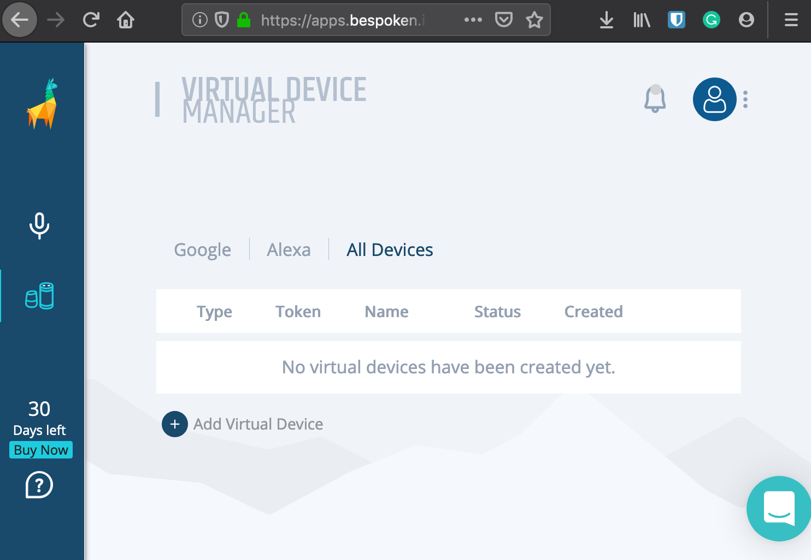
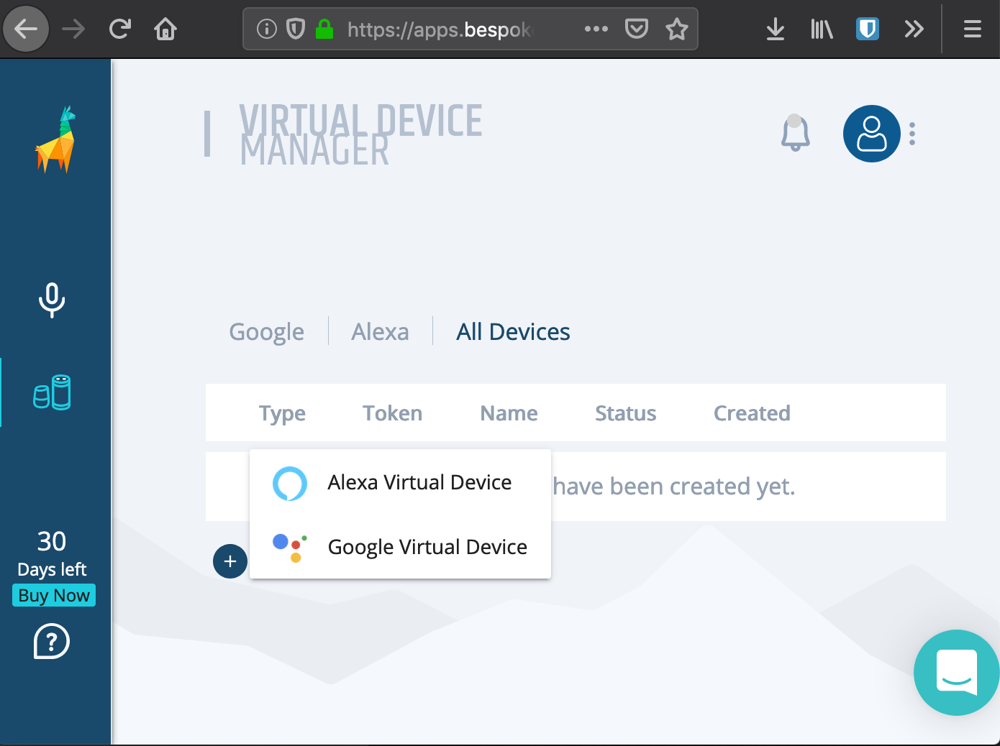
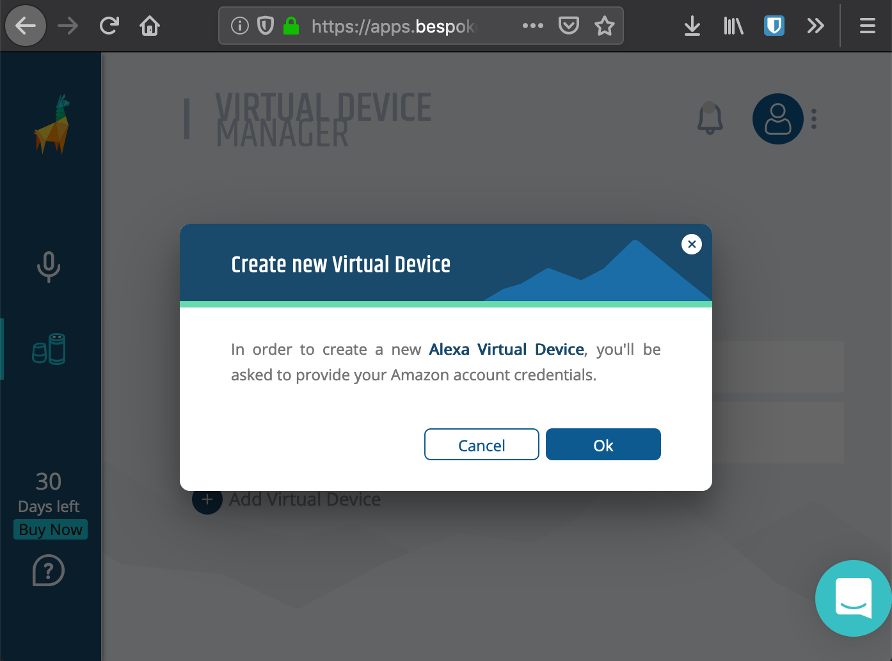
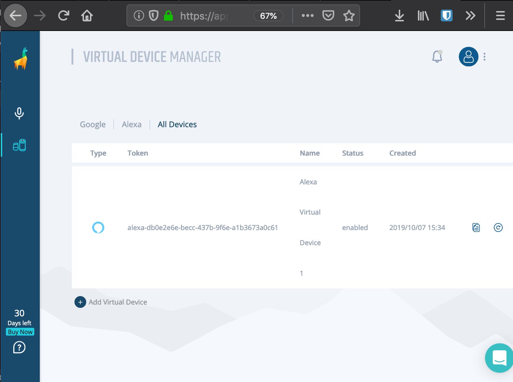
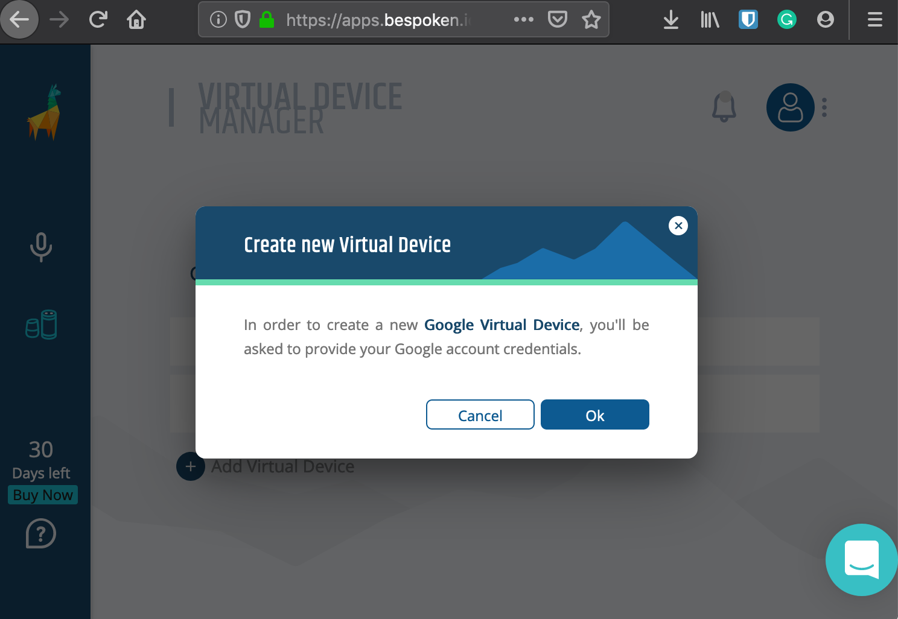
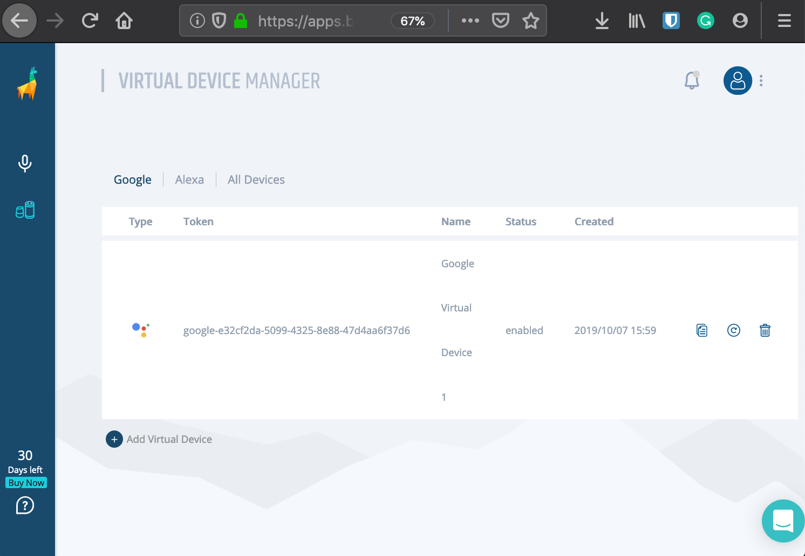

# Setting Up A Virtual Device
## Background
In order to test your Alexa skills and Google Actions, you need to create a Virtual Device. What is a Virtual Device? It is like a physical Amazon Echo or Google Home, but one that can be interacted with programmatically.

We'll create a trial Virtual Device for you, the only thing we need you to do is to grant us to access to your Amazon Alexa or Google Assistant account. Once completed, you will have a token, which uniquely identifies the Virtual Device, that you can use in your tests.

There a couple steps for the setup - but don't worry - you will only have to do it once. And if you run into any issues, just [ping us here](https://gitter.im/bespoken/bst). We'll get it sorted out quickly!

## Creating A Virtual Device
### Virtual Devices for Alexa
1. The way to get a token is through [Bespoken Dashboard](https://apps.bespoken.io/dashboard). Sign up for free or login; you will see a screen like this:


2. On the left panel click on **"Virtual Devices"** option. You will see the virtual device manager:


3. Click on the **"Add Virtual Device"** link, then select "Alexa Virtual Device":


4. A dialog will be displayed, after click on **"OK"** you will be redirected to an Amazon window where you have to log in:



5. After providing your credentials you will return to Bespoken dashboard and the **"Virtual Device Token"** will be retrieved automatically:


### Virtual Devices for Google
1. The way to get a token is through [Bespoken Dashboard](https://apps.bespoken.io/dashboard). Sign up for free or login; you will see a screen like this:


2. On the left panel click on **"Virtual Devices"** option. You will see the virtual device manager:


3. Click on the **"Add Virtual Device"** link, then select "Google Virtual Device":


4. A dialog will be displayed, after click on **"OK"** you will be redirected to an Google window where you have to log in:



5. After providing your credentials you will return to Bespoken dashboard and the **"Virtual Device Token"** will be retrieved automatically:



### Enable personal results for Google 

If you get a response: "to let me read out that information turn on personal results in the google app home" instead of a response from your actions, follow these additional steps:


On Android Devices:

1. Long press the “home” button on an Android device.

2. Click on the compass icon.

3. Click on your user's icon.

4. Click on Settings.

5. Click on the Assistant Tab.

6. Scroll Down and you should see “virtual device” listed after your phone.

7. Click on it and enable Personal Results.

Additional information:

For IOS devices you need to install the *Google Assistant* from the [app store](https://itunes.apple.com/us/app/google-assistant/id1220976145) and do the same steps starting from step 3.

## Using the Device In Your Scripts
Now you can use the virtual device with your test script. Place it in the testing.json file of your project like so:
``` js
{
    "virtualDeviceToken": "MY_TOKEN"
}
```

See how we do it [here](https://github.com/bespoken/virtual-device-example/blob/master/testing.json).

And that is all you need in the setup process, now you can continue with the creation of your test scripts, or using Virtual Device programmatically. 
