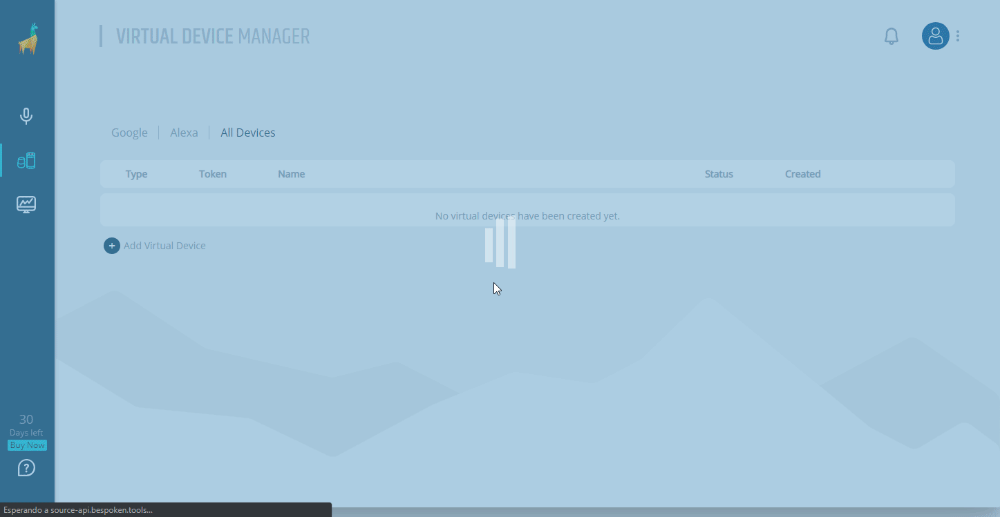

# Setting Up A Virtual Device
## Background
In order to test your Alexa skills and Google Actions, you need to create a Virtual Device. A Virtual Device is just like a physical Amazon Echo or Google Home, but one that can be interacted with programmatically.

We'll create a trial Virtual Device, the only thing we need you to do is grant us access to your Amazon Alexa or Google Assistant account. Once completed, you will have a token that uniquely identifies your Virtual Device, ready to use in your tests.

There are a couple of steps for the setup - but don't worry - you will only have to do it once and, if you run into any issues, just [ping us here](https://gitter.im/bespoken/bst/). We'll get it sorted out quickly!

## Creating A Virtual Device

- Login to our [Bespoken Dashboard](https://apps.bespoken.io/dashboard) (if you don't have an account yet, apply for a free trial), you will see the following screen:


- On the left panel click on **"Virtual Devices"** to access the Virtual Device Manager:


### For Alexa
- Click on the **"Add Virtual Device"** button and select "Alexa Virtual Device". After clicking on **"OK"** you will be redirected to a Login with Amazon page:


- Provide your credentials and you will be returned to the Bespoken Dashboard. The **"Virtual Device Token"** will be retrieved automatically:


### For Google
- Click on the  **"Add Virtual Device"** button and select "Google Virtual Device". After clicking on **"OK"** you will be redirected to a Google Sign-in page:


- Provide your credentials and you will be returned to the Bespoken Dashboard. The **"Virtual Device Token"** will be retrieved automatically:



#### Enabling personal results on your Google Virtual Device
If you get a response that says: "to let me read out that information turn on personal results in the google app home" while using your virtual device, you'll need to follow these additional steps:

1. Long press the “home” button on an Android device. For IOS devices you need to install *Google Assistant* from the [app store](https://itunes.apple.com/us/app/google-assistant/id1220976145), open it, then skip to step 3.

2. Click on the compass icon.

3. Click on your user's icon.

4. Click on Settings.

5. Click on the Assistant Tab.

6. Scroll Down and you should see “virtual device” under "Assistant devices".

7. Click on it and enable Personal Results.


#### Enabling test mode on your Google Action
Another important aspect of testing with Google is that your Action should be enabled for testing. To do this, follow [this guide](https://developers.google.com/assistant/smarthome/develop/testing#setup).

### For IVR systems (Phone)

- Phone virtual devices are available for users of our Contact Center plans. [Contact us](mailto:contact@bespoken.io) if you want to know more.
- Once your account is setup, click on the  **"Add Virtual Device"** button and select "Phone Virtual Device". You won't need to provide credentials for a phone virtual device.


## Using the Device In Your Scripts
Now you can use the virtual device with your test script. Place it in the testing.json file of your project like so:
``` js
{
    "virtualDeviceToken": "MY_TOKEN"
}
```

See how we do it [here](https://github.com/bespoken-samples/virtual-device-example/blob/master/testing.json).

And that is all you need in the setup process, now you can continue with the creation of your test scripts, or using Virtual Device programmatically.
