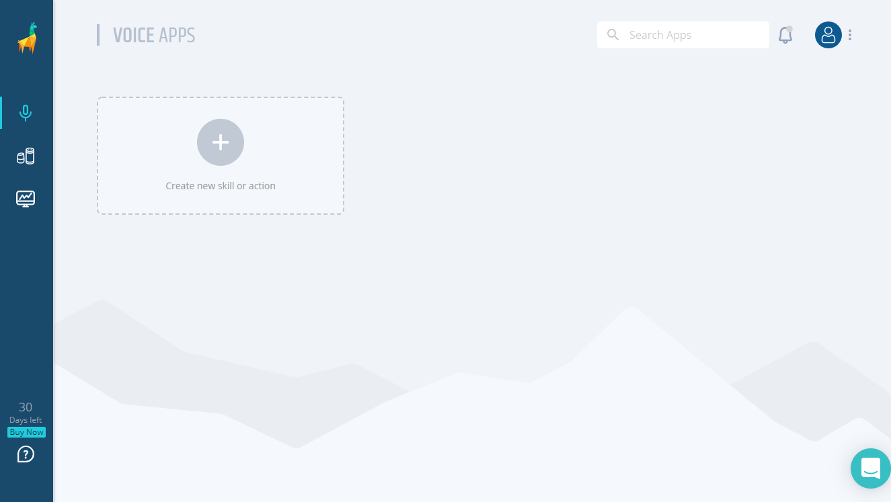

<!-- ---
# Setting Up
layout: default
keywords:
comments: false

# Hero section
title: Setting Up A Virtual Device

# Micro navigation
micro_nav: true
--- -->
# Setting Up A Virtual Device
## Background
In order to test your Alexa skills and Google Actions, you need to create a Virtual Device. What is a Virtual Device? It is like a physical Amazon Echo, but one that can be interacted with programmatically.

We'll create a trial Virtual Device for you, the only thing we need you to do is to grant us to access to your Amazon Alexa or Google Assistant account. Once completed, you will have a token, which uniquely identifies the Virtual Device, that you can use in your tests.

There a couple steps for the setup - but don't worry - you will only have to do it once. And if you run into any issues, just [ping us here](https://gitter.im/bespoken/bst). We'll get it sorted out quickly!

## Creating A Virtual Device
### Virtual Devices for Alexa
1. The way to get a token is through [Bespoken Dashboard](https://apps.bespoken.io/dashboard). Sign up for free or login; you will see a screen like this:


2. Add a source for your skill, to do it just click on the big + icon below the llama, you will be asked to input the name for this source, for example, *"my awesome skill"*. Then click on the text saying **"Validate your new skill >>"**. You will see a window like this:


3. Click on the **"Create Virtual Device"** link, you will see an Amazon window where you have to log in:


4. After providing your credentials you will return to Bespoken dashboard and the **"Virtual Device Token"** will be retrieved automatically:


5. Click on the copy icon next to the name of your virtual device to copy it to the clipboard and you are set.

### Virtual Devices for Google
1. The way to get a token is through [Bespoken Dashboard](https://apps.bespoken.io/dashboard). Sign up for free or login; you will see a screen like this:


2. Add a source for your action, to do it just click on the big + icon below the llama, you will be asked to input the name for this source, for example, *"my awesome action"*. Then click on the text saying **"Validate your new skill >>"**. You will see a window like this:


3. Ensure the type of your source is set to Google Action.


4. Click on the **"Create Virtual Device"** link, after you login or select your account, you will see a Google window where you have to allow Bespoken to access to your Google Account:


5. After allowing access to Bespoken you will return to Bespoken dashboard and the **"Virtual Device Token"** will be retrieved automatically:


6. Click on the copy icon next to the name of your virtual device to copy it to the clipboard and you are set.

## Using the Device In Your Scripts
Now you can use the virtual device with your test script. Place it in the testing.json file of your project like so:
```
{
    "virtualDeviceToken": "MY_TOKEN"
}
```

See how we do it [here](https://github.com/bespoken/virtual-device-example/blob/master/testing.json).

And that is all you need in the setup process, now you can continue with the creation of your test scripts, or using Virtual Device programmatically. 
