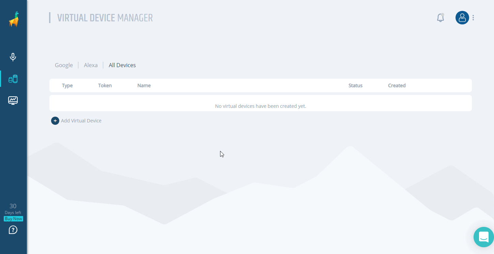

# Setting Up A Virtual Device
## Background
In order to test your Alexa skills and Google Actions, you need to create a Virtual Device. A Virtual Device is just like a physical Amazon Echo or Google Home, but one that can be interacted with programmatically.

We'll create a trial Virtual Device for you, the only thing we need you to do is grant us access to your Amazon Alexa or Google Assistant account. Once completed, you will have a token, which uniquely identifies the Virtual Device, that you can use in your tests.

There is a couple of steps for the setup - but don't worry - you will only have to do it once. And if you run into any issues, just [ping us here](https://gitter.im/bespoken/bst). We'll get it sorted out quickly!

## Creating A Virtual Device
### Virtual Devices for Alexa
1. Sign up for free or login to the [Bespoken Dashboard](https://apps.bespoken.io/dashboard) and you will see the following screen:


2. On the left panel click on **"Virtual Devices"** to access the Virtual Device Manager:


3. Click on the **"Add Virtual Device"** button, then select "Alexa Virtual Device":


4. A dialog will be displayed, after clicking on **"OK"** you will be redirected to a  Login with Amazon page:


5. After providing your credentials you will return to Bespoken dashboard and the **"Virtual Device Token"** will be retrieved automatically:


### Virtual Devices for Google
1. Follow steps 1-3 from "Creating a Virtual Device for Alexa" but on step 3, select "Google Virtual Device" instead.


2. A dialog will be displayed, after clicking on **"OK"** you will be redirected to a Google Sign-in page:


3. After providing your credentials you will return to Bespoken dashboard and the **"Virtual Device Token"** will be retrieved automatically:


### Enable personal results for Google

If you get a response: "to let me read out that information turn on personal results in the google app home" when testing your actions, follow these additional steps:


On Android Devices:

1. Long press the “home” button on an Android device.

2. Click on the compass icon.

3. Click on your user's icon.

4. Click on Settings.

5. Click on the Assistant Tab.

6. Scroll Down and you should see “virtual device” listed after your phone.

7. Click on it and enable Personal Results.

Additional information:

For IOS devices you need to install the *Google Assistant* from the [app store](https://itunes.apple.com/us/app/google-assistant/id1220976145) and do the same steps starting from step 3.

## Using the Device In Your Scripts
Now you can use the virtual device with your test script. Place it in the testing.json file of your project like so:
``` js
{
    "virtualDeviceToken": "MY_TOKEN"
}
```

See how we do it [here](https://github.com/bespoken-samples/virtual-device-example/blob/master/testing.json).

And that is all you need in the setup process, now you can continue with the creation of your test scripts, or using Virtual Device programmatically.
