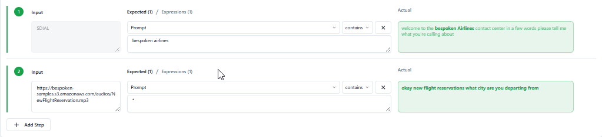
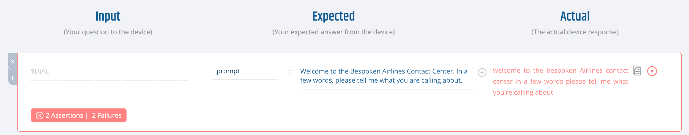
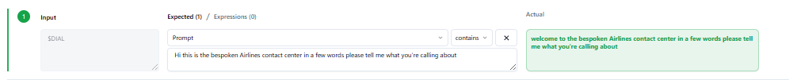
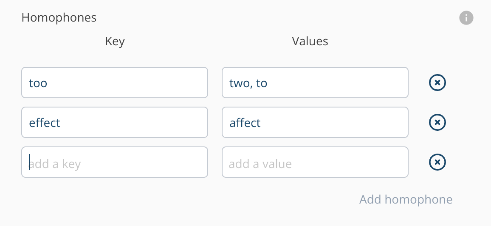
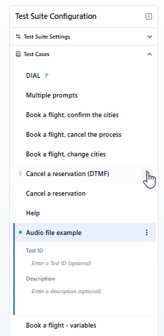
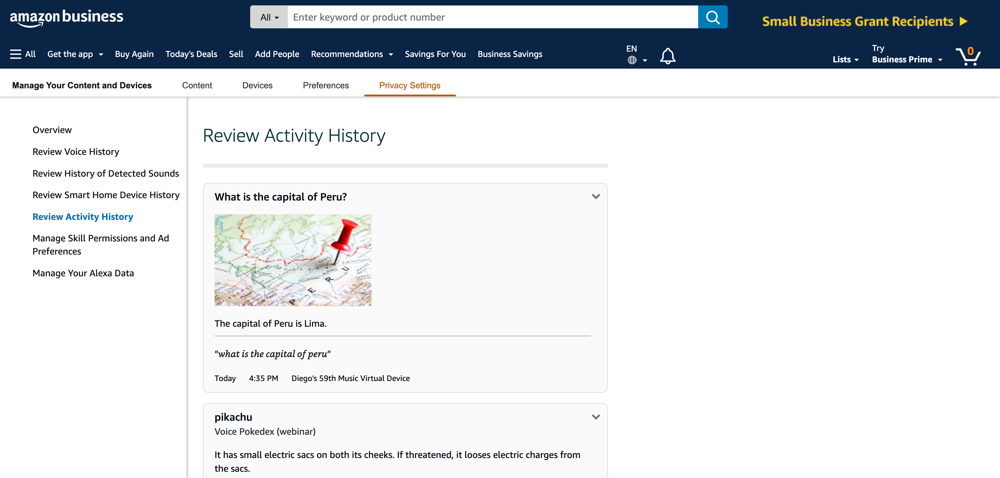

# FAQ for Functional Testing
Here you can find common questions regarding functional testing for Conversational AI.

## General

### What is Functional Testing and why do I need it?
> _Functional testing involves ensuring that the integrated components of an application function as expected. The entire application is tested in a real-world scenario such as communicating with the database, network, hardware, and other applications ... Techopedia_

In the context of conversational AI, functional tests focus on testing:
* The conversational AI application as a whole (from its user interface to its backend).
* Utterance resolution, aka speech recognition.
* Interaction models.

Functional testing is critical to ensure your voice app behaves as expected before it reaches your users. Most apps work with other services and use different pieces of technology, and testing only your code (i.e., just doing unit testing) does not guarantee you are free from errors.

Our approach to functional testing is based on the creation and execution of __test scripts__. Ideally, the test scripts should cover the entire functionality of your conversational app.

### Can I use my own prerecorded audios with your tests?
Yes, you certainly can. To do this, replace utterances in your tests with a publicly available URL containing your audio files. Like this:

Prerecorded audios that are sent as utterances should have the following formats: 
- Any of the [FFMPEG supported audio formats](https://ffmpeg.org/ffmpeg-formats.html) for regular functional tests.
- Any of the [Twilio Play supported audio formats](https://www.twilio.com/docs/voice/twiml/play#nouns) for IVR functional tests. 

### The transcript response from my test differs from what I'm expecting. What should I do?
For functional tests that use speech recognition, it is common to get some words, acronyms, and punctuation wrong. To compensate for this, there are two settings that can be adjusted to make tests pass.

#### Assertion Fuzzy Threshold
This property is common to all testing platforms. It represents how forgiving we should be when comparing the expected vs. actual values received, expressed as a decimal number from 0 to 1. Setting this property to 1 means the values have to match exactly; lowering the value makes the assertions more forgiving.

Here's an example with this value set to 1. Notice how the assertion failed when the only difference was "you are" vs. "you're" at the end and the test still fails.

Here's an example with this value set to 0.8 (our default value). Notice how this time the test passes even while expecting "you are". There's also another difference: "Contact Center" vs. "Customer Center".

In both cases, punctuation marks are not considered when evaluating results.

#### Homophones
Homophones are two or more words that share the same pronunciation but have different spellings or meanings. For example, the words 'hear' and 'here' are homophones because they mean completely different things, even though they sound similar. Homophones can be hard to differentiate during speech recognition. To fix this, you can specify a list of common homophones under the advanced settings like this:

In this case, any of the comma-delimited values will be replaced by their key before evaluating the results.

### How can I execute a subset of my tests within the Dashboard?
If you have a big test suite that contains multiple tests and only want to run a subset of them, simply mark the tests you want to run using the "only" flag. To do this, click on the three dots next to the names of the tests you want to select and click on the "Only" option. After this, click on "Run All" and Bespoken will only run the tests marked with this option, ignoring the rest.

Alternatively, you can use the "Skip" option to mark the tests that should not be run when clicking on "Run All".

## Alexa

### What permissions are needed for Functional Testing?
When you get a token from Bespoken’s Dashboard, what actually happens behind the scenes is we create a Virtual Device to interact with your skills. Virtual Devices need permissions to access your voice apps.

The specific permissions are to access Alexa Voice Services and Alexa Account Connection. This allows us to interact with your skills programmatically. 

Remember, you can remove access at any time by visiting your Alexa account [online](https://alexa.amazon.com/spa/index.html#settings) or via the Alexa app.

### How do I troubleshoot functional tests for Alexa?
There are several steps you can take to troubleshoot Alexa tests:

#### Verify your Alexa Activity History
The easiest way to verify what Alexa understood from our tests is to check the interaction history on the [Alexa privacy site](https://www.amazon.com/alexa-privacy/apd/home) then click on "Review Activity History".

This will allow you to see what Alexa understood from the audio Bespoken sent, as well as the response that was returned to Bespoken. 

You can also click on "Review Voice History" to hear the audio Bespoken sent to Alexa.

::: warning Important
  Note that the exact URL for viewing this history depends on the region you are testing in. For example, for the US go to amazon.com, for Germany go to amazon.de. 
:::

#### Verify the token you are using
If you can't locate the interaction in the history page, you are probably looking at a different account than the one used to create the Bespoken Virtual Device used in your test script. It is as if you are sending the utterance to a different Echo device. Please use the Amazon account associated with the selected token in your test scripts. 

#### Try a different voice
If you can locate the utterance in the activity history but Alexa did not understand it, then we have a speech recognition problem. If the problem is related to the invocation name, that explains why the voice service can't determine which skill to launch - it will say something like "Sorry, I don't know that" instead of invoking the skill.

Consider using any other available voice in the Dashboard. Bespoken supports voices from Amazon Polly, Google Cloud, and Watson TTS. 

#### Check your interaction model
It might happen that the voice service is correctly understanding your utterance but the wrong intent is requested, causing unexpected behavior. In this case, the problem might be located in your interaction model. Adding additional utterances to the model to match what Alexa hears will often resolve the issue.

### How do I test a voice app that requires account linking?
To test a voice app that requires account linking, simply link the account as you normally would within the Alexa app. Once the account linking process is completed, you can talk to the skill and access account-specific information via your virtual device. It's that easy!

Make sure the Alexa account you are using is the same one that your virtual device is associated with.

### I've changed my locale to en-UK, but I can't access a voice app from that region
There's a distinction between a locale and a voice app region. A locale refers to the language that you want to use when communicating with your voice platform. A region refers to the geographical space in which your voice app is available. In other words, your voice app could be prepared to reply to multiple locales (en-US, es-ES, etc.) but then be published only in certain regions. 

By default, our virtual devices will always point to the US region. If you want to reach a voice app in a specific region, you'll need to create a virtual device tied to an Amazon account that is specific to the region you want to test. That is, an amazon.co.uk account for testing a voice app published in the UK, an amazon.es account for voice apps in Spain, and so on. 

### I have errors when testing in parallel with devices using the same account with Alexa
Alexa AVS doesn't handle more than one request for the same account at the same time. If you need to do parallel tests, create the necessary virtual devices using different accounts at the setup.
