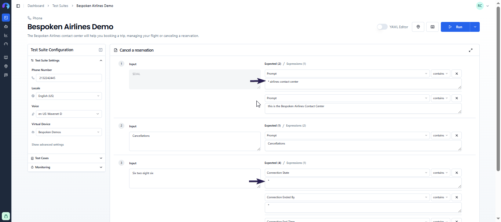
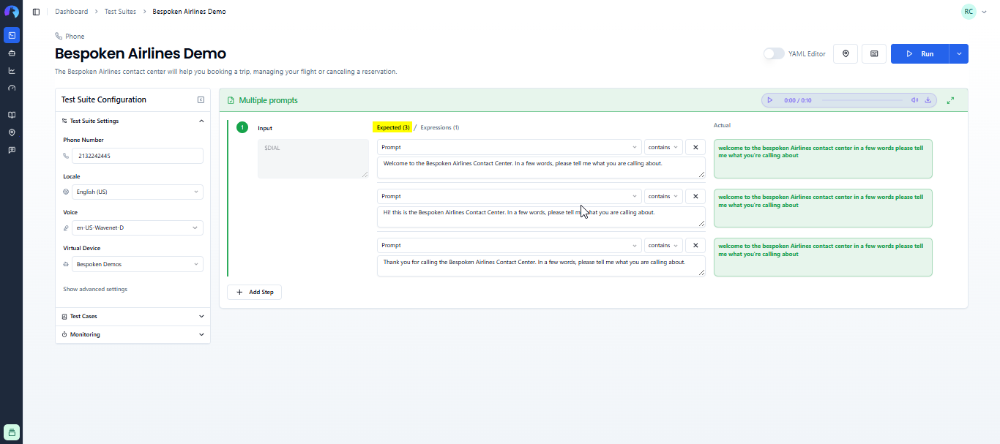
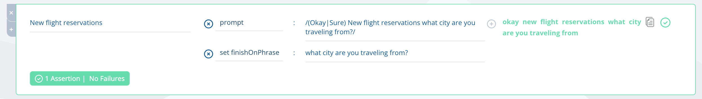

# FAQ for Functional Testing

Here you can find common questions regarding functional testing for Conversational AI.

[[toc]]

## General

### What is Functional Testing and why do I need it?

Functional testing ensures that the integrated components of an application function as expected in real-world scenarios. For conversational AI, it focuses on testing:

* The entire application (from user interface to backend)
* Utterance resolution (speech recognition)
* Interaction models

Functional testing is crucial to ensure your voice app behaves correctly before reaching users. Most apps interact with various services and technologies, so unit testing alone doesn't guarantee error-free performance.

Our approach to functional testing involves creating and executing __test scripts__ that ideally cover your conversational app's entire functionality.

### How do I handle dynamic content in my test scripts?

Bespoken provides several options for handling dynamic content:

#### Wildcards

Use an asterisk `*` as a wildcard for portions of your responses that are highly dynamic, difficult to transcribe, temporary, or that you simply can ignore. For example, in the image below we are replacing "Bespoken Airlines Contact Center" for a wildcard with success.



::: tip
You can use multiple wildcards in a single prompt or replace the entire expected response with a wildcard if the current response isn't crucial to your test.
:::

#### Multiple prompts

When your system alternates between responses (eg. Hi / Hello / Welcome or longer phrases), add multiple prompts for a single interaction. Bespoken will consider the interaction valid if any expected value matches the response. In the image below, notice how the expected responses include Hi and Welcome.



#### Regular expressions

Use regular expressions for more complex comparisons by enclosing the expected value in forward slashes `/`. In the image below, you can see how we are using a regular expressions to expect either "Okay" or "Sure" followed by the rest of the expected response.



### How can I address slight differences between expected and actual responses?

For functional tests using speech recognition, it's common to encounter minor discrepancies in words, acronyms, and punctuation. Two settings can be adjusted to accommodate these differences:

#### Assertion Fuzzy Threshold

Found under "Advanced settings," this property determines how forgiving comparisons between expected and actual values should be. It's expressed as a decimal from 0 to 1, where 1 requires an exact match and lower values allow for more differences.

Below is an example with threshold set to 1 (exact match required). Notice how the assertion failed when the only difference was "you are" vs. "you're" at the end and the test still fails.


Next is an example with threshold set to 0.8 (default value, more forgiving). Notice how this time the test passes even while expecting "you are". There's also another difference: "Contact Center" vs. "Customer Center".


Note: Punctuation marks are not considered when evaluating results.

#### Homophones

Homophones are words with the same pronunciation but different spellings or meanings (e.g., 'hear' and 'here'). These can be challenging for speech recognition. To address this, specify a list of common homophones in the advanced settings:


Any of the comma-delimited values will be replaced by their key before evaluating results.

### Can I use prerecorded audio files in my tests?

Yes, you can use prerecorded audio files by replacing utterances in your tests with a publicly available URL containing your audio files:


Supported audio formats:
- Regular functional tests: Any [FFMPEG supported audio format](https://ffmpeg.org/ffmpeg-formats.html)
- IVR functional tests: Any [Twilio Play supported audio format](https://www.twilio.com/docs/voice/twiml/play#nouns)

### How can I run a subset of my tests within the Dashboard?

To run only specific tests from a larger test suite:

1. Click the three dots next to the test names you want to run.
2. Select the "Only" option.
3. Click "Run All" to execute only the marked tests.


Alternatively, use the "Skip" option to exclude specific tests when clicking "Run All."

### How do I retrieve my API key?

To get your API key:

1. Navigate to the Dashboard.
2. Click the user menu in the upper right corner.
3. Select "Account."
4. Copy the API key within the "API access" tab.


### Does Bespoken support conditional steps in test scripts?

Currently, scripts generated in the Dashboard do not support conditional steps.

### Where can I see my consumed utterances?

View your organization's utterance consumption for the current month on the "Billing" page in your Dashboard. The utterance count resets at the start of each month.


### Can I schedule tests to run at specific times?

Yes, by enabling monitoring. This allows you to set specific test schedules and receive notifications for test failures. Learn more about monitoring [here](/monitoring/).

### How can I handle monitoring alerts on holidays?

Monitoring schedules use CRON expressions, which don't account for holidays. We recommend preparing your constantly monitored tests for different, alternative prompts using wildcards, regular expressions, or additional explicit prompts in your assertions, as explained earlier in this page.

### How difficult is it to set up functional tests, and how long does it take?

Setting up functional tests with Bespoken is straightforward. Our UI guides you through creating test scripts, and our team is available to help via email or chat. Creating a first test usually takes a few minutes. Most customers have a working set of test suites covering their systems' most important aspects within their first week of using Bespoken.

### Can I import tests from other sources into the Bespoken Dashboard?

Yes! We offer an easy way to import tests using an Excel template, which you can upload directly to the Bespoken Dashboard's Test Suites page.

If you prefer not to use Excel, contact us by email. We've successfully imported tests from systems like TestRail, Genesys, and others, and we'd be happy to work with you on this.

### Do I need coding skills to create tests with Bespoken?

No coding skills are necessary to work with Bespoken.

## Alexa

### What permissions are needed for Functional Testing with Alexa?

When you obtain a token from Bespoken's Dashboard, we create a Virtual Device to interact with your skills. This requires permissions to access Alexa Voice Services and Alexa Account Connection, allowing us to interact with your skills programmatically.

You can remove access at any time through your Alexa account [online](https://alexa.amazon.com/spa/index.html#settings) or via the Alexa app.

### How do I troubleshoot functional tests for Alexa?

Follow these steps to troubleshoot Alexa tests:

#### 1. Verify your Alexa Activity History

Check what Alexa understood from our tests on the [Alexa privacy site](https://www.amazon.com/alexa-privacy/apd/home):

1. Click on "Review Activity History."
2. View what Alexa understood and its response to Bespoken.
3. Click "Review Voice History" to hear the audio Bespoken sent to Alexa.


::: warning Important
The exact URL for viewing this history depends on your testing region (e.g., amazon.com for the US, amazon.de for Germany).
:::

#### 2. Verify the token you are using

If you can't find the interaction in the history, you might be looking at a different account than the one used for the Bespoken Virtual Device in your test script. Ensure you're using the Amazon account associated with the selected token in your test scripts.

#### 3. Try a different voice

If Alexa doesn't understand the utterance (visible in the activity history), you may have a speech recognition problem. Consider using another available voice in the Dashboard. Bespoken supports voices from Amazon Polly, Google Cloud, and Watson TTS.

#### 4. Check your interaction model

If Alexa understands the utterance but triggers the wrong intent, the problem might be in your interaction model. Adding more utterances to match what Alexa hears can often resolve this issue.

### How do I test a voice app that requires account linking?

To test a voice app requiring account linking:

1. Link the account as you normally would within the Alexa app.
2. Once account linking is complete, you can interact with the skill and access account-specific information via your virtual device.

Ensure the Alexa account you're using matches the one associated with your virtual device.

### I've changed my locale to en-UK, but I can't access a voice app from that region

There's a distinction between locale and voice app region:

- Locale: The language used for communicating with your voice platform.
- Region: The geographical area where your voice app is available.

By default, our virtual devices point to the US region. To test a voice app in a specific region, create a virtual device tied to an Amazon account for that region (e.g., amazon.co.uk for UK, amazon.es for Spain).

### I have errors when testing in parallel with devices using the same account with Alexa

Alexa AVS doesn't handle multiple simultaneous requests for the same account. For parallel testing, create separate virtual devices using different accounts during setup.

## IVR

### What is the default number used for calling in IVR tests?

The default number Bespoken uses for IVR end-to-end tests is: `+1 202 559 1161` (Washington, US).

### Can I get a different number to call?

Yes, contact us at [support@bespoken.ai](mailto:support@bespoken.ai), and we'll set up a different number for you, including phones for various countries.

### What countries are supported for IVR testing?

We support nearly 200 locales. If you're unsure about a specific country, email us at [support@bespoken.ai](mailto:support@bespoken.ai) to confirm availability.

### What IVR/CCaaS platforms do you support?

Our IVR end-to-end testing is system-agnostic. We only need the phone number to call, and we'll handle the rest. We've worked with many platforms, including Genesys, AWS Connect, Twilio, and others.

### Can I use Bespoken to monitor my IVR?

Yes, monitoring is available for all platforms Bespoken supports. Learn more about monitoring [here](/monitoring/).

### Can I simulate load on my IVR with the Bespoken dashboard?

Bespoken offers Load Testing for IVR, which can help verify that your system is prepared for high-traffic events. While we use functional tests created in the Dashboard for load testing, the actual load testing process is not run within the Dashboard and requires assistance from a Bespoken SME. Contact us at [contact@bespoken.ai](mailto:contact@bespoken.ai) for more information about Load Testing.

## Webchat

### What if my webchat is embedded in an iframe?

If your webchat is embedded in an iframe, specify the iframe selector in the advanced settings. This ensures the test script can correctly locate and interact with the chatbot within the iframe.

### How can I simulate a user clicking on a button?

Our end-to-end testing for Webchat supports the use of jQuery as input. You can use this to click, select, or interact with your chatbot window. For example, to click a button labeled "Rewards program":

```
$('button:contains("Rewards program")').click()
```

## WhatsApp

### What is Bespoken's default number for WhatsApp tests?

The default number we use to reach your WhatsApp bot is: `+1 (872) 213-7017`.

### Can we test using other numbers?

Yes, we can configure additional WhatsApp numbers for testing. Contact us at [support@bespoken.ai](mailto:support@bespoken.ai) for assistance.

### I'm not receiving Menu messages. What can I do?

Menu messages are not currently supported by our functional tests. However, you can easily mock them by putting `[MENU]` before your regular expected response. This is explained in more detail [here](/guides/whatsapp/#menu-messages-mocking).

### Can I see the images sent by my WhatsApp bot?

Images sent as part of WhatsApp responses will appear as clickable links within the Test Page "Actual" column.