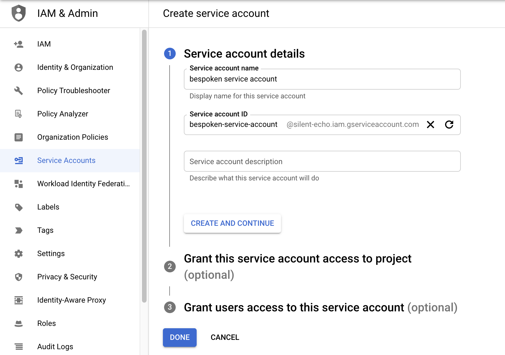

# FAQ For Google Marketplace
Here are answers to commonly asked questions about our service.

## Pre-requisites

### How to set up a google cloud service account

Go to [service accounts](https://console.cloud.google.com/iam-admin/serviceaccounts), and create a service account.
Fill in the name and id.
[](./assets/google-marketplace-create-service-account-1.png)

Grant the role "Service Account Token Creator", and complete the process with the default values.
[](./assets/google-marketplace-create-service-account-2.png)

Search for the newly created account service, see the details, and copy the "Unique ID".
[](./assets/google-marketplace-create-service-account-3.png)

Reach the bespoken team at contact@bespoken.io, requesting the access credentials, have to provide the "Unique ID", they will reply with some settings to set up your Google VM.

### How to set up an https URL that works with the Bespoken VM

- Redirect traffic from your load balancer to the VM.
- Set up your [https certificate](#how-to-set-up-your-own-https-certificate-within-the-vm) within the VM.

#### How to set up your own https certificate within the VM
NOTE: Before using this approach, ensure that you have access to the domain’s DNS configuration through your DNS provider.

For all the following commands, change your_domain with the domain you will use. Example: ivr-server.bespoken.tools

##### Allow http and https traffic
Make sure the firewall allows traffic to HTTP and HTTPS, update otherwise.
[](./assets/google-marketplace-firewall.png)

##### Configuring a static IP Address
Google Cloud Platform instances are launched with a dynamic IP address by default, which means that the IP address changes every time the server is stopped and restarted. This behavior is not desired, we have to reserve a static IP address and assign it to the VM. Follow the [instruccions](https://cloud.google.com/compute/docs/ip-addresses/reserve-static-external-ip-address).

##### Update DNS record
Create an A record in your DNS provider, to point to the IP address set in the previous step. You should get a response when accessing the domain:
```bash
http://your_domain
```

##### Enable SSL access over HTTPS with letsencrypt

Create the directory for your_domain as follows, using the -p flag to create any necessary parent directories:
```bash
sudo mkdir -p /var/www/your_domain/html
```

Next, create a sample index.html page using nano or your favorite editor:
```bash
sudo nano /var/www/your_domain/html/index.html
```

Inside, add the following sample HTML:
```html
<html>
    <head>
        <title>Welcome to your_domain!</title>
    </head>
    <body>
        <h1>Success! The your_domain server block is working!</h1>
    </body>
</html>
```
Save and close the file by typing CTRL and X then Y and ENTER when you are finished.

Execute the command:
```bash
sudo nano /etc/nginx/sites-available/your_domain
```

Paste in the following configuration block, replacing the domain name. If you have changed the default port, update accordingly:
```bash
server {
  listen 80;
  listen [::]:80;

  root /var/www/your_domain/html;
  index index.html index.htm index.nginx-debian.html;

  server_name your_domain;

  location / {
    proxy_pass http://localhost:3000;
    proxy_http_version 1.1;
    proxy_set_header Upgrade $http_upgrade;
    proxy_set_header Connection 'upgrade';
    proxy_set_header Host $host;
    proxy_cache_bypass $http_upgrade;
  }
}
```

Execute the command:
```bash
sudo ln -s /etc/nginx/sites-available/your_domain /etc/nginx/sites-enabled/
```

To check for errors:
```bash
sudo nginx -t
```

Restart the nginx server:
```bash
sudo systemctl restart nginx
```

If you access your domain you should get a message like this:
```json
{"message":"Health check: Looks good!","timestamp":"2021-06-18T21:04:04.683Z"}
```

Now, we will generate a SSL certificate:
```bash
sudo certbot --nginx -d your_domain
```

If this is your first time running certbot, you will be prompted to enter an email address and agree to the terms of service. After doing so, certbot will communicate with the Let’s Encrypt server, then run a challenge to verify that you control the domain you’re requesting a certificate for.

If that’s successful, certbot will ask how you’d like to configure your HTTPS settings.

Output
Please choose whether or not to redirect HTTP traffic to HTTPS, removing HTTP access.
- - - - - - - - - - - - - - - - - - - - - - - - - - - - - - - - - - - - - - - -
1: No redirect - Make no further changes to the webserver configuration.
2: Redirect - Make all requests redirect to secure HTTPS access. Choose this for
new sites, or if you're confident your site works on HTTPS. You can undo this
change by editing your web server's configuration.
- - - - - - - - - - - - - - - - - - - - - - - - - - - - - - - - - - - - - - - -
Select number 1.

Your certificates are downloaded, installed, and loaded. Try reloading your website using https:// and notice your browser’s security indicator. It should indicate that the site is properly secured, usually with a lock icon.

## Server configuration

### How to connect to the VM
You can connect to the VM [through the Google Cloud Console](https://cloud.google.com/compute/docs/instances/connecting-to-instance#connecting_to_vms).

### How to start and stop the server

[Connect to VM](#how-to-connect-to-the-vm) before executing any command.

Obtain the status of a service:
```bash
sudo -u bespoken /home/bespoken/scripts/status.sh
```

To start the service:
```bash
sudo -u bespoken /home/bespoken/scripts/start.sh
```

To stop the service:
```bash
sudo -u bespoken /home/bespoken/scripts/stop.sh
```

### How to update server settings

You can update the server settings [updating the instance metadata](https://cloud.google.com/compute/docs/metadata/setting-custom-metadata#update_metadata).

|Name|Description|Default|
|--- |--- |--- |
|role-arn|Value provided by bespoken to access their services||
|secret-name|Value provided by bespoken to access their services||
|url|Base url to access the service||

You must restart the VM after any change.


## Troubleshooting
### How to access server logs
The logs contain information that can be useful for troubleshooting possible issues. They can be found [connecting to VM](#how-to-connect-to-the-vm) and executing the following command:

```bash
sudo -u bespoken /home/bespoken/scripts/logs.sh
```
