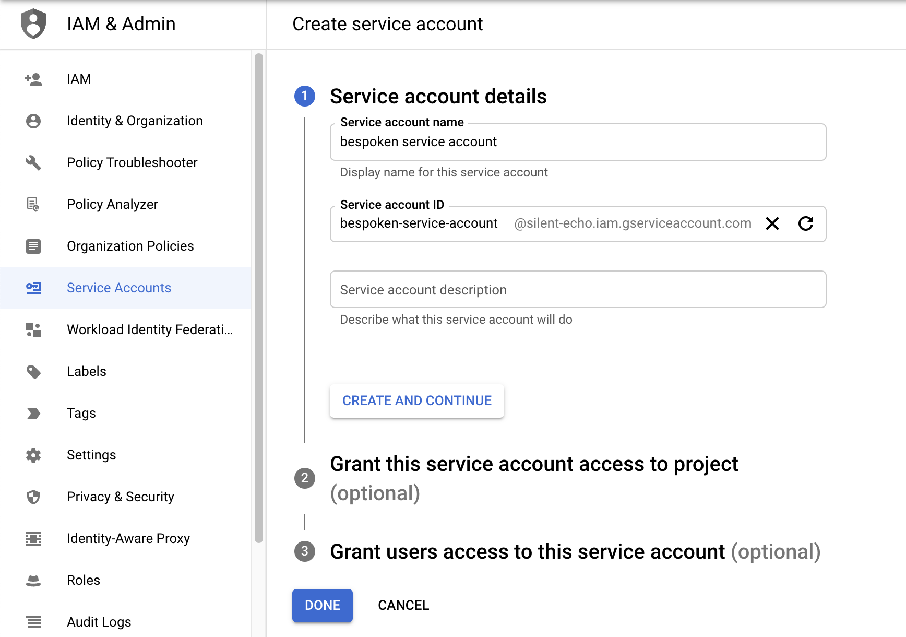
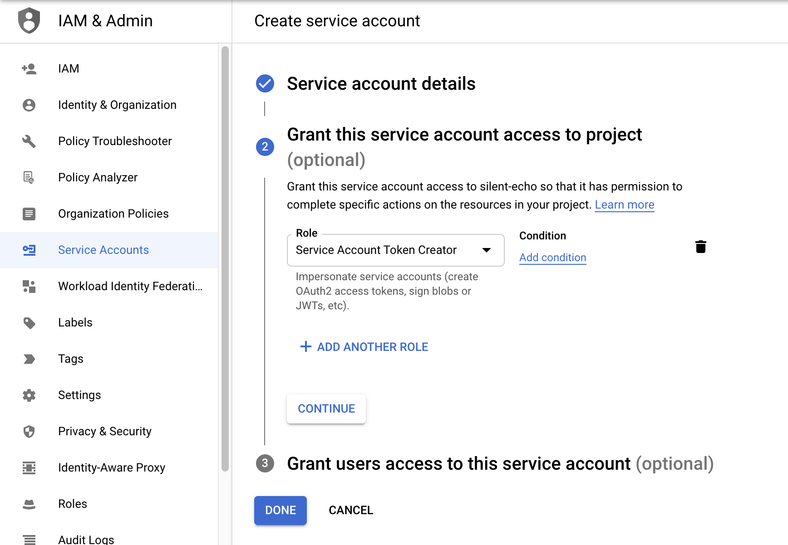
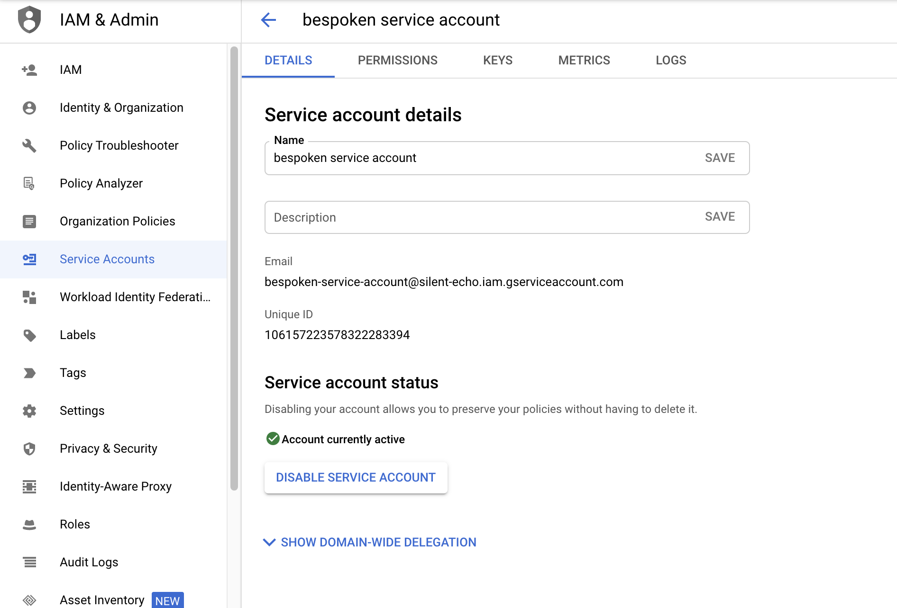

# Getting Started With 

## What is IVR-Server?

We provide a service to test Interactive Voice Response (IVR) and Intelligent Virtual Agent (IVA) systems by leveraging Twilio to interact with them.

## Before you begin

### Request access credentials
Go to [service accounts](https://console.cloud.google.com/iam-admin/serviceaccounts), and create a service account.
Fill the name and id.
[](./assets/google-marketplace-create-service-account-1.png)

Grant the role "Service Account Token Creator", and complete the process with the default values.
[](./assets/google-marketplace-create-service-account-2.png)

Search for the new created account service, see the details, and copy the "Unique ID"
[](./assets/google-marketplace-create-service-account-3.png)

Reach the bespoken team, requesting the access credentials, you have the provide the "Unique ID", they will reply with some settings to setup your Google VM.

## Deployment process
In the deplolyment process, fill the parameters for the VM, it is recommended at least 1vCPU and 1GB memory. For "Role arn", and "Secret name" complete those with the settings from the bespoken team. "Server url" is the url that will be used by the server. "Port" is the number of the port used to run the server, by default is 3000, it should be greater than 1024. You can [change](/google-marketplace/faq/#update-server-settings) these settings after the deploymnet is done.

An additional step is required after the deployment is completed. Stop the VM, edit the "Service account" field, select the service account created in the previous step and "Save" the changes.
[](./assets/google-marketplace-set-service-account.png)

After that youn can start the VM again.

## Verify if service is running
Get the IP number that was assigned to the VM, and make a request to the port you setup, by default 3000. If the server is running you will get a response, otherwise go to [troubleshooting](/google-marketplace/faq/#troubleshooting).

```bash
http://replace-with-your-ip:3000
```

## HTTPS connections
The server needs HTTPS connection to work. There are a couple of alternatives to achieve this:

- If you already have in place a Load Balancer to handle HTTPS connections, just redirect the traffic to the VM on the port set during deployment.
- Setup the SSL certificate [within the server](/google-marketplace/faq/#setup-ssl-certificate)
