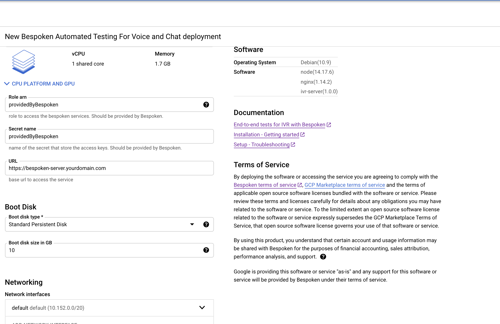
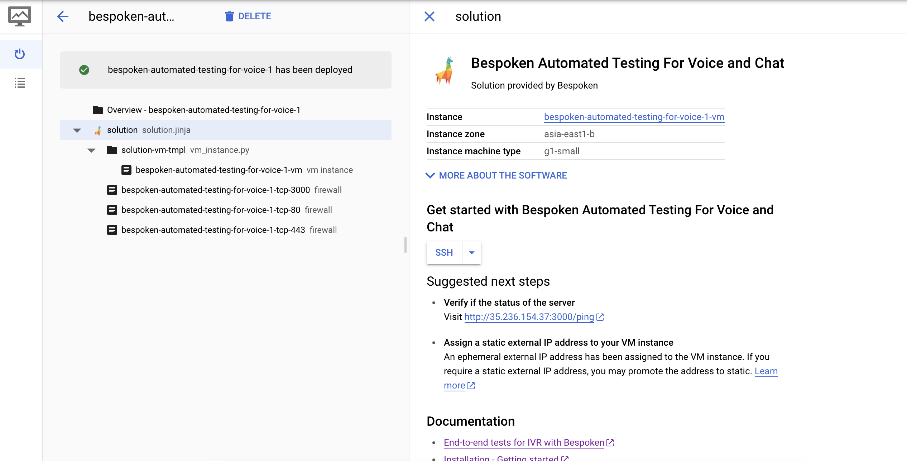
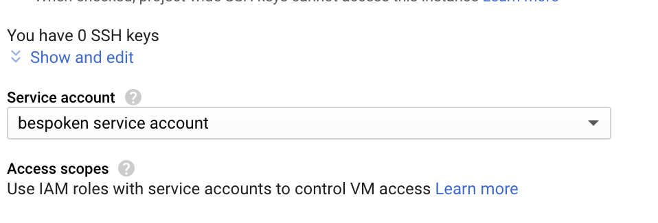

# Getting Started With Bespoken Automated Testing for IVR

## What is Bespoken Automated Testing for IVR?

Bespoken Automated Testing for IVR is a testing, training, and monitoring solution designed specifically for contact centers. Using Bespoken with your environment ensures that your contact center is delivering world-class customer service while reducing operating costs.

Increase customer satisfaction and call deflection rates, reduce speech recognition errors, and have confidence your system can meet any surge in calls. All with Bespoken.

## Features

* **Testing**: We mimic actual calls and texts to your contact center to ensure it understands your customers and is providing them with fast and easy resolutions to their queries. Our tests are easy to set up and written in plain-english. Once created, they can be run automatically, either on schedule or based on external triggers (such as changes to code).
* **Training**: We provide detailed, easy-to-implement advice to ensure your users are always well-understood. Speech recognition can be impacted by accents, poor line quality, and/or background noise. Bespoken makes sure your customers are understood every time.
* **Monitoring**: Once your Genesys application is tested, trained, and has gone live, our monitoring makes sure it continues to deliver outstanding performance and reliability. And when problems do arise, we let you know right away.
* **Load Testing**: Have confidence your application can scale. We simulate high volumes of calls, automatically, to identify bottlenecks and ensure your system will scale.

## Pre-requisites

- A google cloud [service account](/google-marketplace/faq/#how-to-set-up-a-google-cloud-service-account). After
the account is created, you need to reach out to Bespoken and ask for the required parameters to set up your VM.

- The https URL that will point to your VM, the URL setup will be done after the deployment is completed. The URL could be [updated](/google-marketplace/faq/#how-to-update-server-settings) after the deployment. Example:
```bash
https://ivr-server.yourdomain.com
```

- Make sure you have [firewall rules](https://cloud.google.com/filestore/docs/configuring-firewall) to allow inbound traffic to ports: 80, 443, and 3000. 

## Deployment process

- Go to the Google Cloud Marketplace and install Bespoken Automated Testing For Voice and Chat.

- In the deployment process, fill the parameters for the VM, it is recommended at least 1vCPU and 1.7GB memory, make sure to choose the Zone that’s best for you. Complete "Role arn", and "Secret name" with the values provided by Bespoken. Fill up the "Url" defined in the pre-requisites. You can [change](/google-marketplace/faq/#how-to-update-server-settings) these settings after the deployment is done.
[](./assets/google-marketplace-deployment.png)

- After the deployment is completed, you will see a confirmation like the image below.
[](./assets/google-marketplace-deployment-completed.png)

- An additional step is required after the deployment is completed. Click on your instance name and you should see the list of VMs available. Click again on your new instance name to see its details. Stop your instance using the buttons at the top. Then click on Edit. Update the "Service account" field, select the service account created in the previous step and "Save" the changes. After that, you can start the VM again.
[](./assets/google-marketplace-set-service-account.png)


## Verify if service is running
Get the IP number that was assigned to the VM, look for the “External ip” that was assigned to the VM.

Using the IP, make a request to port 3000. If the server is running you will get a response, otherwise, go to [troubleshooting](/google-marketplace/faq/#troubleshooting).

```bash
http://replace-with-your-ip:3000
```

Response:
```json
{"message":"Health check: Looks good!","timestamp":"2021-09-22T19:04:51.547Z"}
```

## After deployment

- After you verify the service is running it is neccesary to [setup your https URL](/google-marketplace/faq/#how-to-set-up-an-https-url-that-works-with-the-bespoken-vm).
