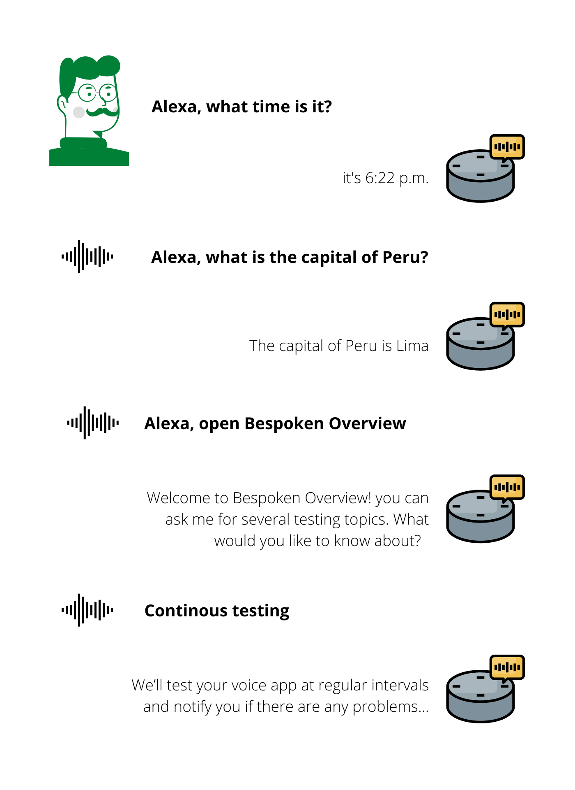
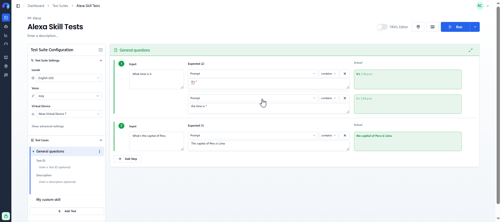
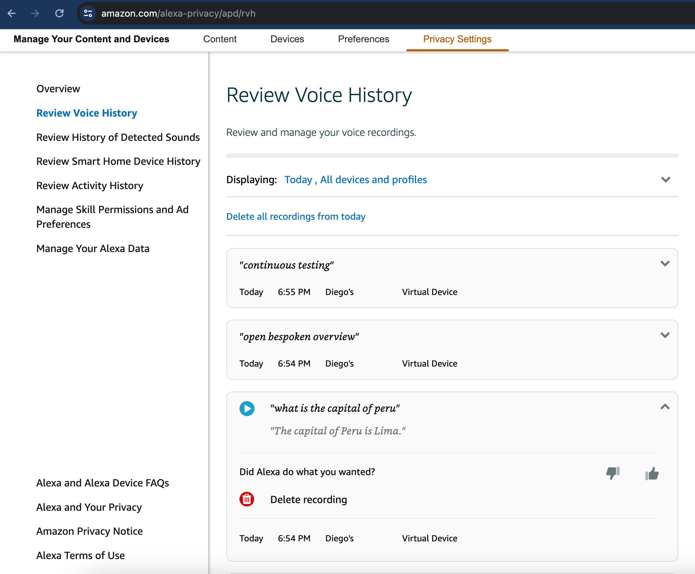
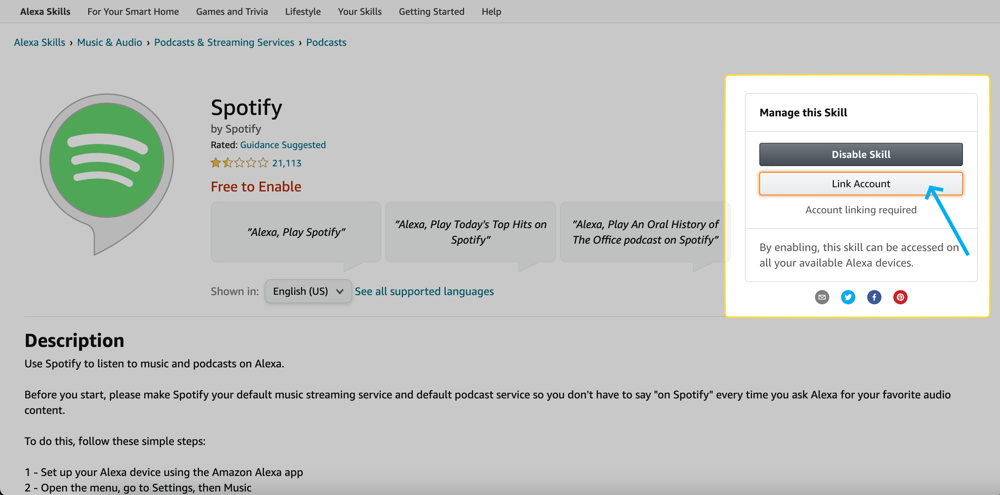

---

title: Alexa and Google Assistant  
permalink: /guides/alexa-google  
sidebarDepth: 3

---

# Functional Testing for Alexa and Google Assistant  
Bespoken can interact with your Alexa skills and Google Actions to test their functionality using an authenticated Virtual Device. We send audio to invoke the desired skill, capture the response audio, as well as their JSON payload, and use them in our assertions.

::: tip Important  
In this guide, we'll cover the specifics of testing Alexa and Google Assistant systems. For common concepts on how to test with Bespoken, refer to the [Test Page](/dashboard/test-page) article in the Dashboard section. We highly recommend reading that first.

Additionally, you will need to create your own Alexa and Google virtual devices as explained [here](/dashboard/virtual-devices#alexa-and-google-devices).  
:::

## Approach  
Consider the following example from a user interacting with Alexa:



In this image, the user has:  
- Asked for the time, which can have a variable response.  
- Asked for the capital of Peru, which can only be Lima.  
- Opened a skill "Bespoken Overview."  
- Continued the conversation with the skill.

Here's how this would look like as a Bespoken test:



Notice how:  
- We did not need to say "Alexa" (or "Ok Google" for Google actions). This is because wake words are needed when interacting with hardware devices, but we can omit them because we interact directly with Alexa and Google APIs.  
- We used a wildcard for the time question, as this can be highly variable.  
- We only put "Lima" as the expected response and not the whole phrase to account for variability in the responses.  

<!-- TODO: Add custom skill example -->

## Configuration  
The main configuration for these tests consists of the following:

| Property | Description | Default |  
| --- | --- | --- |  
| Locale | The language in which the system is being tested. Used for transcription and text-to-speech conversion. | en-US |  
| Voice | The voice to use when speaking. Options include voices from Amazon Polly, Google Text-to-Speech, and IBM Watson. | Joey |  
| Virtual Device | The virtual device to use in your test. A virtual device is tied to an existing Amazon or Google account. | Default device |

### Input Configuration  
In the input field, any text will be converted into audio and sent to Alexa/Google.

Additionally, you have the option to enter SSML directly into this field to further customize an utterance. For example:  
```xml  
<speak>Hello, <break time="1s"/> how are you today?</speak>  

```
would take a 1-second pause after the word "Hello," while 
```ssml
<speak>Hello, how are <emphasis level="strong">you</emphasis> today?</speak>
``` 
would put a strong emphasis on "you." You can learn more about SSML [here](https://cloud.google.com/text-to-speech/docs/ssml).

Finally, you can also use prerecorded audio simply by entering a WAV or MP3 file URL in the input field.

### Expected Configuration  
The main expected property `prompt` will be compared against the transcription of what we hear from your skill, as explained previously [here](/dashboard/test-page.md#interpreting-the-results).

For both Alexa and Google, we also return any JSON payload received. These typically include information about directives, stream IDs, image URLs, etc. You can query these by turning on the YAML editor and directly replacing the `prompt` property of the desired interaction with a JSON path to the property you want to test. The property will remain set when switching back to the UI editor.

### Advanced Settings  
In addition to the [common advanced settings](/dashboard/test-page/#advanced-settings), the following parameters are also accepted for Alexa and Google testing:

| Property | Description | Default |  
| --- | --- | --- |  
| Speech-to-Text model | Specifies the machine-learning model used to transcribe the response audio. This can improve transcription accuracy depending on the audio source. Note: not all models support all languages. Learn more about it [here](https://cloud.google.com/speech-to-text/docs/transcription-model). | Phone call |  
| Homophones | Lists values that will be replaced by their key when found to help with speech recognition. For example, "There" vs. "Their" vs. "They're". Separate values with commas. | N/A |

## Reviewing your Alexa History  
A good debugging technique for Alexa involves checking your Alexa history to:  
- Verify your commands reached Alexa.  
- Review what was understood by Alexa.  
- Verify the responses.



To do this, simply go to: [https://www.amazon.com/alexa-privacy/apd/rvh](https://www.amazon.com/alexa-privacy/apd/rvh)

## Account Linking  
Some Alexa skills will require you to go through an account linking process. When this happens, follow the account linking steps from the skill's homepage or the Alexa app on your phone. After doing so, Bespoken will be able to continue interacting with your skill, and you won't need to repeat the process.

