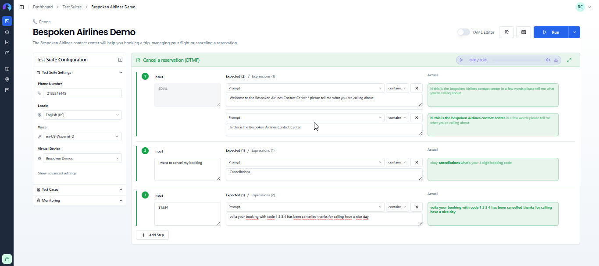

# Functional Testing for Interactive Voice Response Systems
We provide support for Interactive Voice Response (IVR) and Intelligent Virtual Agent (IVA) systems by simulating real user interactions. This involves placing a call and interacting with your system using voice and DTMF inputs.

::: tip Important
In this guide, we'll cover the specifics of testing IVR systems. For common concepts on how to test with Bespoken, refer to the [Test Page](/dashboard/test-page) article in the Dashboard section. We highly recommend reading that first.
:::

## Approach
Consider the following excerpt from a call made to an airline company's IVR system:


Unlike other conversational platforms, where communication happens in turns, an IVR call occurs over a bi-directional line where both parties can speak at any time. Therefore, it's crucial to identify key moments during the call to translate them correctly into a test. From the caller's perspective, the key moments in the call are:

- Dialing the airline's number
- Identifying when it's our turn to talk ("tell me what you're calling about")
- Responding with our intention
- Pressing a number on the phone keypad if necessary
- Repeating a step if the IVR system does not understand us

Here's the same call represented as a Bespoken test:



In this test:
- We call the configured number and start transcribing the call in real-time.
- We expect to hear "Hi! This is the Bespoken airlines contact center. In a few words, please tell me what you're calling about."
- We say "Cancellations" after hearing "tell me what you are calling about."
- We press `1234` on our keypad after hearing "4 digit booking code."
- We expect to hear "Your booking with code 6286 has been canceled. Thanks for calling, have a nice day!"

The keywords corresponding to these key moments in a conversation are: `$DIAL`, `finishOnPhrase`, and `$<NUMBER>`. These are the most common keywords you'll need to get familiar with, and we'll explain these and other options below.

## Configuration
The main configuration for an IVR test consists of the following:
| Property       | Description                                                                                      | Default       |
|----------------|--------------------------------------------------------------------------------------------------|---------------|
| Locale         | The language in which the system is being tested. Used for real-time transcription and text-to-speech conversion. | en-US |
| Voice          | The voice to use when speaking on the call. Options include voices from Amazon Polly, Google Text-to-Speech, and IBM Watson. | Joey |
| Phone number   | The phone number to call in your test.                                                           | N/A |
| Virtual Device | The virtual device to use in your test. A default device is already included in your account.     | Default device |


### Input Configuration
In the input field, any text will be converted into audio and played during the call. However, there are other accepted keywords in this field:
- `$DIAL` Represents picking up the phone and calling the configured number. It is the first input in any IVR test.
- `$<NUMBER>` Represents a DTMF input. For example, $1 when prompted to press 1. Longer numbers are also accepted.

Additionally, you have the option to enter SSML directly into this field to further customize an utterance. For example: 
```
<speak>Hello, <break time="1s"/> how are you today?</speak>
```
would take a 1-second pause after the word "Hello," while 
```
<speak>Hello, how are <emphasis level="strong">you</emphasis> today?</speak>
``` 
would put a strong emphasis on "you." You can learn more about SSML [here](https://cloud.google.com/text-to-speech/docs/ssml).

Finally, you can also use prerecorded audio simply by entering a WAV or MP3 file URL in the input field.

### Expected Configuration
The main expected property `prompt` will be compared against the transcription of what we hear from your IVR system, as explained previously [here](/dashboard/test-page.md#interpreting-the-results).

There are other properties that will modify the behavior of the interaction and allow it to move the test further. These properties start with the word `set` and are all optional:

| Property | Description | Default |
|---|---|---|
| `set finishOnPhrase` | Ends the current interaction and moves to the next when this phrase is heard.| Last portion of the current `prompt` |
| `set listeningTimeout` | Ends the current interaction and moves to the next after this many seconds.  | 60 seconds |
| `set endSpeechTimeout` | Ends the current interaction and moves to the next after this many seconds of silence. | N/A |
| `set pauseBeforeUtterance` | Adds this many seconds of silence before the utterance. | N/A |
| `set repeatOnPhrase` | Repeats the current utterance if this phrase is heard. Example: "sorry I didn't get that." | N/A |

Finally, you can also evaluate the property `connection.endedBy` to determine who ended the call. It contains two possible values: `caller` or `callee`, and it can only be present on the last utterance.

### Advanced Settings
In addition to the [common advanced settings](/dashboard/test-page/#advanced-settings), the following parameters are exclusive to IVR testing:

| Property | Description | Default |
|---|---|---|
| Record call | When enabled, records the call, making it available for listening after the test run. | true |
| "Repeat on" phrases | Repeats the current utterance if one of these phrases is found. Useful when the system does not understand what was said. | N/A |
| Speech-to-Text model | Specifies the machine-learning model used to transcribe the call audio. This can improve transcription accuracy depending on the audio source. Note: not all models support all languages. Learn more about it [here](https://cloud.google.com/speech-to-text/docs/transcription-model). | Phone call |
| Homophones | Lists values that will be replaced by their key when found to help with speech recognition. For example, "There" vs. "Their" vs. "They're". Separate values with commas. | N/A |
| Pause before utterance | Number of seconds of silence before playing an utterance. | 0 |
| Finish on phrase fuzzy threshold | A decimal from 0 to 1 that sets the threshold for fuzzy matching to identify a finishOnPhrase value. A value of 1 means the phrases must match exactly. | 0.9 |
| End of speech timeout | Time in seconds of silence to wait before moving to the next interaction. | N/A |
