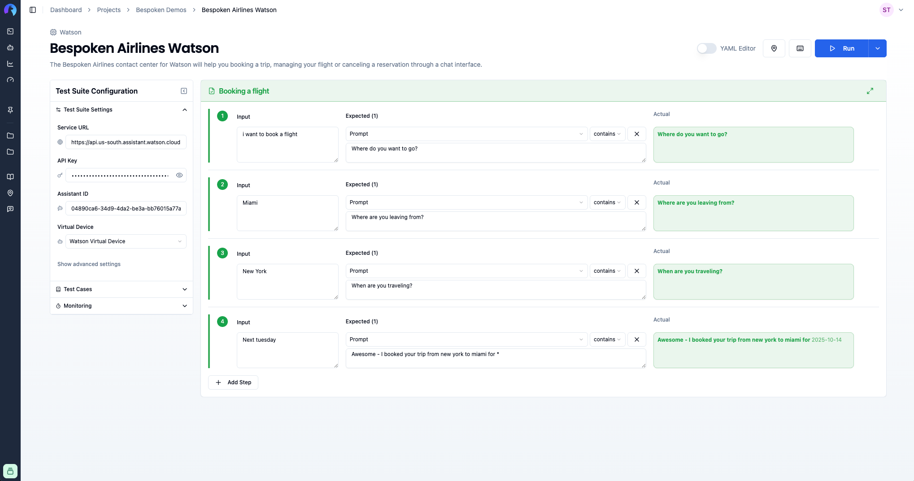
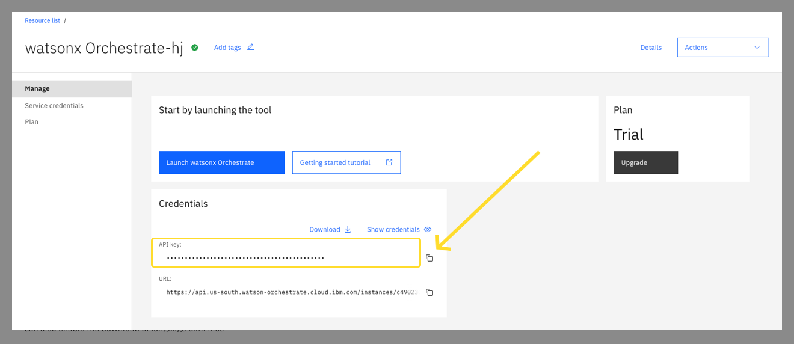
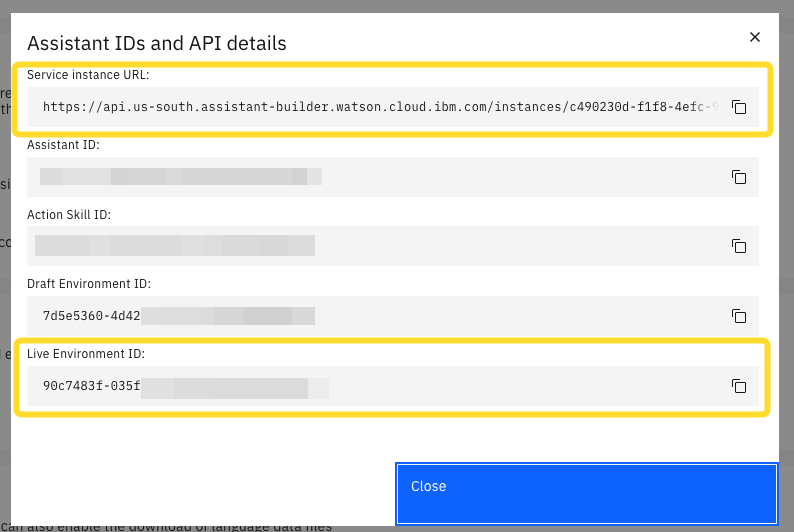
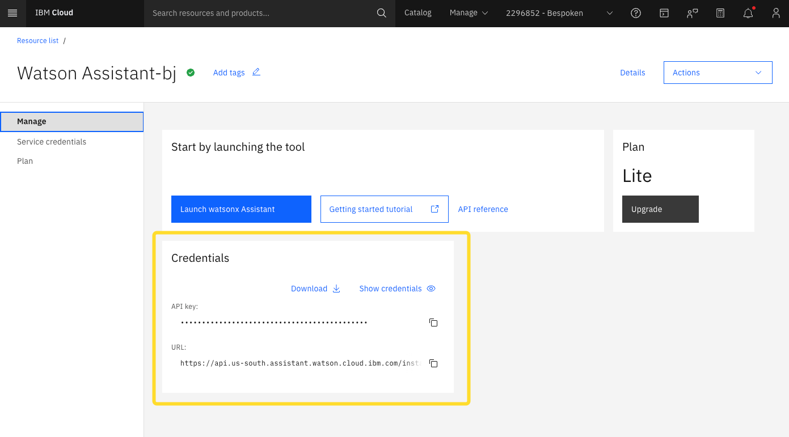
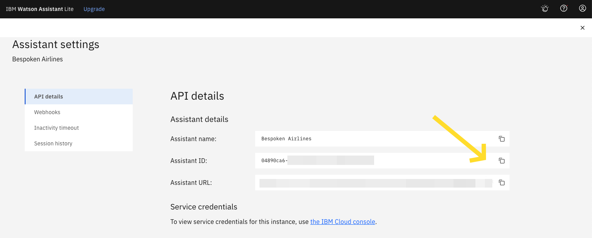

# Functional Testing for IBM Watson Assistant

::: tip Important
In this guide, we'll cover the specifics of testing IBM Watson Assistant. For common concepts on how to test with Bespoken, refer to the [Test Page](/dashboard/test-page) article in the Dashboard section. We highly recommend reading that first.
:::

## Approach
IBM Watson Assistant allows you to build live chatbots into any device, application, or channel. This means Watson could be at the core of your IVR, web chatbot, or WhatsApp bot. Bespoken provides support for testing Assistants created in IBM watsonx Orchestrate or through the legacy Watson Assistant interface by connecting directly to their APIs. This provides great convenience for running regressions, saving testing time and testing different languages using text.

Here's how a Watson Test looks like in Bespoken:

## Configuration 
The main configuration for an IBM Watson Assistant test consists of the following:

| Property                         | Description                                                                                      | Default        |
|----------------------------------|--------------------------------------------------------------------------------------------------|----------------|
| Virtual Device                        | The virtual device to use in your test. A default device is already included in your account.    | Default device |
| Watson Assistant API Key              | A token granting access to communicate with your assistant externally. | N/A            |
| Watson Assistant Service URL          | URL representing a Watson Assistant instance hosted in a specific region. | N/A  |
| Watson Assistant ID / Environment ID  | Identifier for the assistant you want to test. For legacy Watson Assistant, use the Assistant ID. For watsonx Orchestrate Assistant Builder, use the Environment ID instead. | N/A            |

:::tip Important
The legacy version of Watson Assistant used the Assistant ID. For Assistants created using the Assistant Builder in watsonx Orchestrate, you'll need to enter an Environment ID instead.
:::

### Watsonx Orchestrate Assistant Builder

You can get the Assistant API key from the watsonx Orchestrate instance page:

To get the Service URL and Environment ID, launch the instance and then go to Assistant Builder → Assistant Settings → Assistant IDs and API Details:

### Watson Assistant (Legacy)

You can get the API key and Service URL from the Watson Assistant instance page:

You can get the Assistant ID by launching the instance, opening your assistant and then clicking on the three dots menu at the top right corner of the page and selecting "Assistant Settings":

### Input Configuration
In the input field, any text will be sent directly to your Watson Assistant.

### Expected Configuration
The main expected property `prompt` will be compared against the responses from your assistant. For more details on interpreting test results, see the [Test Page guide](/dashboard/test-page.md#interpreting-the-results).