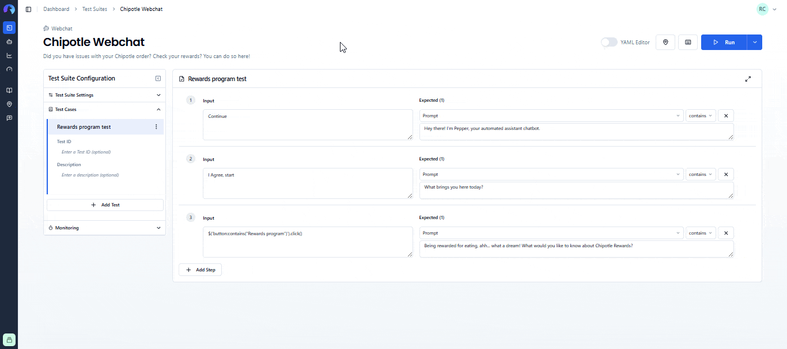
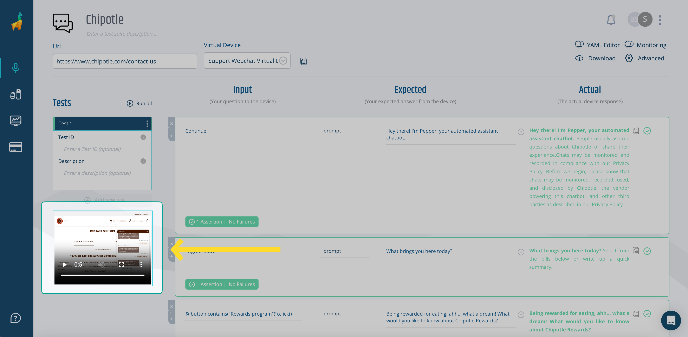

# Functional Testing for Webchat  
Bespoken can interact with your web chatbots to test their functionality by simulating real user interactions and evaluating the responses.

::: tip Important  
In this guide, we'll cover the specifics of testing chatbot systems. For common concepts on how to test with Bespoken, refer to the [Test Page](/dashboard/test-page) article in the Dashboard section. We highly recommend reading that first.  
:::

## Approach  
Let's take a look at this video of a user contacting Chipotle's support chatbot:

<video width="640" controls>  
  <source src="../assets/images/guides/webchat-chipotle.mp4" type="video/mp4">  
  Your browser does not support the video tag.  
</video>

In the video:
1. The user is on the [support page](https://www.chipotle.com/contact-us) of Chipotle's website. 
2. The user clicks on the "Ask Pepper" button at the bottom.
3. A chat window opens with initial messages, and the user agrees to continue by typing in a text field.
4. Presented with more options, the user clicks on "Rewards Program" at the end.

Now, here's how this would look as a Bespoken test:



Notice how:  
- We entered the URL as the main configuration parameter.
- The inputs in the first two interactions are plain text, which will be typed in the chatbot.
- We capture the text responses from your chatbot and retrieve them in the "Actual" field.
- The third interaction is written using JQuery, to simulate a button click.
- There are other configurations in the Advanced Settings tab needed for this test (explained below).

## Configuration  
The main configuration for these tests consists of the following:

| Property | Description | Default |  
| --- | --- | --- |  
| URL | URL where the chatbot is located. | N/A |  
| Virtual Device | The virtual device to use in your test. | Default device |

Additionally, there are other required parameters placed under the Advanced Settings tab for convenience. These allow Bespoken to know where should we type the inputs, and were should we look for responses.

### Input Configuration  
In the input field, any text will be typed into the chatbot window and sent as a message.

Additionally, you can use JQuery to interact with elements within the chatbot window. In our example above, we entered:

```javascript
$('button:contains("Rewards program")').click()
```

This code looks for a button that contains the text "Rewards program" and clicks on it. While this is not the norm, you can use this technique to press buttons, select values from a dropdown, check radio buttons, and more.

### Expected Configuration  
The main expected property `prompt` will be compared against your chatbot responses as explained previously [here](/dashboard/test-page.md#interpreting-the-results).

Additionally, you can use the `display` property. This will return the whole HTML we capture from your chatbot, so use it with caution. You can also use JQuery to run an assertion on an specific element of your chatbot. To do this, simply turn on the YAML editor and replace the `prompt` property of an interaction with the JQuery expression that points to the element you want to test. The property will remain set when switching back to the UI editor.

### Advanced Settings  
In addition to the [common advanced settings](/dashboard/test-page/#advanced-settings), the following parameters are also accepted for Webchat testing:

| Property | Description | Default |  
| --- | --- | --- |  
| Headless testing | Use a headless browser for testing, avoiding having to load the application's user interface. This enhances test speed and reliability, but it may not be supported on all pages. | True |  
| Bypass CSP | Bypass the page Content Security Policy. For sites that won't allow automated testing on their pages. | False |  
| Navigation Timeout | Numeric value that will change the default navigation timeout. | N/A |  
| Initialize Script | Script that runs after opening the chatbot window before starting any test commands. | N/A |  
| Open Selector | The CSS selector to open the chatbox widget. | N/A |  
| **Text Input Settings: Selector** | Required. The CSS selector for the text input where messages should be entered. | N/A |  
| Text Input Settings: Script After Each Command | Script to run after each input has been entered. | N/A |  
| Text Input Settings: IFrame Selector | IFrame CSS selector, if the chatbot lives within one. | N/A |  
| **Reply Settings: Selector** | Required. The CSS selector used to look for the reply within the webchat HTML. | N/A |  
| Reply Settings: Script After Each Command | Milliseconds to wait for a reply. | 15000 |  
| Reply Settings: IFrame Selector | IFrame CSS selector, if the chatbot lives within one. | N/A |  
| Load Timeout | Milliseconds to wait for the webpage to finish loading. | 10000 |  
| Initialize Timeout | Milliseconds to wait for the initialize script to finish. | 5000 |  
| Viewport Width | Desired width in which to test the page. | N/A |  
| Viewport Height | Desired height in which to test the page. | N/A |  
| Additional scripts | URLs pointing to additional JS scripts to be used during testing. Make sure to include [JQuery](https://ajax.googleapis.com/ajax/libs/jquery/3.6.4/jquery.min.js) if your page doesn't have it already | N/A |

Most of these parameters are optional. We only need to know how to open your chatbot window, where to type our inputs and where to look for responses. For reference, these are the values used in the Chipotle example above:
- Open selector: `#customer-care-engagement`
- Text input settings selector: `[data-lp-point="chat_input"]`
- Reply settings selector: `[data-lp-cust-id="transcript_bubble_agent_text"]`
- Additional scripts: `https://cdn-script.com/ajax/libs/jquery/3.7.1/jquery.js`

## Video Evidence  
After each test run, you'll have video playback available on the left side of the testing page. This can be helpful as evidence of your test and can also be used during the test setup to better understand what your test is doing and correct any steps that are not working as expected.



For reference, here's the video generated from our previous test:

<video width="640" controls>
  <source src="../assets/images/guides/webchat-evidence.mp4" type="video/mp4">
  Your browser does not support the video tag.
</video>
