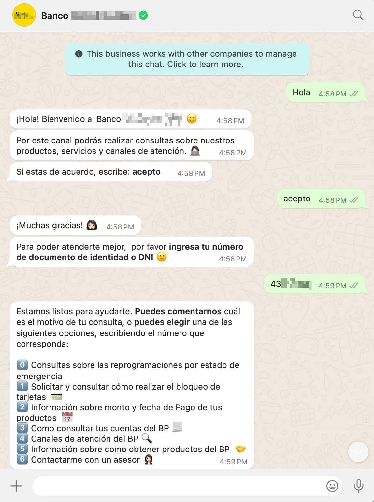
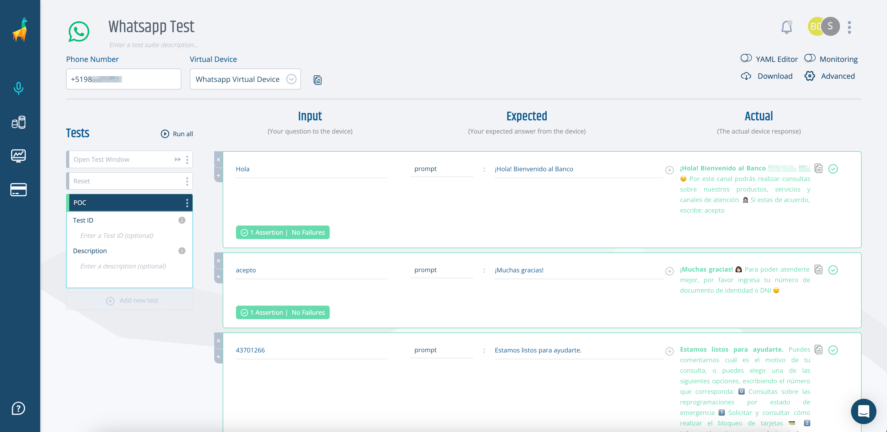
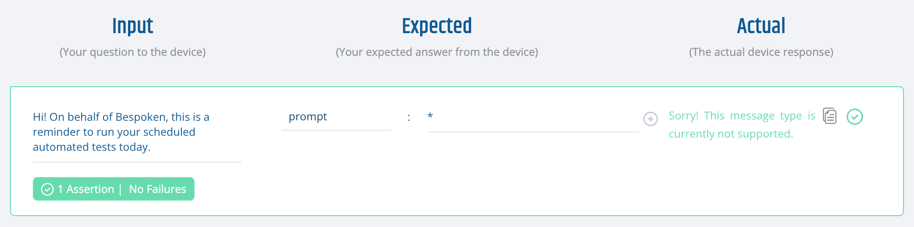
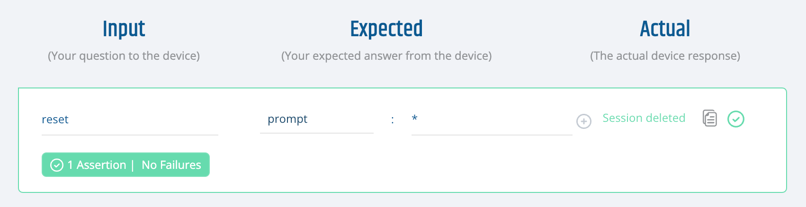
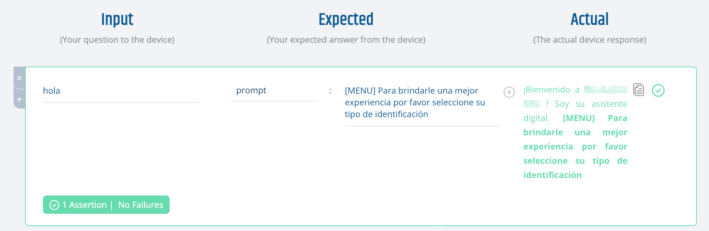

# Functional Testing for Whatsapp  
Bespoken can interact with your Whatsapp for Business bots to test their functionality by simulating real user interactions and evaluating the responses.

::: tip Important  
In this guide, we'll cover the specifics of testing Whatsapp for Business bots. For common concepts on how to test with Bespoken, refer to the [Test Page](/dashboard/test-page) article in the Dashboard section. We highly recommend reading that first.  
:::

## Approach  
Let's take a look at this conversation with a South American Bank.



In this chat:
- The user sends a "Hello" message to it's bank.
- The bank instantly responds with multiple messages.
- The user agrees to it's term and conditions.
- The bank ask the user to enter an ID number.
- The conversation continues.

This is how the same conversation would look as a Bespoken test:



Notice that response messages have been grouped together as a single response, before proceeding to the next interaction. This is based on timing and can be configured globally or per interaction as explained below.

## Configuration  
The main configuration for Whatsapp tests consists of the following:

| Property | Description | Default |  
| --- | --- | --- |  
| Phone Number | Phone number of the Whatsapp for Business bot to reach. | N/A |  
| Virtual Device | The virtual device to use in your test. | Default device |

### Input Configuration  
In the input field, any entered text will be sent as a message to Whatsapp.

### Expected Configuration  
The main expected property `prompt` will be compared against the Whatsapp responses as explained previously [here](/dashboard/test-page.md#interpreting-the-results). Responses will be gathered for a brief time before being returned and moving to the next interaction. This period can be customized per interaction with the `set responseWaitTime` property.

### Advanced Settings  
In addition to the [common advanced settings](/dashboard/test-page/#advanced-settings), the following parameters are also accepted for Whatsapp testing:

| Property | Description | Default |  
| --- | --- | --- |  
| Response Wait Time | Numeric value in seconds that the system waits for response messages before moving to the next interaction. Response messages are grouped together before being returned. Changing this value affects all the interactions, unless another value is set at the interaction level. Lower the value for faster responses. | 30 |  

## Special Considerations  
Bespoken uses it's own Whatsapp for Business account to test others. This comes with some considerations that you should know about and plan around.

### Concurrency
Bespoken uses it's own Whatsapp numbers to run tests. This means that the same number can't run two tests against the same number at the same time as this would be like having two whatsapp chats with a single contact. If you try to do this, you might get mixed up results.

### Testing Window
There are two ways in which Whatsapp bots can send freeform messages to a user:
- The user has initiated the conversation with the bot.
- The bot has sent a "template" message and the user has responded to it.
After any of these two conditions is met, the Whatsapp for Business number can send freeform messages for up to 24 hours until one of the conditions above is met again.

Bespoken's default templated message is:
```
Hi! On behalf of Bespoken, this is a reminder to run your scheduled automated tests today.
```

You can use this template once per day, whenever you want to test your Whatsapp bot. As long as your system responds something to this template, the contet of that response is not relevant.



::: tip Tip  
Leverage Bespoken's monitoring to set up a test that opens your Whatsapp testing window every 24 hours, so you don't need to worry about it.
:::

### Session handling
Bespoken interacts with your Whatsapp bot as a real user would. This means that after running a test, the next test would continue where the first left off. To prevent this, it is required that your bot has a sesssion reset mechanism. This could either be an API call or, preferably, a message that triggers the session reset. 



### Supported message types
The following message types are supported by Bespoken's Whatsapp testing:
- Text
- Media: Images

Images are returned as clickable links within the response. Clicking the link will show the received image.

### Menu messages mocking
Currently Bespoken does not support receiving Menu messages via Whatsapp. You can however, mock receiving your expected menu by adding `[MENU]` at the start of your expected value. When we detect these messages, we'll return them as part of the response. This way, you can continue testing past these steps.




