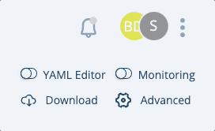
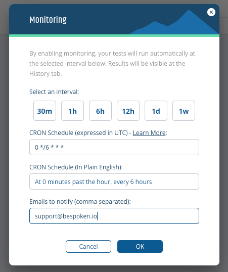
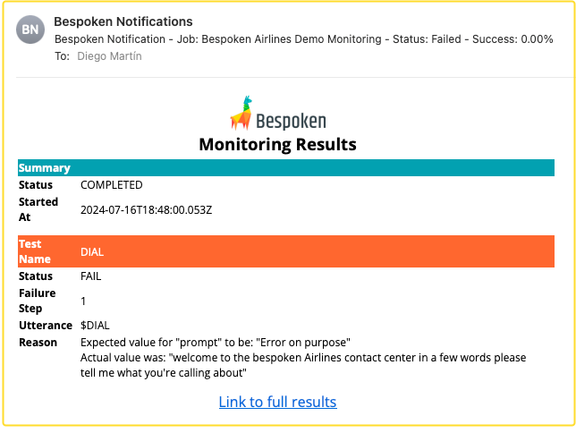
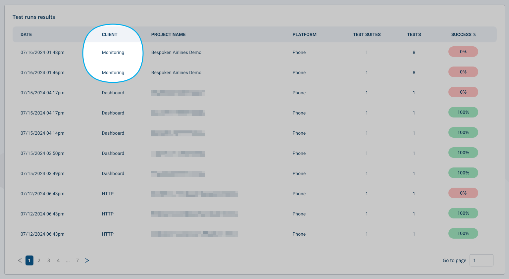

# Monitoring

Monitoring is a crucial feature that allows you to keep track of your conversational AI application's performance and functionality continuously. By setting up monitoring, you can ensure that your system remains reliable, and any issues are promptly detected and addressed. This proactive approach helps maintain a seamless user experience and avoids unexpected downtimes.

## Supported Platforms
Monitoring works across all your supported platforms, providing a unified way to keep an eye on your systems, whether it's an IVR, web chatbot, or any other integrated platform.

## Enabling Monitoring
To enable monitoring, navigate open the test page for the test suite that you want to monitor and click on the monitoring toggle.

This action will open a modal where you can configure your monitoring preferences.

### Configuration Modal
In the configuration modal, you will be prompted to provide:
- **CRON expression:** This determines the frequency of the monitoring checks. You can use one of the predefined CRON expressions available, or enter a custom one in the textfield below.

::: warning Important
All CRON expressions entered in this modal are in UTC. Please consider that to adapt monitoring to your local timezone.
:::

- **Emails to notify:** Enter the email addresses that should receive notifications in case of a test failure. Separate as many emails as you need using commas.

Once configured, your tests will be run automatically at the specified intervals by our system.

## Test Execution and Notifications
Monitoring will run all tests within your test suite. This can impact the time it takes to run the tests and the number of utterances used. 

- Use the "only" or "skip" flags to select or avoid specific tests to run, as explained [here](../dashboard/test-page/#running-your-tests).
- If the test run succeeds, no notifications will be sent.
- If the test run fails, an email will be sent to the specified addresses. The email will include details of the test run and a link to the history page where you can review the results.

## Viewing Results
The results of the monitoring tests will be shown on the [history page](../dashboard/history/). When a test run is triggered by monitoring, the "Client" column will display "Monitoring".

## Disabling Monitoring
To disable monitoring, simply click on the toggle again and confirm that you want to disable it. This will stop the automated tests from running.

## Important Considerations
- Be cautious about the frequency of your tests, as each test run will consume utterances from your plan. Make sure to choose a schedule that balances the need for frequent checks with your plan's limitations.

By following these steps, you can effectively set up and manage monitoring for your applications, ensuring they perform optimally at all times.