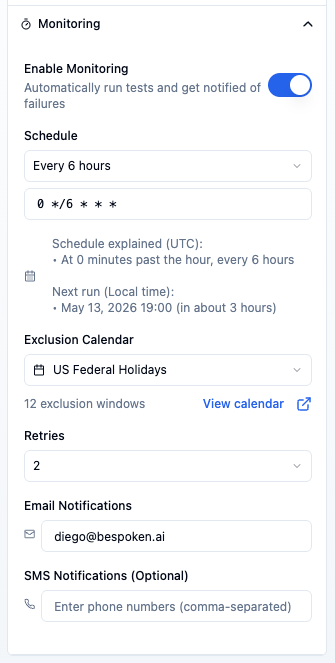
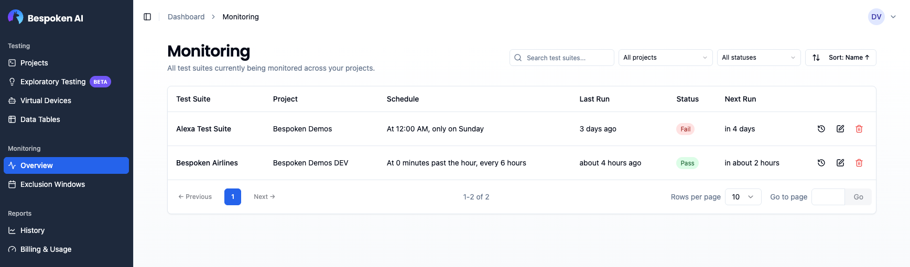

# Monitoring

Monitoring lets Bespoken automatically run your test suites on a defined schedule and alert you when failures are detected. This helps you catch regressions early and ensure your system stays stable between manual test runs.

## Supported Platforms
Monitoring works across all your supported platforms, providing a unified way to keep an eye on your systems, whether it's an IVR, web chatbot, or any other integrated platform.

## Enabling Monitoring

To enable monitoring, open the test suite you want to monitor, expand the **Monitoring** section in the configuration panel on the left, and toggle **Enable Monitoring** on.

### Schedule

Once monitoring is enabled, select how often you want the tests to run:

| Option | Frequency |
|--------|-----------|
| Every 30 minutes | `*/30 * * * *` |
| Every hour | `0 * * * *` |
| Every 6 hours | `0 */6 * * *` |
| Every 12 hours | `0 */12 * * *` |
| Every day | `0 0 * * *` |
| Every week | `0 0 * * 0` |

The CRON expression field is always visible below the dropdown. A plain-English explanation of the expression (e.g., "At minute 0 past every 6th hour") is shown automatically to help you verify the schedule is correct.

::: tip Custom Schedules
Users on paid plans can type any valid CRON expression directly into the field to set a fully custom schedule.
:::

::: warning Trial Limits
Schedules shorter than 6 hours (Every 30 minutes and Every hour) are not available during a trial.
:::

::: warning Timezone
All CRON expressions are evaluated in UTC. Please account for your local timezone when configuring a schedule.
:::

### Exclusion Calendar

You can optionally attach an **exclusion calendar** to pause monitoring during scheduled maintenance windows, public holidays, or other known downtime periods. Select a calendar from the **Exclusion Calendar** dropdown in the monitoring configuration panel — scheduled runs that fall within any defined window will be skipped automatically.

See [Exclusion Windows](./exclusion-windows/) for instructions on creating and managing calendars.

### Retries

Use the **Retries** dropdown to configure how many times Bespoken should re-run the suite if it fails before sending a notification:

| Value | Behavior |
|-------|----------|
| 0 (disabled) | Notify on first failure |
| 1 | Retry once before notifying |
| 2 | Retry twice before notifying (default) |
| 3 | Retry three times before notifying |

Retries help reduce false positives caused by transient network errors or temporary platform issues.

### Notifications

Configure who gets alerted when a monitored test suite fails:

- **Email Notifications** — Enter one or more comma-separated email addresses. Recipients receive an alert whenever the suite reports a failure after all retries are exhausted.
- **SMS Notifications** (optional) — Enter one or more comma-separated phone numbers to receive SMS alerts in addition to email. Numbers should not have dashes, spaces, or parentheses; plus signs for international numbers are allowed.

Once configured, your tests will run automatically at the specified intervals. You will also see a green monitoring pill next to your test suite name for suites that are being monitored.

::: warning Utterance Usage
Each scheduled test run consumes utterances from your plan. Choose a schedule frequency that balances the need for regular checks with your plan's limits.
:::

## Test Execution and Notifications

Monitoring runs all tests within your test suite. This can impact the time it takes to run the tests and the number of utterances used.

- Use the "only" or "skip" flags to select or exclude specific tests, as explained [here](../dashboard/test-page/#running-your-tests).
- If the test run succeeds, no notifications are sent.
- If the test run fails, an email is sent to the specified addresses with details of the run and a link to the history page where you can review the results.

## Monitoring Overview

The **Monitoring** page (accessible from the main sidebar) gives you a single view of all test suites currently being monitored across your projects.

The table includes the following columns:

| Column | Description |
|--------|-------------|
| Test Suite | Name of the monitored suite, links to the suite editor |
| Project | Project the suite belongs to |
| Schedule | Human-readable description of the CRON schedule |
| Last Run | Relative time of the last run; links to the run detail page |
| Status | Result of the last run: **Pass**, **Fail**, or **Pending** |
| Next Run | Estimated time until the next scheduled run |

### Filtering and Sorting

Use the controls in the top-right corner to narrow down the list:

- **Search** — Filter by test suite name.
- **Project** — Show only suites from a specific project.
- **Status** — Filter by last run status: Passing, Failing, or Pending / Not run.
- **Sort** — Sort by name, project, last modified date, last run date, or status.

### Actions

Each row has three action buttons:

- **History** — Opens the run history filtered to this test suite.
- **Edit** — Opens the monitoring settings dialog where you can update the schedule, exclusion windows, retries, and notification recipients.
- **Disable** — Removes monitoring from the associated test suite.

## Viewing Results

The results of monitoring runs are shown on the [history page](../dashboard/history/). When a test run is triggered by monitoring, the **Client** column displays "Monitoring".

