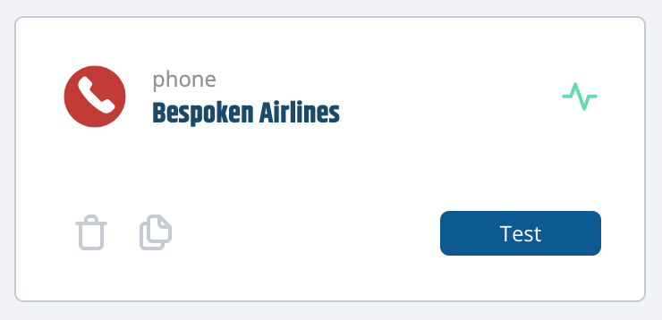
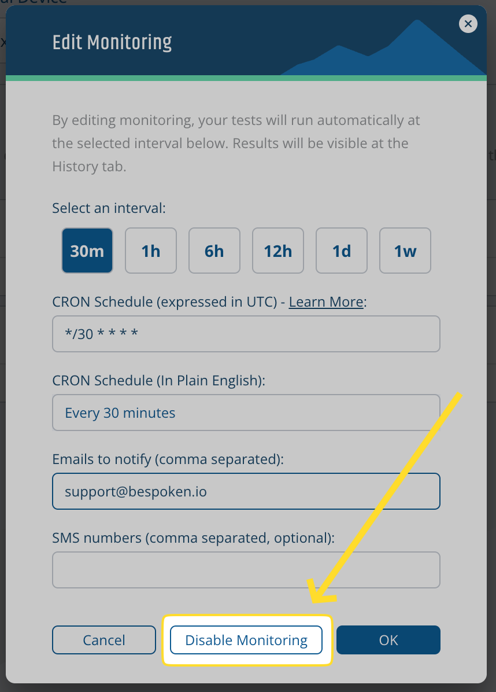

# Monitoring

Monitoring is a crucial feature that allows you to keep track of your conversational AI application's performance and functionality continuously. By setting up monitoring, you can ensure that your system remains reliable, and any issues are promptly detected and addressed. This proactive approach helps maintain a seamless user experience and avoids unexpected downtimes.

## Supported Platforms
Monitoring works across all your supported platforms, providing a unified way to keep an eye on your systems, whether it's an IVR, web chatbot, or any other integrated platform.

## Enabling Monitoring
To enable monitoring, open the test page for the test suite that you want to monitor and click on the "Enable Monitoring" toggle on the Test Suite Configuration panel.

This action will allow you to configure your monitoring preferences.

### Monitoring Configuration
In the configuration panel, you will be prompted to provide:
- **CRON expression:** This determines the frequency of the monitoring checks. You can use one of the predefined CRON expressions available, or enter a custom one in the textfield below.

::: warning Important
All CRON expressions entered in this modal are in UTC. Please consider that to adapt monitoring to your local timezone.
:::

- **Emails to notify:** Enter the email addresses that should receive notifications in case of a test failure. Separate as many emails as you need using commas.

- **SMS numbers (optional):** Enter the phone numbers that should receive an SMS notification in case of a test failure. You can add multiple numbers separated by commas. Numbers should not have dashes, spaces, or parenthesis, plus signs for international numbers are allowed.

Once configured, your tests will be run automatically at the specified intervals by our system. You will also see a green monitoring pill next to your test suite name for test suites that are being monitored.

## Test Execution and Notifications
Monitoring will run all tests within your test suite. This can impact the time it takes to run the tests and the number of utterances used. 

- Use the "only" or "skip" flags to select or avoid specific tests to run, as explained [here](../dashboard/test-page/#running-your-tests).
- If the test run succeeds, no notifications will be sent.
- If the test run fails, an email will be sent to the specified addresses. The email will include details of the test run and a link to the history page where you can review the results.

## Viewing Results
The results of the monitoring tests will be shown on the [history page](../dashboard/history/). When a test run is triggered by monitoring, the "Client" column will display "Monitoring".

## Editing and Disabling Monitoring
To edit your monitoring schedule, simply click on the toggle again. This will open the monitoring modal with your current configuration already loaded. Apply the changes necessary and click on "Ok" to finish. If you don't want to keep monitoring your tests, simply click on the "Disable monitoring" button instead.

::: warning Important
Be cautious about the frequency of your tests, as each test run will consume utterances from your plan. Make sure to choose a schedule that balances the need for frequent checks with your plan's limitations.
:::

By following these steps, you can effectively set up and manage monitoring for your applications, ensuring they perform optimally at all times.