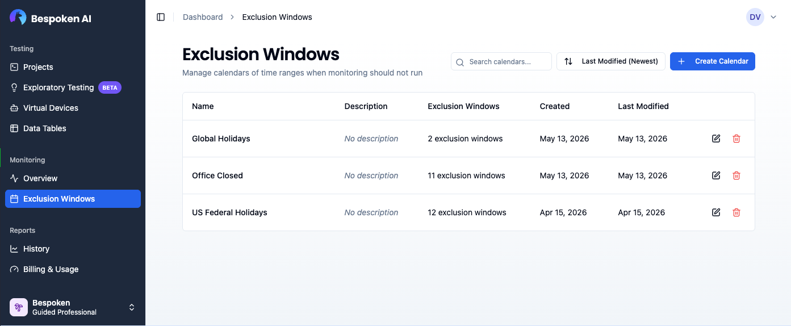
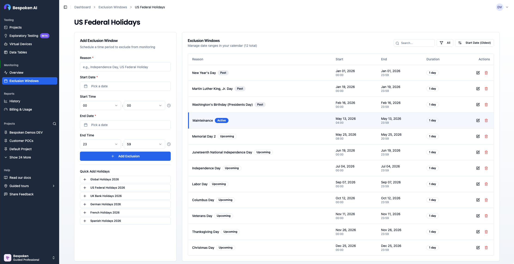
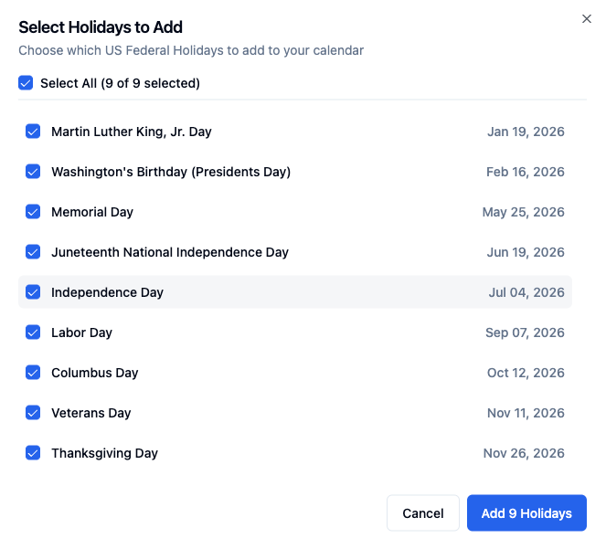
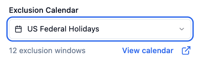

# Exclusion Windows

Exclusion windows let you define date and time ranges when monitoring should not run — for example, during scheduled maintenance, public holidays, or known downtime periods. They are organized into reusable **exclusion calendars** that can be shared across multiple test suites.

## Managing Calendars

Exclusion calendars are managed from the **Exclusion Windows** page, accessible from the main navigation sidebar.

The page lists all calendars in your organization. You can search by name or description, sort by name, last modified date, creation date, or number of exclusion windows, and create, edit, or delete calendars using the controls in each row.

### Creating a Calendar

Click **Create Calendar** and provide a name and an optional description. After saving, you are taken directly to the calendar editor to start adding exclusion windows.

### Adding Exclusion Windows

The calendar editor is split into two panels:

- **Left panel** — Form for adding a new exclusion window. Fill in the **Reason** (e.g., "Christmas Day"), **Start Date**, **Start Time**, **End Date**, and **End Time**, then click **Add**.
- **Right panel** — Table of all exclusion windows in this calendar. Windows are color-coded by status: currently active windows are highlighted in blue. You can filter by status (All / Upcoming / Past), sort, and search by reason or date.

#### Quick Add Holidays

For common public holidays, use the **Quick Add** buttons to add multiple windows at once. Buttons are available for:

- Global
- US Federal
- UK
- Germany
- France
- Spain

Clicking a button opens a dialog listing all public holidays for that region. You can select individual dates or use **Select All**, then confirm to add them all as exclusion windows in a single step.

::: tip Best Practice
Create one calendar per region or maintenance schedule (e.g., "US Federal Holidays", "Weekly Maintenance Window") and reuse it across all relevant test suites.
:::

## Attaching a Calendar to a Test Suite

Once you have created a calendar, attach it from the monitoring configuration panel of any test suite:

1. In the **Monitoring** section of the configuration panel, locate the **Exclusion Calendar** dropdown.
2. Select the desired calendar. The dropdown shows the calendar name and the number of exclusion windows it contains.
3. Use the **View calendar** button to open the calendar detail page in a new tab.

Scheduled runs that fall within any defined exclusion window are skipped automatically.

To remove the calendar from a test suite, open the dropdown and select **None (no exclusion windows)**.
