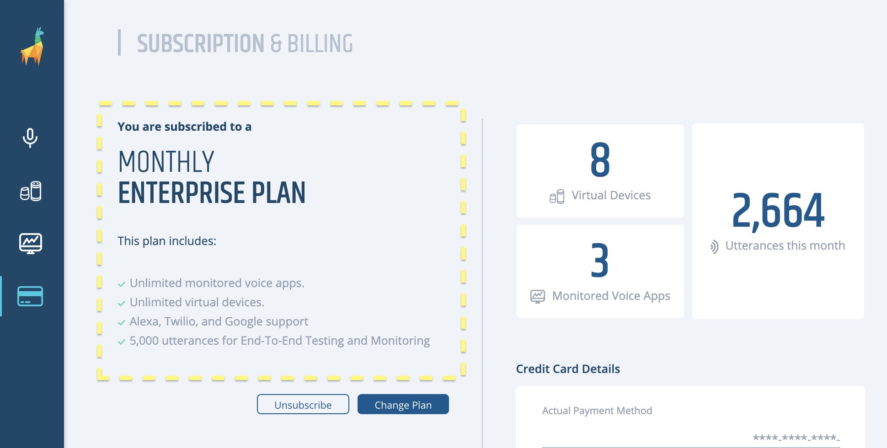
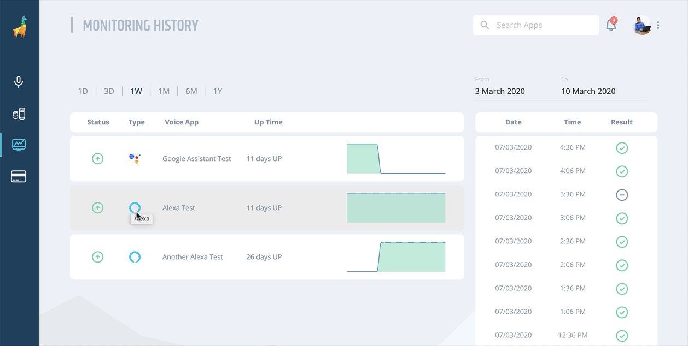
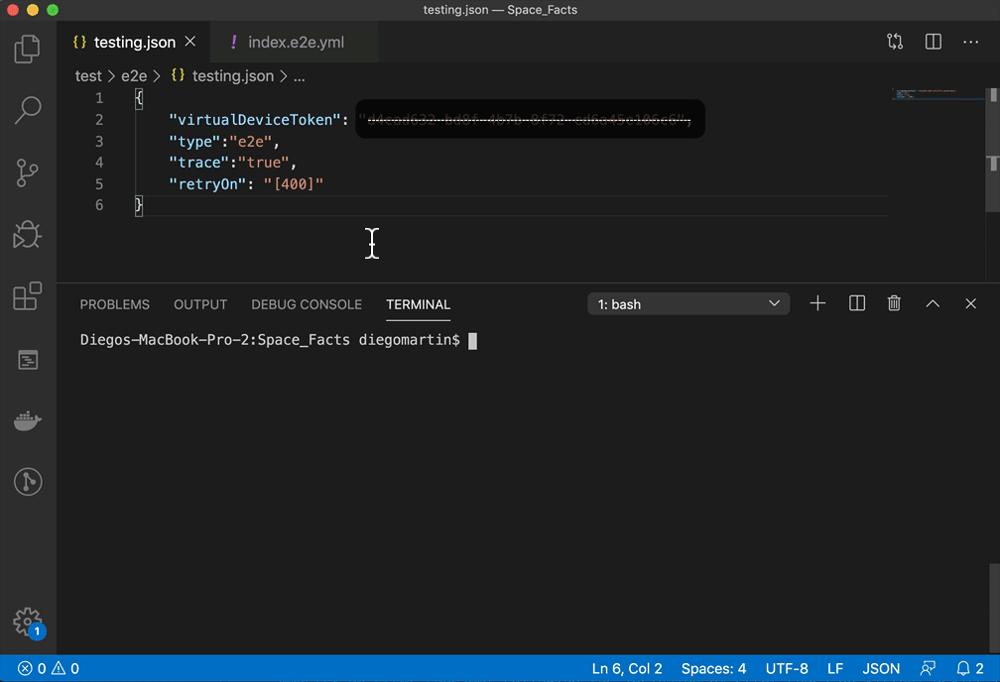

# Bespoken Release Roundup - March 2020
Another month, another set of new features and enhancements for you to discover :).

## [Dashboard](https://apps.bespoken.io)
- **Pricing update**: Our prices for new customers have been updated recently and you can find them now on our Billing page. If you want to know more about what is included in each plan, please visit [https://bespoken.io/pricing/](https://bespoken.io/pricing/).

### New features and improvements
- **Enterprise plan subscription details**: Also on our Billing page, if you are part of a custom Enterprise plan, you'll be able to see what's included in terms of billing dates, platform support, and monthly quota.

- **Monitoring for Twilio**: Continuing with the integration of Twilio apps in our Dashboard, they can now be monitored in the same way we monitor Alexa and Google Assistant voice apps. Want to start automating your tests for Twilio? [Get in touch with us](mailto:sales@bespoken.io).

- **Skipped results in monitoring**: Sometimes monitoring can fail for external reasons to your voice app. This will most likely resolve itself on the next test run but, when it happens, you'll be able to see the error on your monitoring history page as a "skipped" result. 

### Bug fixing
- Fixed an issue that prevented users from creating Google Virtual devices correctly on some occasions.
- Fixed an issue where the monitoring history page wouldn't load data for certain users.
- Fixed an issue that prevented users from opting out of subscribing to our Newsletter during the initial sign-up process and from the "My Account" page.
- Fixed a visual issue that caused a voice app to change its platform icon when deleting a voice app from the Voice apps page. 
- Fixed an issue where monitoring wouldn't work correctly with the advanced settings saying that there was an issue with the "findReplace" setting even when if it wasn't configured.
- Fixed an issue that would prevent some users from receiving their monitoring weekly report.

## Virtual Device
### New features and improvements
- **PCM audio support**: If you are sending audio files to your Virtual devices, you can now use PCM files without the need to rename them or change their format. You can find more information on how to use your audio files for this [here](https://read.bespoken.io/end-to-end/api).
- **Error codes**: Every error response coming from a Virtual device now has a code assigned to it besides its reason and category. You can find the list of error codes [here](https://read.bespoken.io/end-to-end/guide/#retrying-tests)

## [Bespoken CLI](https://www.npmjs.com/package/bespoken-tools)
### New features and improvements
- **Retry on error codes**: Following the inclusion of error codes on Virtual Device responses, you can tell our CLI to retry a test in case of an error up to 5 times. Learn how [here](https://read.bespoken.io/end-to-end/guide/#retrying-tests).

- **JSON files are ignored on test runs**: When running end-to-end tests specifying a custom path, we no longer try to run JSON files on that folder as tests (which resulted in failed test suites and test runs) ([bst#630](https://github.com/bespoken/bst/issues/630)).
- **Twilio tests end when a call ends**: When we detect that a Twilio call has ended, we'll stop the execution and won't send extra utterances to it ([skill-testing-ml#341](https://github.com/bespoken/skill-testing-ml/issues/341)).
- **Getting rid of the "Error description missing" message**: Greatly improved the error messaging for errors outside of the virtual-device scope (is your proxy preventing a connection with our servers? did you lose connection to the internet?, etc.) where we would show an "Error description missing" message before, now you'll see the RAW error message and stack trace. This should help in finding the reason for the error much easier ([bst#632](https://github.com/bespoken/bst/issues/632))
- **Improved messaging on calls that were not answered for Twilio**: When a call couldn't be initiated while testing a Twilio voice app, instead of "Undefined" you'll get a message saying "Call was not answered" ([skill-testing-ml#339](https://github.com/bespoken/skill-testing-ml/issues/339)).
- **HTML reports in a single file**: We've changed the HTML report's behavior to be generated into a single file that is easier for sharing by default. If you still wish to get the report as a folder with styles and assets in different files, just set the env variable `JEST_STARE_INLINE_SOURCE` to `false` ([bst#636](https://github.com/bespoken/bst/issues/636)).

### Bug fixing
 - Fixed an issue that would count a test as passed if it had empty assertions even when it internally could fail for other reasons: unhandled exceptions, no internet access, etc. ([skill-testing-ml#361](https://github.com/bespoken/skill-testing-ml/issues/361)) 

## Others
### Docs additions:
- We've split the configuration part of our end-to-end tests by moving the most advanced settings into its own section. We hope this helps you start testing right away and also be able to customize/troubleshoot your test runs if needed. See our advanced setting section [here](https://read.bespoken.io/end-to-end/guide/#special-advanced-configurations).

