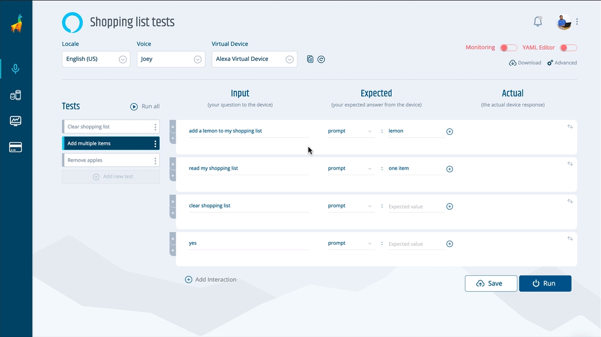
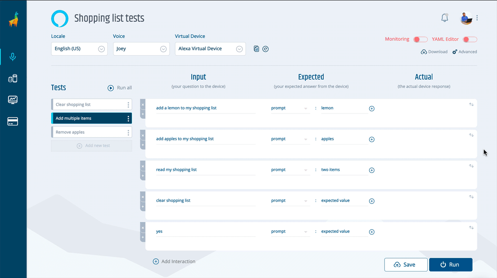

# Bespoken Release Roundup - May 2020

## [Dashboard](https://apps.bespoken.io)

### New features and improvements
- **Insert an utterance**: To make your test writing easier, you can now insert utterances in between others by clicking on the "+" symbol as shown below. No need to remove or edit other utterances to fix assertions in the middle of a test!

- **Reorder your utterances**: In the same vein as the previous feature, you can now reorder your utterances easily by clicking on the two arrows at the right of your utterance and simply dragging and dropping your utterances where they belong. Easy right?

- **Privacy preferences**: You can find a link to our privacy policy in the Dashboard user menu, as well as opt-out of our cookie usage from the "My Account" page if you desire.

### Bug fixes
- Fixed an issue that would prevent users from downgrading to a single-platform plan from a cross-platform one.
- Switching to the YAML editor while having empty tests will now insert placeholders in your assertions to prevent syntax errors on your tests.   

## Virtual Device

### New features and improvements
- **Alexa Presentation Language (APL) support**: Our Alexa virtual device's responses include APL directives now. This means that you can run assertions against your display information and other useful directives at a much deeper level than before. You can access all your skill directives under the `raw.messageBody.directive` path in your assertions.

## [Bespoken CLI](https://www.npmjs.com/package/bespoken-tools)
### New features and improvements
- **HTTPS Proxy support**: You can now use our tools through an https proxy by setting an environment variable like this `HTTPS_PROXY=http://<proxy-url>:<proxy-port>`. [bst#602](https://github.com/bespoken/bst/issues/602)

- **Environment file path**: By using the `--env [filepath]` option, you can specify the location of the .env file you want bst to use. Example: `bst test myTest.e2e.yml --env tests.env`. [bst#637](https://github.com/bespoken/bst/issues/637)

- **Filtering's onRequest callback**: Filtering during a test now supports an `onRequest` callback. This allows for manipulating the JSON payload that is sent to our virtual devices if needed for more complex testing scenarios. [skill-testing-ml#390](https://github.com/bespoken/skill-testing-ml/issues/390)

### Bug fixes
 - Messaging was improved when testing an IVR system and a `phoneNumber` is not provided (bst#646)[https://github.com/bespoken/bst/issues/646]

