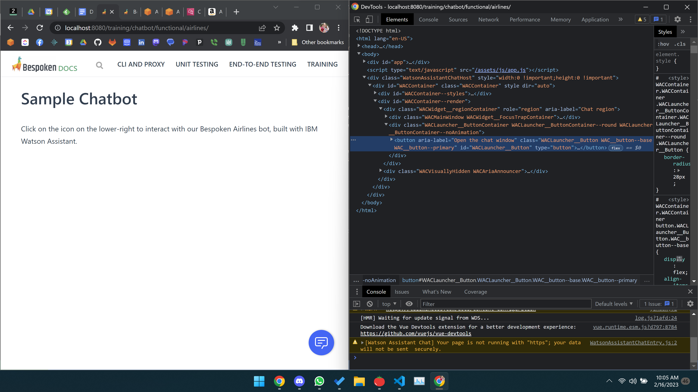
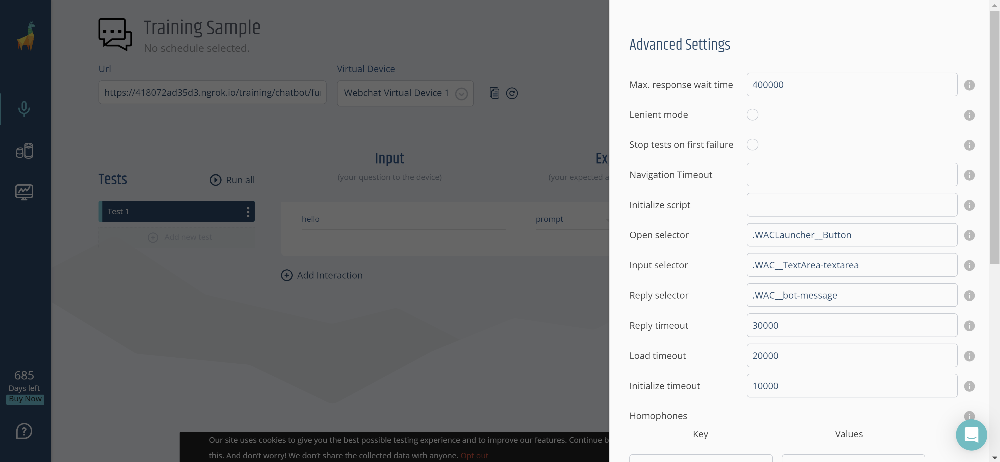

<base target="_blank">
# Configure the chatbot for testing
<video width="640" height="480" controls autoplay muted>
  <!--<source src='/assets/videos/Dashboard-IVR-IBM.mp4' alt="foo"  type="video/mp4">-->
  <source src='https://bespoken-random.s3.amazonaws.com/Bespoken_Dashboard_Demo_IBM_Marketplace.mp4#t=28' alt="foo"  type="video/mp4">
</video>
<br>

## Creating A Test Suite
* Select the "Test Suites" icon on the left navigation bar
* Select "Create a new test suite"
* Enter a test suite name - such as "First Chatbot Test"
* Click "Create"
* Enter the URL where the chatbot can be found in the `Url` field
  * For this first test, enter "https://read.bespoken.io/training/chatbot/functional/sample"

## Binding to HTML Elements
We need to identify a few key pieces of data to setup our webchat tests. They are:

| Field | Description | 
|---| --- |
| Open Selector | The HTML element used to launch the chatbot. Often, this is a button on the lower-right of the page
| Input Selector | The HTML element where the user enters information for the chatbot.
| Reply Selector | The HTML elements that represent the replies from the chatbot. Be careful to just get the chatbot replies, and not the those of the user as well.

In each case, we identify the CSS selector on the page that corresponds to the correct HTML element. To find the correct element and selector, do the following (these instructions assume you are using Google Chrome):
* Open the page where the chatbot is placed
* Right-click on the element 
* Choose "Inspect"
* Examine the Elements section of the source page
* Choose either an HTML `class` or `id` that uniquely identifies the element

For example, we have a sample chatbot as part of this training guide. Below is what we see when we click "Inspect" on the chatbot button in the lower right:
<br/><br/>
<a href='../../../assets/images/ChatbotConfiguration.png' target='_blank'></a>
<br/>
In this case, we can use the HTML class selector ".WACLauncher__Button" for our Open Selector. Note that the class value starts with a "." - this is the case for all class selectors. If we were using the element ID, it would start with a "#". To read more about HTML selectors, [click here](https://developer.mozilla.org/en-US/docs/Learn/CSS/Building_blocks/Selectors).

Each of these values should then be set in our Advanced settings section:
<br/><br/>

<br/><br/>

To try out the chatbot for yourself, [click here](./sample.md).

To verify your HTML element bindings are working right, add a first interaction that just says "hi". Then click "Run".

If everything is working correctly, you should see the response back from our sample bot in the "Actual Response" section. The initial settings should be:
| Field | Value | 
|---| --- |
| Open Selector | .WACLauncher__Button
| Input Selector | .WAC__TextArea-textarea
| Reply Selector | .WAC__received 

## Troubleshooting
We recommend using the `Console` at the bottom of the HTML Inspector if you run into issues.

You can try out different selectors using the command:
```
document.querySelectorAll('.WACLauncher__Button')
```

We can see based on the result if we have chosen the correct selector.

If you struggle to configure the selectors correctly, don't hesitate to reach out to us <a href='mailto:support@bespoken.io'>support@bespoken.io</a>. This is the trickiest part of chatbot testing - once you can find the HTML elements consistently, the rest of the testing process is typically smooth and straightforward.