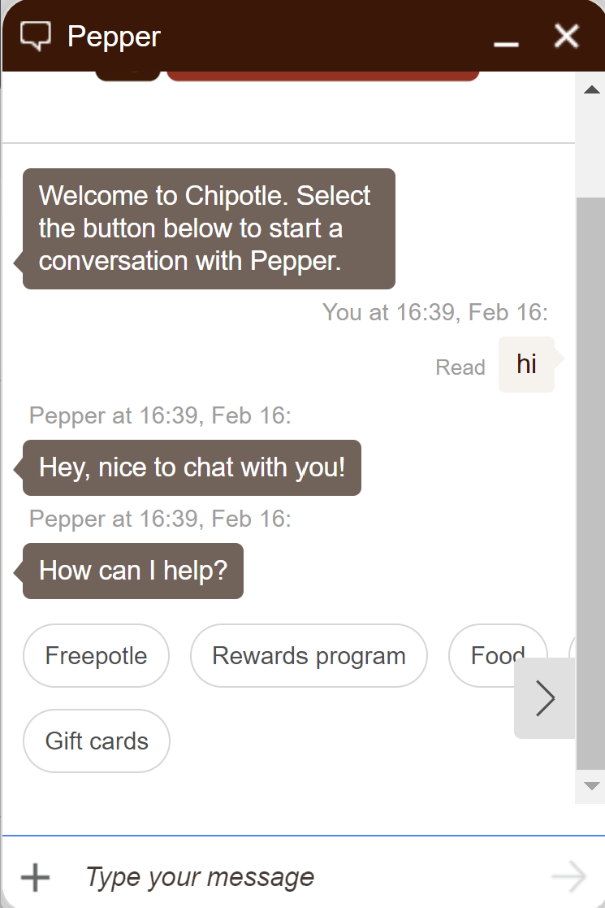

# Using JQuery for Advanced Testing
<video width="640" height="480" controls>
  <!--<source src='/assets/videos/Dashboard-IVR-IBM.mp4' alt="foo"  type="video/mp4">-->
  <source src='https://bespoken-random.s3.amazonaws.com/Bespoken_Dashboard_Watson_Chatbot.mp4#t=590' alt="Bespoken Chatbot Demo Video"  type="video/mp4">
</video>

## When JQuery Is Needed
Below is an example of a chatbot that leverages buttons:
<br><br>
<div class="mx-auto">
  <a class="mx-auto" href="../../../assets//images/Chatbot-Chipotle-Buttons.png" target="_blank">
    
  </a>
</div>
  
  
In this situation, our user can type in Freepotle. But to do complete testing, we may also want to simulate a user pressing the button to ensure that works correctly.

To do this, we embed JQuery automatically into the website being tested so that it can be used in our tests.

## How To Use JQuery
So to press the button shown above, we simply add an input like so:
```
$('button[title="Freepotle"]').click()
```

This will leverage JQuery to click the button labeled "Freepotle". To figure out the right selector to use with JQuery, we used Chrome Developer Tools, similar to how we did in our initial configuration step.