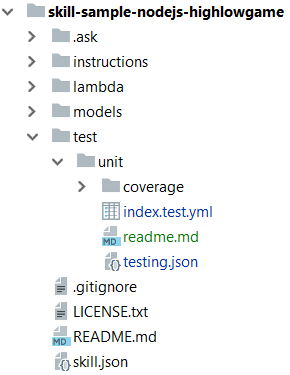

# **FAQs for Unit-Testing**
Here you can find common questions on regards unit testing for voice apps.

## **Getting started**

### **What is unit testing and why do I need it?**
In traditional computer programming, unit testing is a software testing method by which individual units of source code are tested to determine whether they are fit for use. Our approach to unit testing is aligned with the new style of unit tests; which is to focus on the code as a whole as opposed to small parts of it.

*You need to do unit testing* to be sure the voice app code is working correctly. To that end, you can write *__unit tests scripts__* to verify each intent and each major piece of functionality.

For more information about testing voice apps, please read **[here](https://developer.amazon.com/blogs/alexa/post/e2f3d18c-13ca-4796-bc83-e8a196f20e57/building-engaging-alexa-skills-why-testing-and-automation-matter)**.

### **Which tools does Bespoken offer to do unit testing for voice apps?**
We have created a tool called **Virtual Alexa**, which simulates the Alexa Voice Service and creates JSON objects that are sent to your skill. This tool can be used to do unit testing programmatically and run the test suites with a unit testing framework (for example Mocha and Chai). But we also offer an *easier way* to perform unit testing by writing simple test scripts based on **YAML** syntax and running them with our **Skill Tester** tool. These scripts are executed *locally* using our Virtual Alexa simulator. Skill tester also displays the **code coverage** you reach based on your test scripts. To get started with Unit Test Scripts please **[read here](https://read.bespoken.io/unit-testing/getting-started)**.

### **What is code coverage?**
In computer science, test coverage is a measure used to describe the degree to which the source code of a program is executed when a particular test suite runs. A program with high test coverage, measured as a percentage, has had more of its source code executed during testing, which suggests it has a lower chance of containing undetected software bugs compared to a program with low test coverage.

*Bespoken Skill Tester for unit testing comes with Code Coverage out of the box*, you don't need to do anything to enable it, just check the results after executing your test scripts. Here you have a sample output. "% Lines" indicate the total number of lines that have been covered by the test script we are running.

![Sample of Code Coverage output][Codecov-Output]

### **How do I start doing unit testing for my voice apps?**
Start by creating simple test scripts based on our YAML syntax, these are the steps you need to follow in order to create and run your first test script:
1. Install Bespoken Tools by running `npm install bespoken-tools@beta -g` on your command line.
2. Create the main testing folder. We recommend to name it `test`; it should be under the root of your skill's directory.
3. Create a folder named `unit` under `test\`, this folder will store your unit test script files.
4. Add the test configuration file `testing.json`. This file should be located under your `test\unit` directory. It might look like this:
    ```JSON
    {
        "handler": "../../src/index.js",
        "locale": "de-DE",
        "trace": true,
        "jest": {
            "silent": true
        }
    }
    ```
    The most important parameter is the handler where you indicate Bespoken's Skill Tester where the source code of your skill is. These parameters can be overwritten on each test script file under their configuration section.
5. Add your test scripts. We recommend to use next convention when naming your test script files:
     * If you have only one test script: `index.test.yml`
     * If you want to create more than one test script: `functionalityName.test.yml`. 
     
     The yml extension indicates this is a YAML file, which is the syntax we use to create test scripts; `test` means that is a unit test script file. A test script looks like this:
    ```YAML
    ---
    configuration: # You can define your locales or mocks here
      locale: en-US

    --- # Three dashes start a new YAML document
    - test: One complete interaction. # Some metadata about this test sequence
    - LaunchRequest: how many persons are playing today?
    - one: please tell us your name
    - jordi:
      - prompt: your product is Fitbit * Guess the price
      - response.card.title: Fitbit Charge 2 HR
      - response.card.image.largeImageUrl: "https://url/file.jpg"
      - response.card.text: A wristband worn health tracker
    - 240: You said 240 , the actual price was 149 dollars
    - stop
    ```
    A typical YAML sentence is composed of 2 parts separated by a colon; in the left part we have the intent name we want to test; in the right part we have the expected result. You can also access any element on the JSON response object like the session attributes.
6. To execute the scripts go to the folder containing your `testing.json` file and run `bst test`. That will find and run all the unit test scripts under the `test\unit` folder.

For more information about skill unit testing please read **[here](https://read.bespoken.io/unit-testing/getting-started/)**.

### **What are continuous integration (CI) and automated unit testing?**
>*Continuous Integration (CI) is the process of automating the build and testing of code every time a team member commits changes to version control ... Sam Guckenheimer (Microsoft)*

It works by tying a CI platform into the source code repository and **automatically running unit tests** whenever new updates to the code are made on the repository. There are many popular CI platforms, such as Travis CI, CircleCI, and Jenkins, so you can take your pick. They are typically easy to setup, and will “intuit” things about the project (such as what type of programming language it uses and how to run tests within it). This auto-configuration makes them even easier to work with.
![Understanding Continuous Integration][CI]
The continuous integration service is responsible for bringing our source code, **unit tests** and code coverage together, including alerting the developer when there are issues. These issues can manifest with either tests failing or new code that is insufficiently tested. And once configured, there are a ton of helpful tools out there to perform ongoing checks to ensure code quality.

Check this **[sample project](https://github.com/ig-perez/skill-sample-nodejs-fact/tree/ContinuousIntegration)**, it contains a `.travis.yml` file which is the configuration element to enable CI using Travis platform.

### **Besides Alexa, can I use Bespoken to unit test Google Actions?**
We are currently working to release our support of Google Actions unit testing. Please stay tuned since it will be available soon.
 
## **Working with test scripts**

### **How should I organize my folder structure to store my test script files?**
This is our recommendation: 
* Create a `test` folder under the root of your voice app project. This folder will contain your test script files.
* To store your unit test script files and the `testing.json` configuration file create a `unit` folder under your `test` directory.


Here's an example:
<p align="center">
  
</p>

### **Where should I indicate the locale for the script?**
That depends, if you write all your test scripts for one locale only (en-US for example) it's better to define it in your testing.json configuration file:
```JSON
{
  "handler": "../../lambda/custom/index.js",
  "locale": "en-US",
  "trace": true,
  "jest": {
    "silent": false,
    "coveragePathIgnorePatterns": []
  }
}
```
If you have multiple test script files for different locales, then it is better to define the locale in the configuration section of each test script file:
```YAML
---
configuration:
  locale: en-US
  dynamo: mock
  userId: 000000
```
### **How to invoke an intent with slots?**
If you want to execute an intent with slots in just one line, use our succinct syntax. For example:
```YAML
---
- test: The size and pet slot values are provided on open
- PetMatchIntent size=small pet=dog:
  - prompt:
    - Would you prefer a dog to hang out with kids or to protect you?
    - Are you looking for more of a family dog or a guard dog?
- AMAZON.StopIntent: Bye
```
As you can see we add the slots and their values after the intent name in the left part of the YAML sentence. Check the full code of this project and test script **[here](https://github.com/ig-perez/skill-sample-nodejs-petmatch)**.

### **Which shorthand properties can I use to make my script more readable?**
To improve the readibility of your scripts you can use these values in your unit test script file:
* __prompt__: Equivalent for `response.outputSpeech.ssml`
* __reprompt__: Equivalent to `response.reprompt.outputSpeech.ssml`
* __cardTitle__: Equivalent to `response.card.title`
* __cardContent__: Equivalent to `response.card.content`
* __cardImageURL__: Equivalent to `response.card.image.largeImageUrl`
* __sessionEnded__: Equivalent to `response.shouldEndSession`

### **My skill use the Device Address API/DynamoDB how can I do unit testing without hitting the cloud?**
We have created mockups for that, there is no need for you to do any local setup to use them. **[Check this](https://read.bespoken.io/unit-testing/use-cases)** to know how to use them.

### **Can I use utterances instead of intent names in my scripts?**
Yes, you can, but as we are emulating Alexa turning utterances into intents might not be 100% accurate in some cases. To avoid this we recommend setting the exact intent and slot values with the intent and slot properties. For example, you can turn this:
```YAML
---
- test: The size and pet slot values are provided on open
- tell pet match i want a small dog:
  - prompt:
    - Would you prefer a dog to hang out with kids or to protect you?
    - Are you looking for more of a family dog or a guard dog?
- stop: Bye
```
Into this:
```YAML
---
- test: The size and pet slot values are provided on open
- PetMatchIntent size=small pet=dog:
  - prompt:
    - Would you prefer a dog to hang out with kids or to protect you?
    - Are you looking for more of a family dog or a guard dog?
- AMAZON.StopIntent: Bye
```
Check the full code of this project and test script **[here](https://github.com/ig-perez/skill-sample-nodejs-petmatch)**.

### **TBD :: How to unit test multi-locale skills?**
*Lorem ipsum dolor sit amet, id munere tacimates nam. No per velit meliore recteque, sit ne esse iracundia. Ut solet appareat honestatis ius, pri at dicat splendide moderatius. Liber legere ullamcorper usu te, vel dolores adversarium delicatissimi id, ex nam novum pertinacia definiebas. Per ei aeque accusam reprehendunt, vix et erat consulatu, phaedrum quaestio vel id.*

<!-- Images references -->
[CI]: ../assets/images/CI.png "Continuous Integration Flow"
[Codecov-Output]: ../assets/images/BST-Test-Summary.png "Continuous Integration Flow"