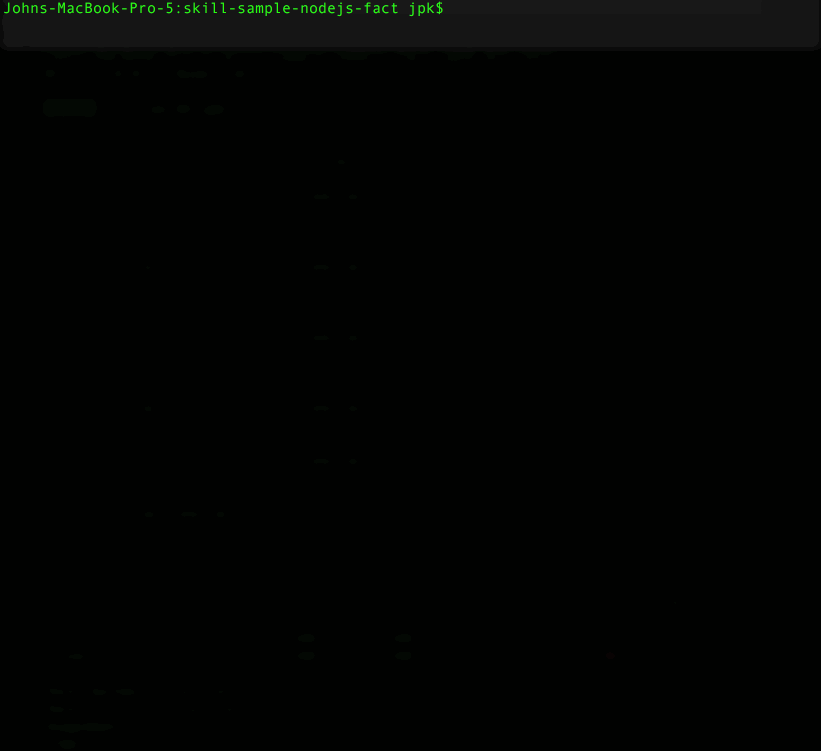
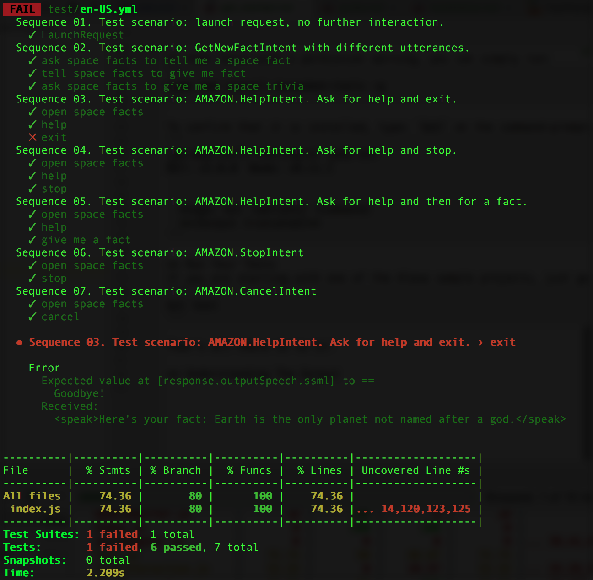
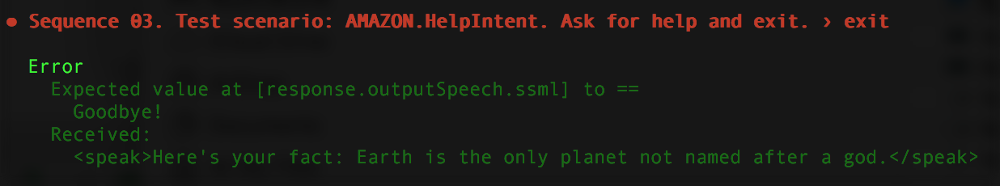

<!-- ---
# Getting Started
layout: default
keywords:
comments: false

# Hero section
title: Getting Started With Unit Testing With Bespoken

# Micro navigation
micro_nav: true
--- -->
# Getting Started With Unit Testing With Bespoken
It's easy to unit-test your Alexa skills and Google actions with Bespoken.



Here's a sample from the tests being run (for Alexa):

```yml
---
configuration:
  locale: en-US

---
- test: "Sequence 01. Test scenario: launch request, no further interaction."
- LaunchRequest: # LaunchRequest is not an utterance but a request type
  - response.outputSpeech.ssml: "Here's your fact"
  - response.card.type: "Simple"
  - response.card.title: "Space Facts"
  - response.card.content: "/.*/" # Regular expression indicating any text will match

---
- test: "Sequence 02. Test scenario: GetNewFactIntent with an utterance"
- "give me a fact":
  - response.outputSpeech.ssml: "/here's your fact.*/i" # i flag means case insensitive
  - response.card.type: "Simple"
  - response.card.title: "Space Facts"
  - response.card.content: "*"

---
- test: "Sequence 03. Test scenario: AMAZON.HelpIntent. Ask for help and exit."
- LaunchRequest: # Empty expected part means we are not testing the response
- help: # This is what we want to test in this sequence
  - response.outputSpeech.ssml: "What can I help you with?"
  - response.card: undefined
  - response.reprompt.outputSpeech.ssml: "What can I help you with?"
- exit:
  - response.outputSpeech: undefined
```

## Setup
To get started, you need to install Bespoken Tools.

If you haven't already, follow these steps:

**Install NPM**  
[Instructions here](https://www.npmjs.com/get-npm) if you have not already installed npm.

**Open A Command Prompt**  
For Mac, run Applications -> Terminal  
For Windows, select Run -> cmd

**Install Bespoken Tools**  
Once on the command-line, type:

```bash
npm install bespoken-tools -g
```

If that fails with a permission warning, you can simply run:
```bash
sudo npm install bespoken-tools -g
```

To confirm that it is installed, type: `bst` on the command-prompt. You should see something like this:
```bash
jpk-mbp:skill-testing-ml jpk$ bst
BST: v2.0.0  Node: v8.11.1


  Usage: bst [options] [command]
  **(Output truncated)**
```

## Run Your Tests
If you are starting with one of the [sample projects below](#further-reading-and-examples), just go ahead and enter:
```bash
bst test
```

That's all there is to it!

## Understanding The Output



The top of the output is the result of each test.
Underneath each test is the sequence of interactions.

If any failed, they are marked with an X.

Below this list of tests, we see detailed output for any test that failed:


This tells the exact interaction that failed, as well as why it failed.
Based on this, we can either fix our test or fix the code.

The summary at the bottom tells us about the success of the tests, as well as basic code coverage info.

To see more detailed code coverage info, we can go to `coverage/lcov-report/index.html`.
The coverage directory will be located in the same directory where your `testing.json` file is located.
This provides detailed information about the code coverage for our tests.

## bst init
The `bst init` command is quick way to create all the needed files and folders needed to start unit testing your voice apps. It's a great starting point! You can read more about it [here](./../../cli/commands#init).

## Further Reading and Examples

### Alexa
To learn in detail how to add more tests and other advanced topics, read our [In-depth guide for Alexa](./guide.html).
Also, learn about other common use-cases [here](./use-cases.html), such as:

* State Management With Dynamo
* Testing The Address API
* Working With Dialogs

And take a look at the following skills with test examples already configured:
* Get Facts
[Github](https://github.com/alexa/skill-sample-nodejs-fact)
[Travis](https://travis-ci.org/ig-perez/skill-sample-nodejs-fact)
[Codecov](https://codecov.io/gh/ig-perez/skill-sample-nodejs-fact)
* Address API Example
[Github](https://github.com/ig-perez/skill-sample-node-device-address-api)
[Travis](https://travis-ci.org/ig-perez/skill-sample-node-device-address-api)
[Codecov](https://codecov.io/gh/ig-perez/skill-sample-node-device-address-api/)
* High Low Game
[Github](https://github.com/ig-perez/skill-sample-nodejs-highlowgame)
[Travis](https://travis-ci.org/ig-perez/skill-sample-nodejs-highlowgame)
[Codecov](https://codecov.io/gh/ig-perez/skill-sample-nodejs-highlowgame)
* AudioPlayer Example
[Github](https://github.com/alexa/skill-sample-nodejs-audio-player)
[Travis](https://travis-ci.org/ig-perez/skill-sample-nodejs-audio-player)
[Codecov](https://codecov.io/gh/ig-perez/skill-sample-nodejs-audio-player/)
* Dialog Manager Example
[Github](https://github.com/bespoken-samples/skill-sample-nodejs-petmatch)
* College Finder (Unit + E2E)
[Github](https://github.com/alexa/skill-sample-nodejs-college-finder)
[Travis](https://travis-ci.org/alexa/skill-sample-nodejs-college-finder)

### Google
To learn in detail how to add more tests and other advanced topics, read our [In-depth guide for Google](./guide-google.html).

And take a look at the following skills with test examples already configured:
* Guess the Price Game
[Github](https://github.com/bespoken-cookbook/GuessThePriceForGoogle)


